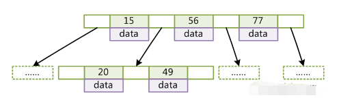
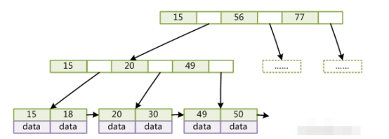
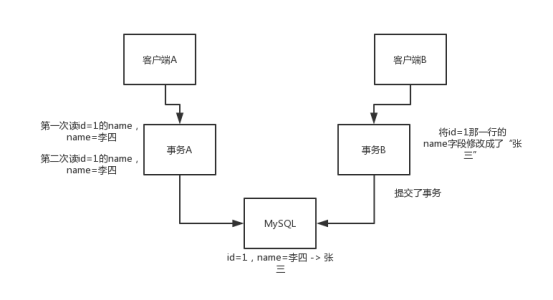
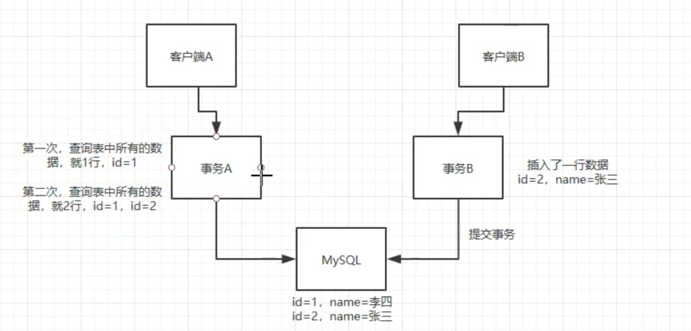
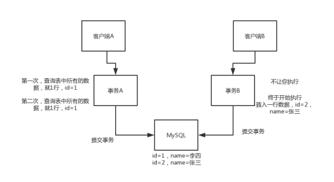
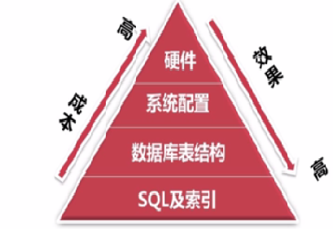

# 数据库

## 0. 数据库范式

- 第一范式：列不可分，eg:【联系人】（姓名，性别，电话），一个联系人有家庭电话和公司电话，那么这种表结构设计就没有达到 1NF；
- 第二范式：有主键，保证完全依赖。eg:订单明细表【OrderDetail】（OrderID，ProductID，UnitPrice，Discount，Quantity，ProductName），Discount（折扣），Quantity（数量）完全依赖（取决）于主键（OderID，ProductID），而 UnitPrice，ProductName 只依赖于 ProductID，不符合2NF；
- 第三范式：无传递依赖(非主键列 A 依赖于非主键列 B，非主键列 B 依赖于主键的情况)，eg:订单表【Order】（OrderID，OrderDate，CustomerID，CustomerName，CustomerAddr，CustomerCity）主键是（OrderID），CustomerName，CustomerAddr，CustomerCity 直接依赖的是 CustomerID（非主键列），而不是直接依赖于主键，它是通过传递才依赖于主键，所以不符合 3NF。


## 1. 存储引擎

### myisam

- 不支持事务
- 不支持外键约束
- 索引文件和数据文件分开，这样在内存里可以缓存更多的索引，**对查询的性能会更好**
- 适用于那种少量的插入，大量查询的场景。

比如说最经典的就是报表系统，比如大数据的报表系统，常见的就是走hadoop生态来搞，hdfs来存储数据，然后基于hive来进行数仓建模，每次hive跑出来的数据都用hadoop从hive中导出到mysql中去。然后基于mysql的在线查询，就接上j2ee写个简单的web系统，每个报表开发一套代码，写sql查数据，组织数据，按照前端要求的格式返回数据，展现出来一个报表。

这种报表系统，是最适合**mysql的myisam存储引擎的**，不需要事务，就是一次性批量导入，接下来一天之内就是纯查询了。

基于自己研发的可配置化BI系统 + **kylin + elasticsearch**，支持大规模数据的复杂报表的支持，做的非常好，效果远远超出基于mysql的那套方案

后来还有那种实时数据报表，就是**storm或者是spark streaming**，跑数据出来，来一条算一条，然后结果立马写入mysql中，这个的话，一般就保留当天数据，其实压力不会太大，但是问题在于说，可能写并发会超高，每秒并发轻易就可以几千甚至上万。所以大数据实时报表不会写mysql了，现在一般都是写es。

你可以按照我上面的这套说辞去说说，如果是java方向的同学，就说你们之前配合你们公司的数据团队开发过这种报表系统的j2ee部分，所以当时用myisam比较多，但是后来人家几乎都不用了，借此体现出你是有实际经验的，这回答的档次都不一样了。

### innodb

说真的，现在一般用mysql都是innodb，而且这个也是mysql 5.5之后的默认存储引擎。

- 就是支持事务
- 走聚簇索引
- 强制要求有主键，支持外键约束
- 高并发、大数据量、高可用等相关成熟的数据库架构
  - 分库分表
  - 读写分离
  - 主备切换「高可用」

全部都可以基于innodb存储引擎来玩儿，如果真聊到这儿，其实大家就可以带一带，说你们用innodb存储引擎怎么玩儿分库分表支撑大数据量、高并发的，怎么用读写分离支撑高可用和高并发读的。


## 2. 索引

### 索引的数据结构

mysql的索引说白了就是用一个数据结构组织某一列的数据，然后如果你要根据那一列的数据查询的时候，就可以不用全表扫描，只要根据那个特定的数据结构去找到那一列的值，然后找到对应的行的物理地址即可。

mysql的索引是怎么实现的而是一颗**b+树**。B+ 树是 B- 树的升级。 从数据结构的角度来看，b-树要满足下面的条件：

+ d为大于1的一个正整数，称为B-Tree的度。
+ h为一个正整数，称为B-Tree的高度。
+ 每个非叶子节点由n-1个key和n个指针组成，其中d<=n<=2d。
+ 每个叶子节点最少包含一个key和两个指针，最多包含2d-1个key和2d个指针，叶节点的指针均为null 。
+ 所有叶节点具有相同的深度，等于树高h。
+ key和指针互相间隔，节点两端是指针。
+ 一个节点中的key从左到右非递减排列。
+ 所有节点组成树结构。
+ 每个指针要么为null，要么指向另外一个节点。
+ 如果某个指针在节点node最左边且不为null，则其指向节点的所有key小于v(key1)，其中v(key1)为node的第一个key的值。
+ 如果某个指针在节点node最右边且不为null，则其指向节点的所有key大于v(keym)，其中v(keym)为node的最后一个key的值。
+ 如果某个指针在节点node的左右相邻key分别是keyi和keyi+1且不为null，则其指向节点的所有key小于v(keyi+1)且大于v(keyi)。



查找的时候，就是从根节点开始二分查找。 b-树就说到这里，直接看下一个，b+树。b+树是b-树的变种。

b+树跟b-树不太一样的地方在于：

+ 每个节点的指针上限为2d而不是2d+1。
+ 内节点不存储data，只存储key；
+ 叶子节点不存储指针。



```sql
select * from table where id = 15 
select * from table where id>=18 and id<=49
```

但是一般数据库的索引都对b+树进行了优化，加了顺序访问的指针，如网上弄的一个图，这样在查找范围的时候，就很方便，比如查找18~49之间的数据：


### B+-tree比B树更适合

- B+tree的磁盘读写代价更低：B+tree的内部结点并没有指向关键字具体信息的指针(红色部分)，因此其内部结点相对B 树更小。如果把所有同一内部结点的关键字存放在同一盘块中，那么盘块所能容纳的关键字数量也越多。一次性读入内存中的需要查找的关键字也就越多，相对来说IO读写次数也就降低了；
- B+tree的查询效率更加稳定：由于内部结点并不是最终指向文件内容的结点，而只是叶子结点中关键字的索引，所以，任何关键字的查找必须走一条从根结点到叶子结点的路。所有关键字查询的路径长度相同，导致每一个数据的查询效率相当；
- **数据库索引采用B+树而不是B树的主要原因：**B+树只要遍历叶子节点就可以实现整棵树的遍历，而且在数据库中基于范围的查询是非常频繁的，而B树只能中序遍历所有节点，效率太低。


### 文件索引和数据库索引使用B+树

文件与数据库都是需要较大的存储，也就是说，它们都不可能全部存储在内存中，故需要存储到磁盘上。而所谓索引，则为了数据的快速定位与查找，那么索引的结构组织要尽量减少查找过程中磁盘I/O的存取次数，因此B+树相比B树更为合适。数据库系统巧妙利用了局部性原理与**磁盘预读原理**，将一个节点的大小设为等于一个页，这样每个节点只需要一次I/O就可以完全载入，而红黑树这种结构，高度明显要深的多，并且由于逻辑上很近的节点(父子)物理上可能很远，无法利用局部性。最重要的是，**B+树还有一个最大的好处：方便扫库。B树必须用中序遍历的方法按序扫库，而B+树直接从叶子结点挨个扫一遍就完了，B+树支持range-query非常方便，而B树不支持，这是数据库选用B+树的最主要原因。**


### myisam存储引擎的索引

先来看看myisam存储引擎的索引实现。就拿上面那个图，咱们来现场手画一下这个myisam存储的索引实现，在myisam存储引擎的索引中，**每个叶子节点的data存放的是数据行的物理地址**，比如0x07之类的东西，然后我们可以画一个数据表出来，一行一行的，每行对应一个物理地址。

**索引文件**


id=15，data：0x07，0a89，数据行的物理地址

数据文件单独放一个文件

```sql
select * from table where id = 15 
// 0x07物理地址 -> 15，张三，22
```

**myisam最大的特点是数据文件和索引文件是分开的，先是索引文件里搜索，然后到数据文件里定位一个行的。**


### innodb存储引擎的索引

**innodb的数据文件本身就是个索引文件，就是主键key，然后叶子节点的data就是那个数据的所在行**。


- 要求必须有主键，会根据主键建立一个默认索引，叫做**聚簇索引**
- innodb的数据文件本身同时也是个索引文件，索引存储结构大致如下：

> 15，data：0x07，完整的一行数据，（15,张三,22）       InnoDB不是这么搞的
> 22，data：完整的一行数据，（22,李四,30）                    InnoDB就是这么操作的

**「数据行与索引文件绑在一起」，innodb表是要求必须有主键的**,  如果对某个非主键的字段创建个索引:

- 那么最后那个叶子节点的值就是主键的值
- 因为可以用**主键的值到聚簇索引里根据主键值再次查找到数据，即所谓的回表**，例如：

```sql
select * from table where name = ‘张三’
```

**先到name的索引里去找**，找到张三对应的叶子节点，叶子节点的data就是那一行的主键，id=15，然后再根据id=15，到**数据文件里面的聚簇索引**（根据主键组织的索引）根据id=15去定位出来id=15这一行的完整的数据

- innodb不适用UUID生成的超长字符串作为主键。会导致所有的索引的data都是那个主键值，最终导致索引会变得过大，浪费很多磁盘空间。

- 一般innodb表里，建议统一用auto_increment自增值作为主键值
  - 因为这样可以保持聚簇索引直接加记录就可以
  - 如果用那种不是单调递增的主键值，可能会导致b+树分裂后重新组织，会浪费时间。


### 索引的使用规则

这个东西是跟联合索引（复合索引）相关联的，就是说，你很多时候不是对一个一个的字段分别搞一个一个的索引，而是针对几个索引建立一个联合索引的。

给大家举个例子，你如果要对一个商品表按照店铺、商品、创建时间三个维度来查询，那么就可以创建一个联合索引：shop_id、product_id、gmt_create

一般来说，你有一个表（product）：shop_id、product_id、gmt_create，你的SQL语句要根据这3个字段来查询，所以你一般来说不是就建立3个索引，**一般来说会针对平时要查询的几个字段，建立一个联合索引**

后面在java系统里写的SQL，都必须符合最左前缀匹配原则，确保你所有的sql都可以使用上这个联合索引，通过索引来查询

**create index (shop_id,product_id,gmt_create)**


##### 全列匹配

这个就是说，你的一个sql里，正好where条件里就用了这3个字段，那么就一定可以用到这个联合索引的：

**select \* from product where shop_id=1 and product_id=1 and gmt_create=’2018-01-01 10:00:00’**


##### 最左前缀匹配

这个就是说，如果你的sql里，正好就用到了联合索引最左边的一个或者几个列表，那么也可以用上这个索引，在索引里查找的时候就用最左边的几个列就行了：

**select \* from product where shop_id=1 and product_id=1**，这个是没问题的，可以用上这个索引的


##### 最左前缀匹配了，但是中间某个值没匹配

这个是说，如果你的sql里，就用了联合索引的第一个列和第三个列，那么会按照第一个列值在索引里找，找完以后对结果集扫描一遍根据第三个列来过滤，第**三个列是不走索引去搜索的，就是有一个额外的过滤的工作**，但是还能用到索引，所以也还好，例如：

**select \* from product where shop_id=1 and gmt_create=’2018-01-01 10:00:00’**

就是先根据shop_id=1在索引里找，找到比如100行记录，然后对这100行记录再次扫描一遍，过滤出来gmt_create=’2018-01-01 10:00:00’的行

这个我们在线上系统经常遇到这种情况，就是根据联合索引的前一两个列按索引查，然后后面跟一堆复杂的条件，还有函数啥的，但是只要对索引查找结果过滤就好了，根据线上实践，单表几百万数据量的时候，性能也还不错的，简单SQL也就几ms，复杂SQL也就几百ms。可以接受的。


##### 没有最左前缀匹配

那就不行了，那就在搞笑了，一定不会用索引**，所以这个错误千万别犯**

**select \* from product where product_id=1**，这个肯定不行


##### 前缀匹配

这个就是说，如果你不是等值的，比如=，>=，<=的操作，而是like操作，那么必须要是like ‘XX%’这种才可以用上索引，比如说 百分号用在后面

**select \* from product where shop_id=1 and product_id=1 and gmt_create like ‘2018%’**


##### 范围列匹配

如果你是范围查询，比如>=，<=，between操作，你只能是符合最左前缀的规则才可以范围，范围之后的列就不用索引了

**select \* from product where shop_id>=1 and product_id=1**

这里就在联合索引中根据shop_id来查询了


##### 包含函数

如果你对某个列用了函数，比如substring之类的东西，那么那一列不用索引

select * from product where shop_id=1 and 函数(product_id) = 2

上面就根据shop_id在联合索引中查询


#### 索引的缺点以及使用注意

索引是有缺点的，比如常见的就是会增加磁盘消耗，因为要占用磁盘文件，同时高并发的时候频繁插入和修改索引，会导致性能损耗的（底层b+树需要裂开，在合并，调整平衡，时间复杂度的开销）。

我们给的建议，尽量创建少的索引，比如说一个表一两个索引，两三个索引，十来个，20个索引「不可以」，高并发场景下还可以。

**索引的唯一性（特异性）**

字段，status，100行，status就2个值，0和1, **几乎跟全表扫描**都差不多了

select * from table where status=1，相当于是把100行里的50行都扫一遍

你有个id字段，每个id都不太一样，建立个索引，这个时候其实用索引效果就很好，你比如为了定位到某个id的行，其实通过索引二分查找，可以大大减少要扫描的数据量，性能是非常好的

在创建索引的时候，要注意一个选择性的问题：

- **select count(discount(col)) / count(\*)**，就可以看看选择性
- 就是这个列的唯一值在总行数的占比，如果过低，就代表这个字段的值其实都差不多
- 或者很多行的这个值都类似的，那创建索引几乎没什么意义，你搜一个值定位到一大坨行，还得重新扫描。

就是要一个字段的值几乎都不太一样，此时用索引的效果才是最好的

还有一种特殊的索引叫**做前缀索引**，就是说，某个字段是字符串，很长，如果你要建立索引，最好就对这个字符串的前缀来创建

- 比如前10个字符这样子
- 要用前多少位的字符串创建前缀索引，就对不同长度的前缀看看选择性就好了
- 一般前缀长度越长选择性的值越高。

因为在互联网系统中，一般就是尽量降低SQL的复杂度，让SQL非常简单就可以了，然后搭配上非常简单的一个主键索引（聚簇索引）+ 少数几个联合索引，就可以覆盖一个表的所有SQL查询需求了。更加复杂的业务逻辑，让java代码里来实现就ok了。

SQL达到95%都是单表增删改查，如果你有一些join等逻辑，就放在java代码里来做。SQL越简单，后续迁移分库分表、读写分离的时候，成本越低，几乎都不用怎么改造SQL。互联网公司而言，用**MySQL当最牛的在线即时的存储，存数据，简单的取出来；不要用MySQL来计算，不要写join、子查询、函数放MySQL里来计算**，高并发场景下；计算放java内存里，通过写java代码来做；可以合理利用mysql的事务支持。


#### 什么情况下设置了索引但无法使用

- 以“%(表示任意0个或多个字符)”开头的LIKE语句，模糊匹配；

- OR语句前后没有同时使用索引；

- 数据类型出现隐式转化（如varchar不加单引号的话可能会自动转换为int型）；

- 对于多列索引，必须满足 **最左匹配原则** (eg：多列索引col1、col2和col3，则 索引生效的情形包括 col1或col1，col2或col1，col2，col3)。

  

#### 什么样的字段适合创建索引

- 经常作查询选择的字段
- 经常作表连接的字段
- 经常出现在order by, group by, distinct 后面的字段


#### 索引的分类

- 普通索引和唯一性索引：索引列的值的唯一性

- 单个索引和复合索引：索引列所包含的列数

- 聚簇索引与非聚簇索引：聚簇索引按照数据的物理存储进行划分的。对于一堆记录来说，使用聚集索引就是对这堆记录进行堆划分，即主要描述的是物理上的存储。正是因为这种划分方法，导致聚簇索引必须是唯一的。聚集索引可以帮助把很大的范围，迅速减小范围。但是查找该记录，就要从这个小范围中Scan了；而非聚集索引是把一个很大的范围，转换成一个小的地图，然后你需要在这个小地图中找你要寻找的信息的位置，最后通过这个位置，再去找你所需要的记录。

  

#### 主键、自增主键、主键索引与唯一索引概念区别

主键：指字段 唯一、不为空值 的列；

主键索引：指的就是主键，主键是索引的一种，是唯一索引的特殊类型。创建主键的时候，数据库默认会为主键创建一个唯一索引；

自增主键：字段类型为数字、自增、并且是主键；

唯一索引：索引列的值必须唯一，但允许有空值。主键是唯一索引，这样说没错；但反过来说，唯一索引也是主键就错误了，因为唯一索引允许空值，主键不允许有空值，所以不能说唯一索引也是主键。


#### 主键和索引有什么区别

**主键是一种特殊的唯一性索引，其可以是聚集索引，也可以是非聚集索引。**在SQLServer中，主键的创建必须依赖于索引，默认创建的是聚集索引，但也可以显式指定为非聚集索引。InnoDB作为MySQL存储引擎时，默认按照主键进行聚集，如果没有定义主键，InnoDB会试着使用唯一的非空索引来代替。如果没有这种索引，InnoDB就会定义隐藏的主键然后在上面进行聚集。所以，对于聚集索引来说，你创建主键的时候，自动就创建了主键的聚集索引。


## 3. 事务

**事务是用来确保数据一致性用的。**

最最最基本的用mysql来开发，就3点：存储引擎（了解），索引（能建索引，写的SQL都用上索引），事务（了解事务的隔离级别，基于spring的事务支持在代码里加事务）

### 事务的ACID

- Atomic：原子性，就是一堆SQL，要么一起成功，要么都别执行，不允许某个SQL成功了，某个SQL失败了，这就是扯淡，不是原子性。
- Consistency：一致性，这个是针对数据一致性来说的，就是一组SQL执行之前，数据必须是准确的，执行之后，数据也必须是准确的。别搞了半天，执行完了SQL，结果SQL对应的数据修改没给你执行，那不是坑爹么。
- Isolation：隔离性，这个就是说多个事务在跑的时候不能互相干扰，别事务A操作个数据，弄到一半儿还没弄好呢，结果事务B来改了这个数据，导致事务A的操作出错了，那不就搞笑了。 ⇒ 类似于互斥锁
- Durability：持久性，事务成功了，就必须永久对数据的修改是有效的，别过了一会儿数据自己没了，不见了，那就好玩儿了。

### 事务隔离级别

- 读未提交，**Read Uncommitted**：就是说某个事务还没提交的时候，修改的数据，就让别的事务给读到了，这就恶心了，很容易导致出错的。这个也叫做**脏读**。

- 读已提交，**Read Committed**：解决**脏读**

  就是说事务A在跑的时候， 先查询了一个数据是值1，然后过了段时间，事务B把那个数据给修改了一下还提交了，此时事务A再次查询这个数据就成了值2了，这是读了人家事务提交的数据啊，所以是读已提交。这个也叫做不可重复读，就是所谓的一个事务内对一个数据两次读，可能会读到不一样的值。如图：


+ 可重复读，**Read Repeatable**：这个比上面那个再好点儿，就是说事务A在执行过程中，对某个数据的值，无论读多少次都是值1；哪怕这个过程中事务B修改了据的值还提交了，但是事务A读到的还是自己事务开始时这个数据的值。解决**不可重复读**

  如图：



**幻读**：不可重复读和可重复读都是针对两个事务同时对某条数据在修改，但是**幻读针对的是插入**比如某个事务把所有行的某个字段都修改为了2，结果另外一个事务插入了一条数据，那个字段的值是1，然后就尴尬了。第一个事务会突然发现多出来一条数据，那个数据的字段是1。

事务A，揉了揉眼睛，我是不是出现了幻觉？刚才是1条，现在怎么变成2条了



那么幻读会带来啥问题呢？因为在此隔离级别下，例如：事务1要插入一条数据，我先查询一下有没有相同的数据，但是这时事务2添加了这条数据，这就会导致事务1插入失败，并且它就算再一次查询，也无法查询到与其插入相冲突的数据，同时自身死活都插入不了，这就不是尴尬，而是囧了。

+ **串行化**：如果要解决**幻读**，就需要使用串行化级别的隔离级别，所有事务都串行起来，不允许多个事务并行操作。如图：




**MySQL的默认隔离级别是Read Repeatable**，就是可重复读，就是说**每个事务都会开启一个自己要操作的某个数据的快照**，事务期间，读到的都是这个数据的快照罢了，对一个数据的多次读都是一样的。

### MVCC

接下来我们聊下MySQL是如何实现Read Repeatable的吧，因为一般我们都不修改这个隔离级别，**MySQL是通过MVCC机制来实现的，就是多版本并发控制，multi-version concurrency control**。

当我们使用innodb存储引擎，会在每行数据的最后加两个隐藏列：

- 一个保存行的创建时间
- 一个保存行的删除时间，但是这儿存放的不是时间，而是事务id
- 事务id是mysql自己维护的自增的，全局唯一。

+ 事务id，在mysql内部是全局唯一递增的，事务id=1，事务id=2，事务id=3

| id   | name   | 创建事务 id | 删除事务 id |
| ---- | ------ | ----------- | ----------- |
| 1    | 张三   | 120         | 空 -> 122   |
| 2    | 李四   | 119         |             |
| 3    | 小李四 | 122         |             |

#### 删除

- 事务id=121的事务，查询id=1的这一行的时候，一定会找到创建事务id <= 当前事务id的那一行， select * from table where id=1，就可以查到上面那一行

- 与此同时，事务id=122的事务，将id=1的这一行给删除了，此时就会将id=1的行的删除事务id设置成122
- 事务id=121的事务，再次查询id=1的那一行能查到
  - **要求创建事务id <= 当前事务id**
  - **当前事务id < 删除事务id**

#### 更新

- 事务id=121的事务，查询id=2的那一行，查到name=李四
- 事务id=122的事务，将id=2的那一行的name修改成name=小李四
- 事务id=121的事务，查询id=2的那一行，答案是：李四
  - **创建事务id <= 当前事务id**
  - **当前事务id < 删除事务id**


**MVCC类似于git版本控制**

在一个事务内查询的时候，mysql只会查询创建时间的事务id小于等于当前事务id的行，这样可以确保这个行是在当前事务中创建，或者是之前创建的；

同时一个行的删除时间的事务id要么没有定义（就是没删除），要么是比当前事务id大（在事务开启之后才被删除）；满足这两个条件的数据都会被查出来。

**记住，聊到事务隔离级别，必须把这套东西给喷出来，尤其是mvcc**。


## 4. MySQL锁

MySQL锁的类型把，一般其实就是**表锁，行锁，页锁**。

**Myisam会加表锁**

- 就是myisam引擎下，执行查询的时候，会默认加个表共享锁，也就是表读锁，这个时候别人只能来查，不能写数据的；
- 然后myisam写的时候，也会加个表独占锁，也就是表写锁，别人不能读也不能写。

**innodb的行锁**有**共享锁(S)和排它锁(X)**两种

- 共享锁就是，多个事务可以加共享锁读取同一行数据，但是别的事务不能写这行数据；
- 排他锁，就是一个事务可以写这行数据，别的事务只能读，不能写。

**innodb的表锁**

+ 意向共享锁，就是说加共享行锁的时候，必须先加这个共享表锁；

- 意向排它锁，就是说，给某行加排他锁的时候，必须先给表加排它锁；
- **这个表锁，是innodb引擎自动加的**，不用你自己去加。

+ select、innodb啥锁都不加，因为innodb大家记得么，默认实现了可重复读，也就是mvcc机制，所以多个事务随便读一个数据，**大家就读自己那个快照**就可以了，不涉及到什么锁的问题。

但是**innbodb从来不会主动加那个共享锁的，除非你用下面的语句自己手动加个锁**：

手动加共享锁 `select * from table where id=1 lock in share mode` 那你就给哪一行加了个共享锁，其他事务就不能来修改这行数据了

手动加排他锁 `select * from table where id=1 for update` 那你就给哪一行加了个排他锁，意思是你准备修改，别的事务就别修改了、别的事务修改会hang住。这个要慎用，一般我们线上系统不用这个，容易搞出问题来。

然后你修改某行数据，会同时拿这个表的排他锁，但是呢，如果不同的事务修改不同的行，会拿不同行的行级排他锁，但是大家会拿一个表的排他锁，ok，实际上innodb的表级排他锁可以随便拿，这个是没冲突的。

所以这个就是mysql innodb存储引擎的默认锁模式。**相当于就是一行数据，同一时刻只能一个人在修改，但是别人修改，你可以随便读，读是读某个版本的，走mvcc机制。**


### 悲观锁和乐观锁

mysql里的悲观锁是走 `select * from table where id=1 for update` ，就这个，意思是我很悲观，我担心自己拿不到这把锁，我必须先锁死，然后就我一个人可以干这事儿，别人都干不了，不能加共享锁，也不能加排他锁。

乐观锁，就是说我觉得应该没啥问题，我修改的时候感觉差不多可以获取到锁，不需要提前搞一把锁，我就先查出来某个数据， `select id,name,version from table where id=1`  ，接着再执行各种业务逻辑之后再修改，`update table set name='新值',version=version+1 where id=1 and version=1`  ，就是说每次修改，比较一下这条数据的当前版本号跟我之前查出来的版本号是不是一样的，如果是一样的就修改然后把版本号加1，否则就不会更新任何一行数据，此时就重新查询后再次更新。

**AtomicStampedReference 的思路就是乐观锁**

一般悲观锁什么时候用呢？比如你查出来了一条数据，要在内存中修改后再更新到数据库中去，但是如果这个过程中数据被别人更新了，你是不能直接干这个操作的，这个时候，你就得走上面那个操作，查询之后就不让别人更新了，你搞完了再说。

但是真有这种场景，推荐你还是用乐观锁把，悲观锁实现简单一点，但是太有风险了，很容易很容易死锁，比如事务A拿了数据1的锁，事务B拿了数据2的锁，然后事务A又要获取数据2的锁就会等待，事务B又要获取数据1的锁，也会等待，此时尴尬了，死锁，卡死，互相等待，永不释放。


### 死锁

事务A

```
select * from table where id=1 for update
```

事务B

```
select * from table where id=2 for update
```

事务A

```
select * from table where id=2 for update
```

事务B

```
select * from table where id=1 for update
```

常见的死锁就是类似上面那种，给大家说过了，分别都持有一个锁，结果还去请求别人持有的那把锁，结果就是谁也出不来，死锁了

情况太多，不一一列举了，其实就给大家说下发现死锁的时候怎么排查吧, 其实很简单，就是找dba看一下死锁日志，就ok了，然后根据对应的sql，找下对应的代码，具体判断一下为啥死锁了。


## 5. MySQL执行计划

如果某个线上SQL跑的慢，十有八九就是因为那个SQL没有用索引，所以这个时候，第一步就是去看MySQL的执行计划，看看那个SQL有没有用到索引，如果没有，那么就改写一下SQL让他用上索引，或者是额外加个索引。

```sql
explain select * from table
```

table | type | possible_keys | key | key_len | ref | rows | Extra

- table：哪个表
- **type：这个很重要，是说类型**
  - **all（全表扫描）**
  - **index（扫描全部索引）**
  - **range（扫描部分索引）**
  - **eq_ref（走主键，一般就最多一条记录匹配）**
  - **const（读常量，最多一条记录匹配）**
- possible_keys：显示可能使用的索引
- key：实际使用的索引
- key_len：使用索引的长度
- ref：联合索引的哪一列被用了
- rows：一共扫描和返回了多少行
- extra：
  - using filesort（需要额外进行排序）
  - using temporary（**mysql构建了临时表，比如排序的时候**）
  - using where（就是对索引扫出来的数据再次根据where来过滤出了结果）


## 6. 实践中如何优化MySQL

实践中，MySQL的优化主要涉及SQL语句及索引的优化、数据表结构的优化、系统配置的优化和硬件的优化四个方面，如下图所示：

　　　　　　　　　　　　　　

------

### SQL语句优化

SQL语句的优化, SQL语句的优化主要包括三个问题，即如何发现有问题的SQL、如何分析SQL的执行计划以及如何优化SQL，下面将逐一解释。

#### 通过MySQL慢查询日志对有效率问题的SQL进行监控

MySQL的慢查询日志是MySQL提供的一种日志记录，它用来记录在MySQL中响应时间超过阀值的语句，具体指运行时间超过long_query_time值的SQL，则会被记录到慢查询日志中。long_query_time的默认值为10，意思是运行10s以上的语句。慢查询日志的相关参数如下所示：

　　　　　　　　

通过MySQL的慢查询日志，我们可以查询出执行的次数多占用的时间长的SQL、可以通过pt_query_disgest(一种mysql慢日志分析工具)分析Rows examine(MySQL执行器需要检查的行数)项去找出IO大的SQL以及发现未命中索引的SQL，对于这些SQL，都是我们优化的对象。


#### **通过explain查询和分析SQL的执行计划**

使用 EXPLAIN 关键字可以知道MySQL是如何处理你的SQL语句的，以便分析查询语句或是表结构的性能瓶颈。通过explain命令可以得到表的读取顺序、数据读取操作的操作类型、哪些索引可以使用、哪些索引被实际使用、表之间的引用以及每张表有多少行被优化器查询等问题。当扩展列extra出现Using filesort和Using temporay，则往往表示SQL需要优化了。


#### SQL语句的优化

- 优化insert语句：一次插入多值；
- 应尽量避免在 where 子句中使用!=或<>操作符，否则将引擎放弃使用索引而进行全表扫描；
- 应尽量避免在 where 子句中对字段进行null值判断，否则将导致引擎放弃使用索引而进行全表扫描；
- 优化嵌套查询：子查询可以被更有效率的连接(Join)替代；
- 很多时候用 exists 代替 in 是一个好的选择。


### 索引优化

建议在经常作查询选择的字段、经常作表连接的字段以及经常出现在order by、group by、distinct 后面的字段中建立索引。但必须注意以下几种可能会引起索引失效的情形：

- 以“%(表示任意0个或多个字符)”开头的LIKE语句，模糊匹配；
- OR语句前后没有同时使用索引；
- 数据类型出现隐式转化（如varchar不加单引号的话可能会自动转换为int型）；
- 对于多列索引，必须满足最左匹配原则(eg,多列索引col1、col2和col3，则 索引生效的情形包括col1或col1，col2或col1，col2，col3)。


### 数据库表结构的优化

数据库表结构的优化包括选择合适数据类型、表的范式的优化、表的垂直拆分和表的水平拆分等手段。

#### 选择合适数据类型

- 使用较小的数据类型解决问题；
- 使用简单的数据类型(mysql处理int要比varchar容易)；
- 尽可能的使用not null 定义字段；
- 尽量避免使用text类型，非用不可时最好考虑分表；

#### 表的范式的优化

一般情况下，表的设计应该遵循三大范式。

#### 表的垂直拆分

把含有多个列的表拆分成多个表，解决表宽度问题，具体包括以下几种拆分手段：

- 把不常用的字段单独放在同一个表中；
- 把大字段独立放入一个表中；
- 把经常使用的字段放在一起；

这样做的好处是非常明显的，具体包括：拆分后业务清晰，拆分规则明确、系统之间整合或扩展容易、数据维护简单。

#### 表的水平拆分

表的水平拆分用于解决数据表中数据过大的问题，水平拆分每一个表的结构都是完全一致的。一般地，将数据平分到N张表中的常用方法包括以下两种：

- 对ID进行hash运算，如果要拆分成5个表，mod(id,5)取出0~4个值；
- 针对不同的hashID将数据存入不同的表中；

表的水平拆分会带来一些问题和挑战，包括跨分区表的数据查询、统计及后台报表的操作等问题，但也带来了一些切实的好处：

- 表分割后可以降低在查询时需要读的数据和索引的页数，同时也降低了索引的层数，提高查询速度；

- 表中的数据本来就有独立性，例如表中分别记录各个地区的数据或不同时期的数据，特别是有些数据常用，而另外一些数据不常用。

- 需要把数据存放到多个数据库中，提高系统的总体可用性(分库，鸡蛋不能放在同一个篮子里)。

  

### 系统配置的优化

- 操作系统配置的优化：增加TCP支持的队列数
- mysql配置文件优化：Innodb缓存池设置(innodb_buffer_pool_size，推荐总内存的75%)和缓存池的个数（innodb_buffer_pool_instances）


### 硬件的优化

- CPU：核心数多并且主频高的
- 内存：增大内存
- 磁盘配置和选择：磁盘性能


### 连接池优化

#### maxWait

表示从池里获取连接的等待时间，万一你暂时没有可用的连接，就可能要等待别的连接用完释放，你再去使用，**通常建议设置在1000以上，就是等待1s以上，比如你可以设置1200**，因为有的时候要等待建立新的TCP连接，最多在1s内，那你就得等一会儿

**如果这个参数默认设置为0，意思就是无限的等待获取连接，在高并发场景下，可能瞬间连接池耗尽**，大量的请求都卡死在这里等待获取连接，进而导致你tomcat里没有可用的线程，服务就是一个假死的样子

你还会拖累调用你的其他服务，其他服务都卡死在调用你的请求上，可能会导致整体系统大量服务的雪崩

你设置一个靠谱点的参数，那么起码大量线程获取不到连接，**1s左右快速就失败了，这个时候还不至于说拖死整个服务，也不至于说拖死其他调用你的服务**，还不至于会发生服务雪崩的问题

 

#### connectionProperties

里面可以放**connectionTimeout**和**socketTimeout**，推荐

+ connectionTimeout设置为1200， 代表建立TCP连接的超时时间
+ socketTimeout设置为3000， 以及发送请求后等待响应的超时时间

之所以必须设置他们俩，是因为高并发场景下，万一遇到网络问题，可能会导致你跟数据库的Socket连接异常无法通信，**此时你Socket可能一直卡死等待某个请求的响应**，然后其他请求无法获取连接，只能是重启系统重新建立连接才行

所以设置一下超时时间，可以让网络异常之后，连接自动超时断开重连

 

#### maxActive

最大连接池数量，一般建议是设置个20就够了，如果确实有高并发场景，可以适当增加到3~5倍，但是不要太多，其实一般这个数字在几十到**100就很大了，因为这仅仅是你一个服务连接数据库的数量，你数据库整体能承受的连接数量是有限的**

而且连接越多不是越好，数据库连接太多了，会导致cpu负载很高，可能反而会导致性能降低的，所以这个参数你一般设置个20，最多加到个几十，其实就差不多了

更多的，你反而应该是优化你每个请求的性能，别让一个请求占用连接太长的时间


## 7. 数据库高级功能

### 存储过程

存储过程是事先经过编译并存储在数据库中的一段SQL语句的集合。进一步地说，存储过程是由一些T-SQL语句组成的代码块，这些T-SQL语句代码像一个方法一样实现一些功能（对单表或多表的增删改查），然后再给这个代码块取一个名字，在用到这个功能的时候调用他就行了。存储过程具有以下特点：

- 存储过程只在创建时进行编译，以后每次执行存储过程都不需再重新编译，而一般 SQL 语句每执行一次就编译一次，所以使用存储过程可提高数据库执行效率；
- 当SQL语句有变动时，可以只修改数据库中的存储过程而不必修改代码；
- 减少网络传输，在客户端调用一个存储过程当然比执行一串SQL传输的数据量要小；
- 通过存储过程能够使没有权限的用户在控制之下间接地存取数据库，从而确保数据的安全。


### drop, delete, truncate的区别

SQL中的drop、delete、truncate都表示删除，但是三者有一些差别：

- Delete用来删除表的全部或者一部分数据行，执行delete之后，用户需要提交(commmit)或者回滚(rollback)来执行删除或者撤销删除， delete命令会触发这个表上所有的delete触发器；

- Truncate删除表中的所有数据，这个操作不能回滚，也不会触发这个表上的触发器，TRUNCATE比delete更快，占用的空间更小；

- Drop命令从数据库中删除表，所有的数据行，索引和权限也会被删除，所有的DML触发器也不会被触发，这个命令也不能回滚。

  因此，在不再需要一张表的时候，用drop；在想删除部分数据行时候，用delete；在保留表而删除所有数据的时候用truncate。

  

### 视图和游标

视图是一种虚拟的表，通常是有一个表或者多个表的行或列的子集，具有和物理表相同的功能，可以对视图进行增，删，改，查等操作。特别地，对视图的修改不影响基本表。相比多表查询，它使得我们获取数据更容易。

游标是对查询出来的结果集作为一个单元来有效的处理。游标可以定在该单元中的特定行，从结果集的当前行检索一行或多行。可以对结果集当前行做修改。一般不使用游标，但是需要逐条处理数据的时候，游标显得十分重要。

在操作mysql的时候，我们知道MySQL检索操作返回一组称为结果集的行。这组返回的行都是与 SQL语句相匹配的行（零行或多行）。使用简单的 SELECT语句，例如，没有办法得到第一行、下一行或前 10行，也不存在每次一行地处理所有行的简单方法（相对于成批地处理它们）。有时，需要在检索出来的行中前进或后退一行或多行。这就是使用游标的原因。游标（cursor）是一个存储在MySQL服务器上的数据库查询，它不是一条 SELECT语句，而是被该语句检索出来的结果集。在存储了游标之后，应用程序可以根据需要滚动或浏览其中的数据。游标主要用于交互式应用，其中用户需要滚动屏幕上的数据，并对数据进行浏览或做出更改。


### 触发器

触发器是与表相关的数据库对象，在满足定义条件时触发，并执行触发器中定义的语句集合。触发器的这种特性可以协助应用在数据库端确保数据库的完整性。


## 8. 压测TPS不达标的优化方法

对系统进行压测，比如每秒压个几百请求到几千请求，甚至上万请求，此时发现死活压不上去，压来压去，你的系统最多每秒就处理几百个请求，根本到不了几千个请求，此时就发现系统的TPS不达标，此时如何优化？ 

其实这个时候，如果发现TPS不达标，通常是说明你系统肯定是每个请求处理时间太长了，所以就导致你单位时间内，在有限的线程数量下，能处理的TPS就少了，这个时候往往要先优化性能，再提TPS

假设你一共有200个线程，结果你每个请求要耗费500ms，每个线程每秒就只能处理2个请求，**200个线程每秒只能处理400个请求，比你期望的单机处理500~600个请求，要少了很多**

 

既然说要优化性能，那就得通过打日志的方式，或者是监控的方式，**检查你服务的每个环节的性能开销，通常来说用打日志方式会细化一些，要靠监控把每个细节摸清楚，也挺难的，毕竟很多是代码细节** 。把你的系统里一个请求过来，每一次数据库、缓存、ES之类的操作的耗时都记录在日志里面，把你的每个请求执行链路里的每个耗时小环节，都给记录清楚他，**比如说你一个请求过来一共500ms，此时你发现就是某个SQL语句一下子耗时了300多ms，其实其他的操作都在正常范围内** 

优化一下SQL语句呢？这个SQL语句搞了一个全表扫描，因为写SQL的时候没有考虑到使用索引，所以此时可以建立新的索引，或者是改写SQL语句，让他可以使用到你建立好的索引，SQL语句优化到100ms

 

**每个请求只要300ms就可以了，每个线程每秒可以处理3个请求，200个线程每秒可以处理600个请求**。你可以检查你核心服务的每个环节的性能，针对性的做优化，把你每个请求的时间降到最低，这样你单位时间内的TPS绝对就提高了，这个很关键


其次就是增加机器数量，线性扩容了，比如说服务层面，**每个服务单机最多抗800请求，那扩容到部署10台机器，就可以抗8000请求，但是你又得考虑你依赖的数据库，MQ，Redis能不能抗下这么多的并发**