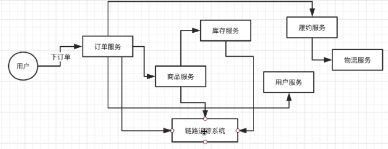
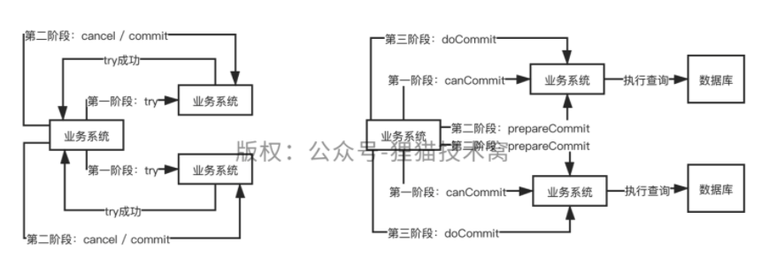
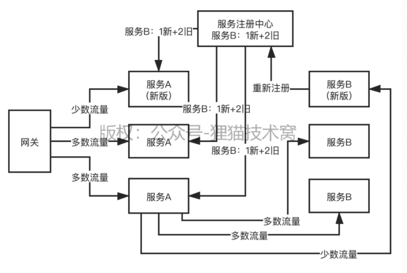
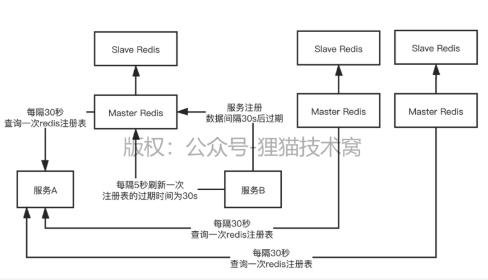

# 分布式架构高级

## 1. 链路追踪系统

什么是分布式链路追踪。下订单之后，直到返回，需要几秒钟。每个系统之间的调用。追踪了有什么用，调用链路

+ 链路性能监控
+ 链路故障排查

Google的Dapper，阿里的鹰眼，大众点评的CAT，Twitter的Zipkin，LINE的pinpoint，国产的skywalking，很多，国内一般用CAT和zipkin比较多

其实核心架构就是做一个框架，然后每一次服务调用都要经过这个框架，框架采集调用链路的数据存储起来，然后有可视化界面展示出来每个调用链路，性能，故障，这些东西
订单服务收到这个请求是12:00:00，商品服务收到这个请求是12:00:01，库存服务收到这个请求是12:00:10

+ 每一个请求入口 , traceid 
+ 每一服务调用， spanid 
+ 上游服务 id , parenetid 
+ 调用时间． timestamp ，有正向的，还有反向的，把请求发出，请求接收，业务处理，各种时间都记录下来，计算网络耗时和业务处理耗时

底层的服务框架，接收到每一层请求调用的州侯都要交给链路追踪系统的客户端框架来处理一下traceid代表了一次请求 

> traceid = 1 , spanid = 1 , parentid = 0 , received_ timestamp = 12 : 00 : 00 300 , send _ timestamp = 12 : 00 : 00 302 //订单服务
> traceid = 1 , spanid = 2 , parentid = 1 , received _ timestamp = 12 : 00 : 00 303 , send _ timestamp = 12 : 00 : 00 305 //商品服务
> traceid = 1 , spanid = 3 , parentid = 2 , received _ timestamp = 12 : 00 : 00 306  //库存服务
> traceid = 1 , spanid = 3 , parentid = 2 , send _ timestamp = 12 : 00 : 05 502 //库存服务
> traceid = 1 , spanid = 2 , parentid = 1 , received _ timestamp 二 12 : 00 : 05 503 //商品服务

## 2. 三阶段提交

#### 两阶段提交

+ try: 预留锁定资源

+ commit/cancel：如果try成功, 就提交修改。如果没有同时try成功，就回滚操作

#### 三阶段提交

+ canCommit：能否提交事务
+ prepareCommit：锁定资源，但是不提交修改
+ doCommit：提交修改或者回滚

## 3. snowflake算法时钟回拨

snowflake，一串数字，用很多的二进制里的bit位，去代表不同的东西

40多位都是当前机器上的时间，中间有几位是代表的是机器id，当前一秒内自增长的id

分布式业务系统，分布在很多台机器上，这很多台机器都要生成唯一的id，不能重复，此时可以调用某台机器上的snowflake算法生成的唯一id

> 12:00:00 500 28 1~20
> 12:00:04 300 28 1~20

12:00:05 308，**当前你的snowflake算法部署的机器发生了本地时钟的回拨，时间回拨到了12:00:00 500这个时间**

判断是否发生了时钟回拨，当前时间比我上一次生成id的时间要小，此时就是发生了时钟回拨问题，12:00:00 500 28 1~20，snowflake算法生成的不重复的id，**此时会导致生成的id是重复的**，这就比较坑了

比较简单容易理解的思路，当前的机器的可能会跟一台基准时间服务器进行时间校准，导致你的机器的时间本来跑的稍微快了一点，此时跟基准时间服务器进行了校准，你的时间回拨回去了，倒退回去了

**你在内存里把过去1个小时之内生成的每一毫秒的每台机器生成的id都在内存里保存最大的那个id**

> 12:00:00 500 28 20
> 12:00:04 300 28 8

如果发生了时钟回拨，**此时你看看时钟汇报到了之前的哪一毫秒里去，直接接着在那一毫秒里的最大的id继续自增就可以了**，12:00:00 500 28 21

## 4. 灰度发布

**网关灰度发布**：按照服务的流量权重把少量流量发给新版的服务

**组件灰度发布**：新版服务会打一个标签，比如服务B，1台服务器新版本，2台服务器旧版本。服务A会从服务注册中心拉取服务B的注册信息，把少量的流量发送到新版的服务B

## 5. Redis 做服务注册中心

+ **服务注册过期**：约定服务注册30s后过期
+ **服务注册前缀**：你的服务注册的key都是：service_ORDER，service_PRODUCT，scan扫描指定的前缀开头的所有的key，一次性把注册表里的几十个到几百个服务都给扫描出来，获取到一个完整的注册表

基于Redis还可以做分布式服务注册中心，Redis Cluster，做一个集群