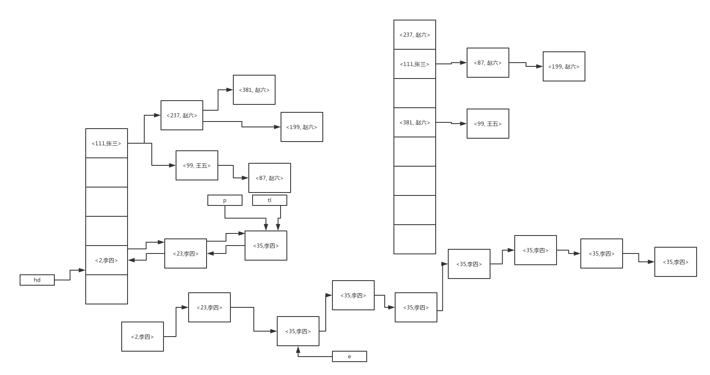
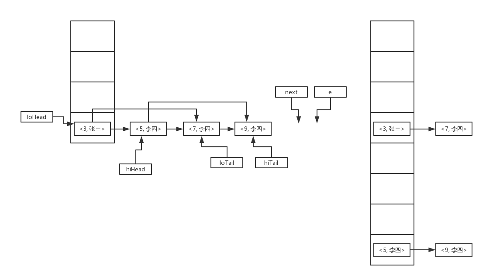
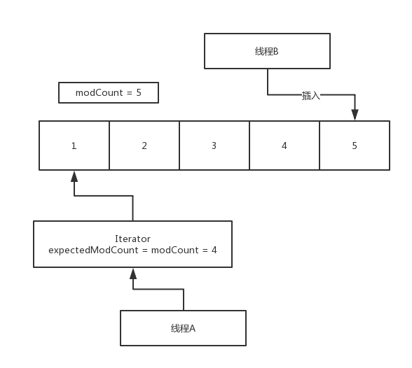

# Java核心


## 1. ArrayList 源码解析

原理就是底层基于数组来实现。

### 缺点

+ 数组的长度是固定的，java里面数组都是定长数组，比如数组大小设置为100，此时你不停的往ArrayList里面塞入这个数据，此时元素数量超过了100以后，此时就会发生一个数组的扩容，就会搞一个更大的数组，把以前的数组拷贝到新的数组里面去。 这个数组扩容+元素拷贝的过程，相对来说会慢一些。不要频繁的往ArrayList里面去塞数据，导致他频繁的数组扩容，避免扩容的时候较差的性能影响了系统的运行

+ 数组来实现，数组你要是往数组的中间加一个元素，是不是要把数组中那个新增元素后面的元素全部往后面挪动一位，所以说，如果你是往ArrayList中间插入一个元素，性能比较差，会导致他后面的大量的元素挪动一个位置

### 优点 

+ 非常适合随机读，你可以随机的去读数组中的某个元素，list.get(10)，相当于是在获取第11个元素，这个随机读的性能是比较高的，随机读，list.get(2)，list.get(20)，随机读list里任何一个元素。 因为基于数组来实现，他在随机获取数组里的某个元素的时候，性能很高，他可以基于他底层对数组的实现来快速的随机读取到某个元素，直接可以通过内存地址来定位某个元素。


ArrayList，常用，如果你不会频繁的在里面插入一些元素，不会导致频繁的元素的位置移动、数组扩容，就是有一批数据，查询出来，灌入ArrayList中，后面不会频繁插入元素了，主要就是遍历这个集合，或者是通过索引随机读取某个元素，使用ArrayList还是比较合适的。

若果你涉及到了频繁的插入元素到list中的话，尽量还是不要用ArrayList，数组，定长数组，长度是固定的，元素大量的移动，数组的扩容+元素的拷贝

开发系统的时候，大量的场景，需要一个集合，里面可以按照顺序灌入一些数据，ArrayList的话呢，他的最最主要的功能作用，就是说他里面的元素是有顺序的，我们在系统里的一些数据，都是需要按照我插入的顺序来排列的


默认的构造函数，直接初始化一个ArrayList实例的话，会将内部的数组做成一个默认的空数组，{}，Object[]，他有一个默认的初始化的数组的大小的数值，是10，也就是我们可以认为他默认的数组初始化的大小就是只有**10个元素**

ArrayList的话，玩儿好的话，一般来说，你应该都不是使用这个默认的构造函数，你构造一个ArrayList的话，基本上来说就是默认他里面不会有太频繁的插入、移除元素的操作。**基本上最好是给ArrayList构造的时候，给一个初始化的数组的大小**，比如说，100个数据，1000,10000，避免数组太小，往里面塞入数据的时候，导致数据不断的扩容，不断的搞新的数组

```java
ensureCapacityInternal(size + 1);  // Increments modCount!!
```

你每次往ArrayList中塞入数据的时候，人家都会判断一下，当前数组的元素是否塞满了，如果塞满的话，此时就会扩容这个数组，然后将老数组中的元素拷贝到新数组中去，确保说数组一定是可以承受足够多的元素的

### add(E)源码

```java
public boolean add(E e) {
    ensureCapacityInternal(size + 1);  // Increments modCount!!
    elementData[size++] = e;
    return true;
}
```

### set()源码

```java
E oldValue = elementData(index);
```

### add(index, e)源码

```java
System.arraycopy(elementData, index, elementData, index + 1, size - index);
elementData[index] = element;
```

### get()方法的源码

```java
elementData[index]
```

### remove(index)源码

```java
E oldValue = elementData(index);
int numMoved = size - index - 1;
if (numMoved > 0)
  System.arraycopy(elementData, index+1, elementData, index, numMoved);
elementData[--size] = null;
```


### 源码分析的总结

remove(), add(index, element) 这个两个方法，都会导致数组的拷贝，大量元素的挪动，性能都不是太高，基于数组来做这种随机位置的插入和删除，其实性能真的不是太高

add()、add(index, element)，这两个方法，都可能会导致数组需要扩容，数组长度是固定的，默认初始大小是10个元素，如果不停的往数组里塞入数据，可能会导致瞬间数组不停的扩容，影响系统的性能

set(), get()，定位到随机的位置，替换那个元素，或者是获取那个元素，这个其实还是比较靠谱的，基于数组来实现随机位置的定位，性能是很高的


ArrayList里面最关键的一块，就是如果数组填充满了以后，如何进行扩容

+ 假设我们现在用的是默认的一个数组的大小，也就是10，现在呢已经往这个数组中添加了10个元素了，此时数组的size = 10，capacity = 10
+ 此时调用add()方法插入一个元素，插入第11个元素咯，肯定是插入不进去的

```
ensureCapacityInternal(minCapacity)
calculateCapacity(elementData, minCapacity)
```

+ elementData已经填充了10个元素了，minCapacity = 11

+ elementData.length是默认的值，其实就是10，也就是说默认的情况下，这个数组最多只能放10个元素

+ 要放第11个元素，elementData.length，最多只能放10个，同时现在已经放了10个了，你现在是要放第11个元素，所以此时会对数组进行扩容

```java
private void grow(int minCapacity) {
  // overflow-conscious code
  int oldCapacity = elementData.length;
  int newCapacity = oldCapacity + (oldCapacity >> 1);
  if (newCapacity - minCapacity < 0)
    newCapacity = minCapacity;
  if (newCapacity - MAX_ARRAY_SIZE > 0)
    newCapacity = hugeCapacity(minCapacity);
  // minCapacity is usually close to size, so this is a win:
  elementData = Arrays.copyOf(elementData, newCapacity);
}
```


+ 数组扩容的时候，他是怎么扩的，老的大小 + 老的大小 >> 1（相当于除以2），实现了一个数组的拷贝

+ 最新的数组，变成了可以容纳15个元素的数组，但是此时数组中只有10个元素

看完了这个JDK的源码，非常简单的，算扩容的新数组的大小.搞一个新数组，Arrays.copyOf()工具方法，完成老数组到新数组的一个拷贝. 基于数组来玩儿，最大的问题就是不要频繁的往里面灌入大量的数据，导致频繁的数组的扩容，新老数组元素拷贝，中间的位置插入元素，删除元素，会导致大量的元素的移动

***


## 2. LinkedList 源码解析

LinkedList，底层是基于链表来实现的. LinkedList，链表，一个节点挂着另外一个节点。 LinkedList，如果技术真的好的话，**不要说LinkedList是基于链表实现的，说LinkedList是基于双向链表实现的**，指针，双向链表的数据结构。

### 优点

往这个里面中间插入一些元素，或者不停的往list里插入元素，都没关系，因为人家是链表，中间插入元素，不需要跟ArrayList数组那样子，挪动大量的元素的，不需要，人家直接在链表里加一个节点就可以了. 如果你不断的往LinkedList中插入一些元素，大量的插入，就不需要像ArrayList数组那样还要去扩容啊什么的，人家是一个链表，就是不断的把新的节点挂到链表上就可以了

### 缺点

LinkedList的缺点，不太适合在随机的位置，获取某个随机的位置的元素，比如LinkedList.get(10)，这种操作，性能就很低，因为他需要遍历这个链表，从头开始遍历这个链表，直到找到index = 10的这个元素为止

  

### 使用场景

+ ArrayList：一般场景，都是用ArrayList来代表一个集合，只要别频繁的往里面插入和灌入大量的元素就可以了，遍历，或者随机查，都可以
+ LinkedList：适合，频繁的在list中插入和删除某个元素，然后尤其是LinkedList他其实是可以当做队列来用的，这个东西的话呢，我们后面看源码的时候，可以来看一下，先进先出，在list尾部怼进去一个元素，从头部拿出来一个元素。如果要在内存里实现一个基本的队列的话，可以用LinkedList

用到了内存队列，**用的就是LinkedList**，他里面基于链表实现，天然就可以做队列的数据结构，先进先出，链表来实现，特别适合频繁的在里面插入元素什么的，也不会导致数组扩容

 

### add(index, element) 源码

是在队列的中间插入一个元素

```java
Node<E> node(int index) {
  // assert isElementIndex(index);

  if (index < (size >> 1)) {
    Node<E> x = first;
    for (int i = 0; i < index; i++)
      x = x.next;
    return x;
  } else {
    Node<E> x = last;
    for (int i = size - 1; i > index; i--)
      x = x.prev;
    return x;
  }
} 
```


### get(index) 源码

```java
public E get(int index) {
	checkElementIndex(index);
	return node(index).item;
}
```


JDK的代码一般写的都是很精简，特别注重代码质量，JDK的代码的质量都是比较高的，数据结构的基础薄弱，JDK源码，学习一些最最基础的入门级别的数据结构的一些东西

完全可以学习一下JDK源码的实现，人家的各种list、queue、stack、map、set的数据结构的实现原理，代码是怎么写的，非常值得你来学习，我甚至建议大家如果有空闲的同学，仿照一下JDK对一些集合的实现原理，自己来实现一些LinkedList、ArrayList，把里面的核心方法的代码写一下 

**是获取index位置的Node**

+ size >> 1，比如说现在是size = 4，size >> 1相当于是size / 2，整除，得到的是2
+ index < (size >> 1)，如果index < (size / 2)，如果要插入的位置，是在队列的前半部分，那么就会从队列头部开始遍历，找到index那个位置的Node


## 3. Vector 源码解析

栈，Vector和Stack两个来实现的，Stack代表了一个栈这种数据结构，他是继承自Vector来实现的，Vector是一种类似于ArrayList（基于数组来实现的）数据结构，有序的集合，Stack是一种基于数组来实现的栈数据结构

 

+ 队列：一般是队尾巴进去开始排队，从队头开始出来，排队的过程，先进先出
+ 栈：进去的时候直接压入栈底，出来的时候是从栈的最上面一个元素开始先出来，先进后出

#### 扩容

+ ArrayList每次扩容是1.5倍，capacity + (capacity >> 1) = 1.5
+ Vector每次扩容默认是2倍，默认情况下是直接扩容两倍，2倍


## 4. HashMap 源码解析

### 概述

“手动阀”和”聊扣扣”，如果假设他们的hash值是一样的，怎么办呢？但是这是两个不一样的key啊，hash值一样会导致他们放到同一个数组的索引的位置上去，此时如何处理呢？其实在**JDK 1.8以前，链表解决**。如果有很多的hash冲突，也就是说多个key的hash值，是一样的；或者也可能是多个key的hash值不一样，但是不同的hash值对一个数组的length取模，获取到的这个数组的index位置，是一样的

  

JDK 1.8以后，优化了一下，如果一个链表的长度超过了8，就会自动将链表转换为红黑树，查找的性能，是O(logn)，这个性能是比O(n)要高的，如果你此时要搜索map.get(381)，如果是链表的话，你必须要遍历5个节点

+ 红黑树是二叉查找树，左小右大，根据这个规则可以快速查找某个值
+ 但是普通的二叉查找树，是有可能出现瘸子的情况，只有一条腿，不平衡了，导致查询性能变成O(n)，线性查询了
+ 红黑树，红色和黑色两种节点，有一大堆的条件限制，尽可能保证树是平衡的，不会出现瘸腿的情况
+ 如果插入节点的时候破坏了红黑树的规则和平衡，会自动重新平衡，变色（红 <-> 黑），旋转，左旋转，右旋转

JDK 1.8以后，hashmap的数据结构是，数组 + 链表 + 红黑树


### 源码

```java
static final int DEFAULT_INITIAL_CAPACITY = 1 << 4; // aka 16
```

**应该是数组的默认的初始大小是16**，这个跟ArrayList是不一样的，初始的默认大小是10

 

```java
static final float DEFAULT_LOAD_FACTOR = 0.75f;
```

这个数组的大小，一般会自己手动指定一下，就跟你用ArrayList一样，你需要去预估一下你的这个数据结构里会放多少key-value对，指定的大一些，避免频繁的扩容

这个参数，默认的负载因子，**如果你在数组里的元素的个数达到了数组大小（16） * 负载因子（0.75f）**，默认是达到12个元素，就会进行数组的扩容

 

```java
  static class Node<K,V> implements Map.Entry<K,V> {
  	final int hash;
		final K key;
		V value;
		Node<K,V> next;
}		
```

这是一个很关键的内部类，他其实是代表了一个key-value对，里面包含了key的hash值，key，value，还有就是可以有一个next的指针，指向下一个Node，也就是指向单向链表中的下一个节点。 通过这个next指针，就可以形成一个链表

 

```java
transient Node<K,V>[] table;
```

Node<K, V>[]，这个数组就是所谓的map里的核心数据结构的数组，数组的元素就可以看到是Node类型的，天然就可以挂成一个链表，单向链表，Node里面只有一个next指针

 

```java
transient int size;
```

这个size代表的是就是当前hashmap中有多少个key-value对，如果这个数量达到了指定大小 * 负载因子，那么就会进行数组的扩容

 

```java
int threshold;
```

这个值，其实就是说capacity（就是默认的数组的大小），就是说capacity * loadFactory，就是threshold，如果size达到了threshold，那么就会进行数组的扩容，如果面试这么回答，你就是在打自己的脸

 

### Put(Key, Value) 源码 

map.put(key, value) -> 对key进行hash算法，通过hash获取到对应的数组中的index位置


```java
public V put(K key, V value) {
   return putVal(hash(key), key, value, false, true);
}

static final int hash(Object key) {
  int h;
  return (key == null) ? 0 : (h = key.hashCode()) ^ (h >>> 16);
}
```

 

hash(key)，对key进行hash获取一个对应的hash值，key、value传入到putVal()方法里面去，将key-value对儿根据其hash值找到对应的数组位置。 hash(key)方法JDK源码里面，涉及到了大量的位运算，我需要给大家来手动计算一下位运算操作符的计算过程和结果

 

h = key.hashCode()：这个就是直接获取了key的hash值，通过的是hashCode()方法

 

> 1111 1111 1111 1111 1111 1010 0111 1100
> h >>> 16，这个是位运算的操作，这个东西是把32位的二进制的数字，所有的bit往右侧右移了16位
>
>  
>
> 1111 1111 1111 1111 1111 1010 0111 1100
>-> h >>> 16
> 0000 0000 0000 0000 1111 1111 1111 1111
>
> 
>
> -> h ^ (h >>> 16)
>1111 1111 1111 1111 1111 1010 0111 1100
>  0000 0000 0000 0000 1111 1111 1111 1111 
>1111 1111 1111 1111 0000 0101 1000 0011

 

将他的高16位和低16位进行一个异或(**XOR**)运算。提前在hash()函数里面，就会把高16位和低16位进行一下异或运算，就可以保证说，在hash值的低16位里面，可以同时保留他的高16位和低16位的特征，大家一定要记住这个结论。 高16位是不变的

**相当于是在后面定位到数组index的位运算的时候，哪怕只有低16位参与了运算，其实运算的时候，他的hash值的高16位和低16位的特征都参与到了运算定位到那个数组的index**。**因为这样子可以保证降低hash冲突的概率**，如果说直接用hash值的低16位去运算定位数组index的话，可能会导致一定的hash冲突

**很多key，可能值不同，但是hash值可能是相同的，如果key不同，但是hash值相同，或者是hash值不同，但是到数组的index相同，那么都会出现hash冲突**


```java
if ((tab = table) == null || (n = tab.length) == 0)
	n = (tab = resize()).length;
```

刚开始table数组是空的，所以会分配一个默认大小的一个数组，数组大小是16，负载因子是0.75，threshold是12

 

```java
if ((p = tab[i = (n - 1) & hash]) == null) 
```

> n = 16
> n - 1 = 15
> 15 & hash
> 1111 1111 1111 1111 0000 0101 1000 0011
> 0000 0000 0000 0000 0000 0000 0000 1111
> 0000 0000 0000 0000 0000 0000 0000 0011

算出hash 以后和 size -1 进行一个与操作，转成10进制，就是3，index = 3，就是最后寻址算法获取到的那个hash值对应的数组的index。 每次扩容2^n


### Hash 冲突-链表

```java
if ((tab = table) == null || (n = tab.length) == 0)
            n = (tab = resize()).length;
        if ((p = tab[i = (n - 1) & hash]) == null)
            tab[i] = newNode(hash, key, value, null);
        else {
            Node<K,V> e; K k;
            if (p.hash == hash &&
                ((k = p.key) == key || (key != null && key.equals(k))))
                e = p;
            else if (p instanceof TreeNode)
                e = ((TreeNode<K,V>)p).putTreeVal(this, tab, hash, key, value);
            else {
                for (int binCount = 0; ; ++binCount) {
                    if ((e = p.next) == null) {
                        p.next = newNode(hash, key, value, null);
                      	
                     		// 如果链表长度大于等于8，就更新去红黑树
                        if (binCount >= TREEIFY_THRESHOLD - 1) // -1 for 1st
                            treeifyBin(tab, hash);
                        break;
                    }
                    if (e.hash == hash &&
                        ((k = e.key) == key || (key != null && key.equals(k))))
                        break;
                    p = e;
                }
            }
            if (e != null) { // existing mapping for key
                V oldValue = e.value;
                if (!onlyIfAbsent || oldValue == null)
                    e.value = value;
                afterNodeAccess(e);
                return oldValue;
            }
```


+ 比较hashcode，比较key，如果key一样，就是相同的key在进行value的覆盖
+ 出现了hash冲突，然后此时还不是红黑树的数据结构，还是链表的数据结构
  + 先找到尾节点，把e指针指向尾节点next
  + 在e指针指向的节点位置构造出一个新的节点
  + 把p指针指向新的尾节点

+ 就是说如果当前链表的长度（binCount），大于等于TREEIFY_THRESHOLD - 1的话，如果链表的长度大于等于8的话，链表的总长度达到8的话，那么此时就需要将这个链表转换为一个红黑树的数据结构

 


### Hash 冲突-红黑树

当你遍历到第8个节点，此时binCount是7，同时你挂上了第9个节点，然后就会发现binCount >= 7，达到了临界值，也就是说，当你的链表节点的数量超过8的时候，此时就会将链表转换为红黑树

```java
static final class TreeNode<K,V> extends LinkedHashMap.Entry<K,V> {
        TreeNode<K,V> parent;  // red-black tree links
        TreeNode<K,V> left;
        TreeNode<K,V> right;
        TreeNode<K,V> prev;    // needed to unlink next upon deletion
        boolean red;
        TreeNode(int hash, K key, V val, Node<K,V> next) {
            super(hash, key, val, next);
        }
  
final void treeifyBin(Node<K,V>[] tab, int hash) { 
  int n, index; Node<K,V> e;
  if (tab == null || (n = tab.length) < MIN_TREEIFY_CAPACITY)
    resize();
  else if ((e = tab[index = (n - 1) & hash]) != null) {
    TreeNode<K,V> hd = null, tl = null;
    do {
      TreeNode<K,V> p = replacementTreeNode(e, null);
      if (tl == null)
        hd = p;
      else {
        p.prev = tl;
        tl.next = p;
      }
      tl = p;
    } while ((e = e.next) != null);
    if ((tab[index] = hd) != null)
      hd.treeify(tab);
  }
}
```


接下来针对双向链表，将双向链表转换为一颗红黑树，直接记住这个结论就ok了，当链表的长度超过8的时候，链表就先是变成双向链表，然后是变成红黑树

假设现在某个地方已经是一颗红黑树了, 如果此时在那个地方再次出现一个hash冲突的话，此时就应该是在红黑树里插入一个节点了，不是说挂链表了，红黑树是一个平衡的二叉查找树，平衡的，插入的时候还挺复杂的，变色、旋转


### 扩容 （无冲突）

hashmap底层是基于数组来实现的核心的数据结构，如果是用数组的话，就天然会有一个问题，就跟ArrayList一样，就是数组如果满了，就必须要扩容，hashmap所以也是有扩容的问题存在的

如果数组的长度扩容之后 = 32，重新对每个hash值进行寻址，也就是用**每个hash值跟新数组的length - 1进行与操作**

 

> n-1       0000 0000 0000 0000 0000 0000 0001 1111
> hash1  1111 1111 1111 1111 0000 1111 0000 0101
> &结果  0000 0000 0000 0000 0000 0000 0000 0101 = 5（index = 5的位置） 
>
> n-1       0000 0000 0000 0000 0000 0000 0001 1111
> hash2  1111 1111 1111 1111 0000 1111 0001 0101
> &结果  0000 0000 0000 0000 0000 0000 0001 0101 = 21（index = 21的位置）
>
> 00101 = 5
> 10101 = 21

 

**hashmap的底层原理**

+ hash算法：为什么要高位和低位做异或运算
+ hash寻址：为什么是hash值和数组.length - 1进行与运算。
+ hash冲突的机制：链表，超过8个以后，红黑树
+ 扩容机制：数组2倍扩容，重新寻址（rehash），hash & n - 1，判断二进制结果中是否多出一个bit的1，如果没多，那么就是原来的index，如果多了出来，那么就是**index + oldCap (5 + 16 = 21)**，通过这个方式，就避免了rehash的时候，用每个hash对新数组.length取模，取模性能不高，位运算的性能比较高

 




### 扩容 （有冲突，链表分区）

大概的原理跟我们上面给大家讲解的那套东西是差不多那个意思，就是说他会判断一下，如果是一个链表里的元素的话，那么要么是直接放在新数组的原来的那个index，要么就是原来的index + oldCap

 

 

> hash1             	 	1111 1111 1111 1111 0000 1111 0000 0101
> oldCap（16）        0000 0000 0000 0000 0000 0000 0001 0000
> &运算              		0000 0000 0000 0000 0000 0000 0000 0000
>
>  
>
> hash2              		1111 1111 1111 1111 0000 1111 0001 0101
> oldCap（16）        0000 0000 0000 0000 0000 0000 0001 0000
> &运算              		0000 0000 0000 0000 0000 0000 0001 0000 = 16 != 0


## 5. LinkedHashMap 源码解析

LinkedHashMap，他会记录你插入key-value的顺序， 如果你在遍历的时候，他是按照插入key-value对的顺序给你遍历出来的。 **LinkedHashMap是HashMap的一个子类。只是LinkedHashMap底层是基于双向链表来实现的，TreeMap是基于红黑树来实现顺序的**。

 

在调用LinkedHashMap的put()方法的时候，一定会调用到HashMap的put()方法里面去，调用完put()方法，插入一个key-value对之后，其实就会调用afterNodeInsertion(evict);，这个方法就会去**回调LinkedHahsMap里面的子类的实现**

```java
  void afterNodeInsertion(boolean evict) { // possibly remove eldest
		LinkedHashMap.Entry<K,V> first;
		if (evict && (first = head) != null && removeEldestEntry(first)) {
	      K key = first.key;
	      removeNode(hash(key), key, null, false, true);
	 }
}
```

 

newNode 方法被重写，实现了LinkedHashMap的逻辑，来记录插入key-value对的顺序，用一个链表来记录

```java
Node<K,V> newNode(int hash, K key, V value, Node<K,V> e) {
  LinkedHashMap.Entry<K,V> p =
    new LinkedHashMap.Entry<K,V>(hash, key, value, e);
  linkNodeLast(p);
  return p;
}

private void linkNodeLast(LinkedHashMap.Entry<K,V> p) {
  LinkedHashMap.Entry<K,V> last = tail;
  tail = p;
  if (last == null)
    head = p;
  else {
    p.before = last;
    last.after = p;
  }
}
```


+ **accessOrder默认是false**，如果是默认为false的话，那么你比如说你get一个key，或者是覆盖这个key的值，都不会改变他在链表里的顺序
+ **accessOrder是true的话**，那么如果get一个key或者是覆盖这个key的值，就会导致个key-value对顺序会在链表里改变，会被挪动到链表的尾部去，如果你把accessOrder指定为true，你每次修改一个key的值，或者是get访问一下这个key，都会导致这个key挪动到链表的尾部去

 

## 6. TreeMap 源码解析 

底层是基于红黑树做的数据结构，不是传统意义上的那红HashMap，可以按照你的key的自然顺序来排序，既然人家是按照key的大小来进行排序和迭代输出的

```java
 static final class Entry<K,V> implements Map.Entry<K,V> {
        K key;
        V value;
        Entry<K,V> left;
        Entry<K,V> right;
        Entry<K,V> parent;
        boolean color = BLACK;
 }
```


## 7. Set 源码解析

Set都是直接基于map来实现的。比如说HashSet就是基于HashMap来实现的。HashMap是不允许key重复的，他底层是一个数组，如果你的key重复了，你会hash寻址到数组的同一个位置去，然后覆盖原来的值。 

+ HashSet，他其实就是说一个集合，里面的元素是无序的，他里面的元素是没有重复的，HashMap的key是无顺序的，你插入进去的顺序，跟你迭代遍历的顺序是不一样的，而且HashMap的key是没有重复的，HashSet是不是直接就可以基于HashMap来实现啊
+ LinkedHashSet，他是有顺序的set，也就是维持了插入set的这个顺序，你迭代LinkedHashSet的顺序跟你插入的顺序是一样的，底层是不是直接就可以基于LinkedHashMap来实现的
+ TreeSet，默认是根据你插入进去的元素的值来排序的，而且可以定制Comparator，自己决定排序的算法和逻辑，他底层是不是可以基于TreeMap来实现

 

Set底层的Map，只有key是有值的，value都是null值，都是空的。HashSet底层是基于HashMap来实现的，所以底层也是有数组的，扩容的问题，你可以在构造HashSet的时候就传入数组的大小


## 8. Iterator 源码解析

迭代器在迭代的时候有fail-fast机制。 ConcurrentModificationException，并发修改的异常，这个机制就叫做fail fast。 modCount就是用来实现fail fast机制的，各个集合里面其实都有这个modCount的概念，只要这个集合被修改了，那么就会对modCount++。 modificationCount，修改次数，只要你修改一次，就会更新这个，add、remove、set

比如说在迭代一个ArrayList之前，已经插入了4个元素，此时modCount = 4，在你获取和初始化一个迭代器的时候，里面的expectedModCount就会被初始化为modCount，throw new ConcurrentModificationException();，并发修改冲突异常。 java集合包下的类，都是非线程安全的，所以说里面都设计了针对并发修改集合的问题，有fail fast机制，modCount




```java
final void checkForComodification() {
  if (modCount != expectedModCount)
    throw new ConcurrentModificationException();
}
```
