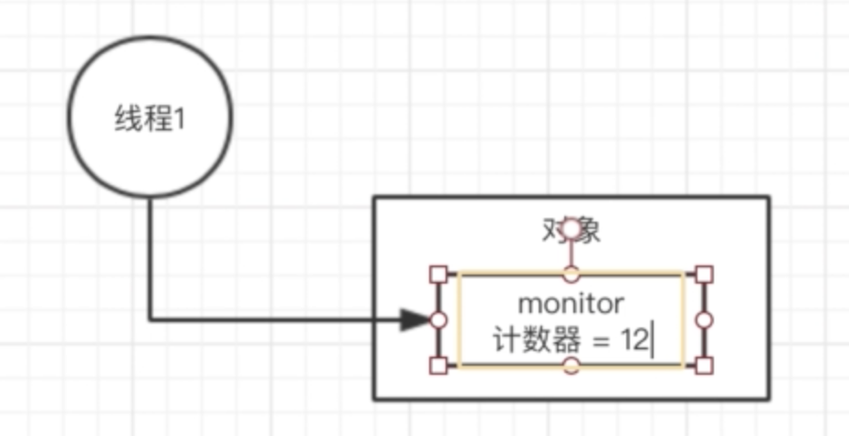
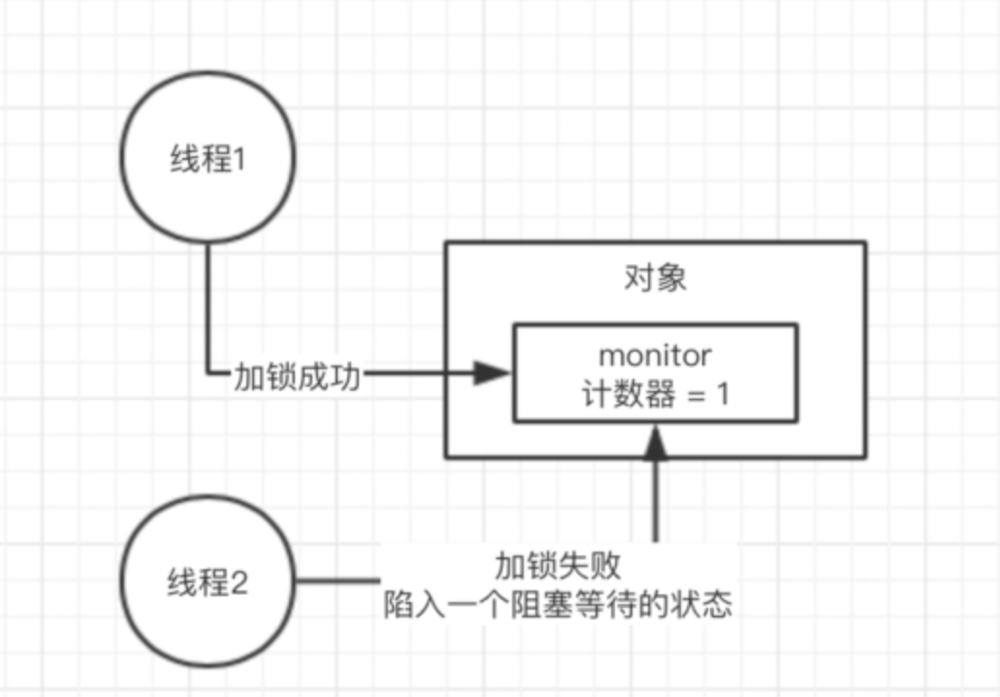
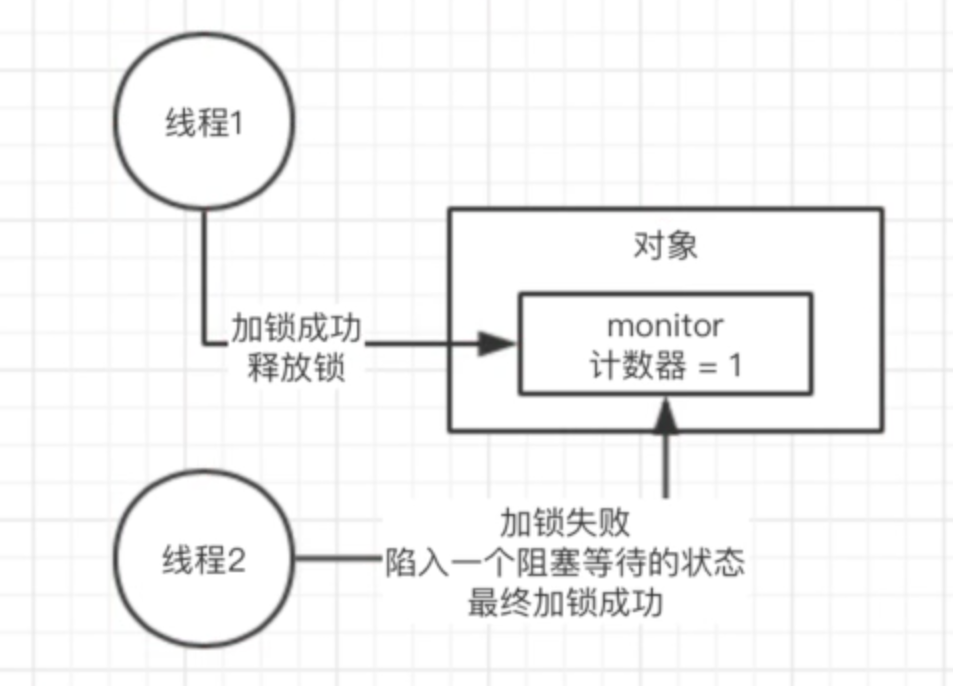
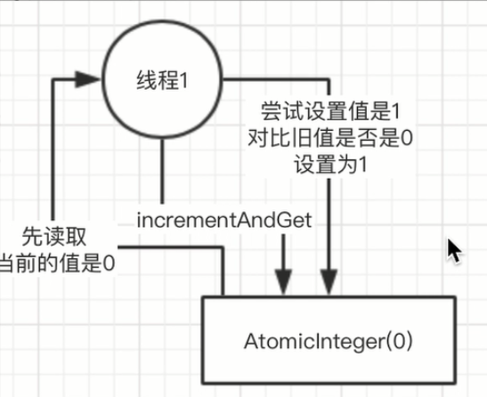
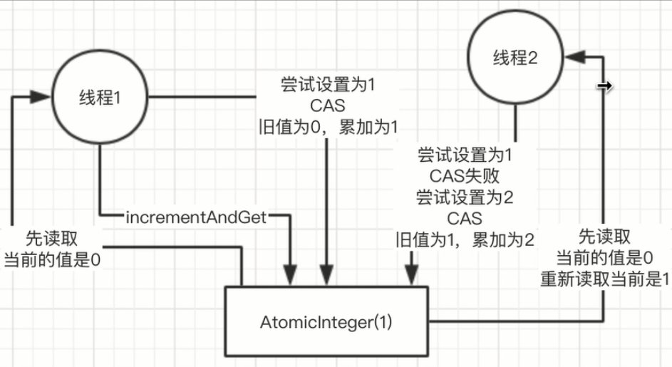
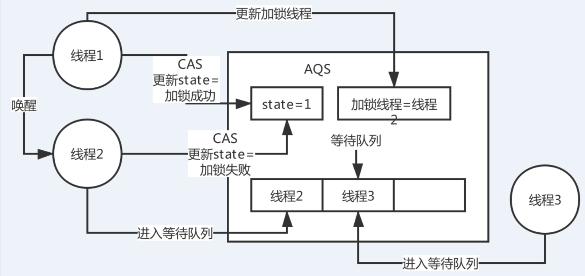
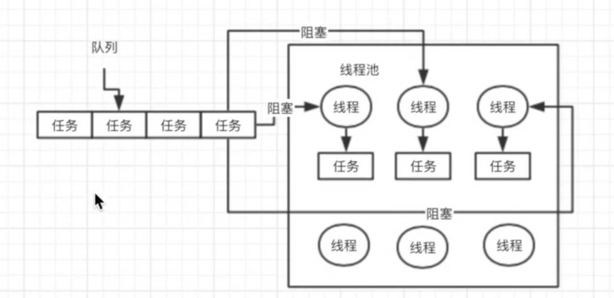
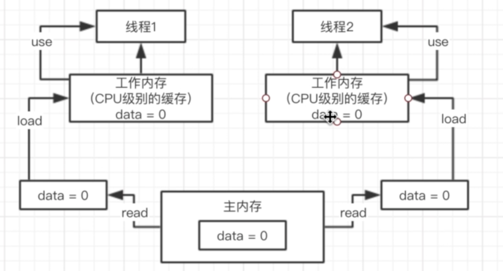
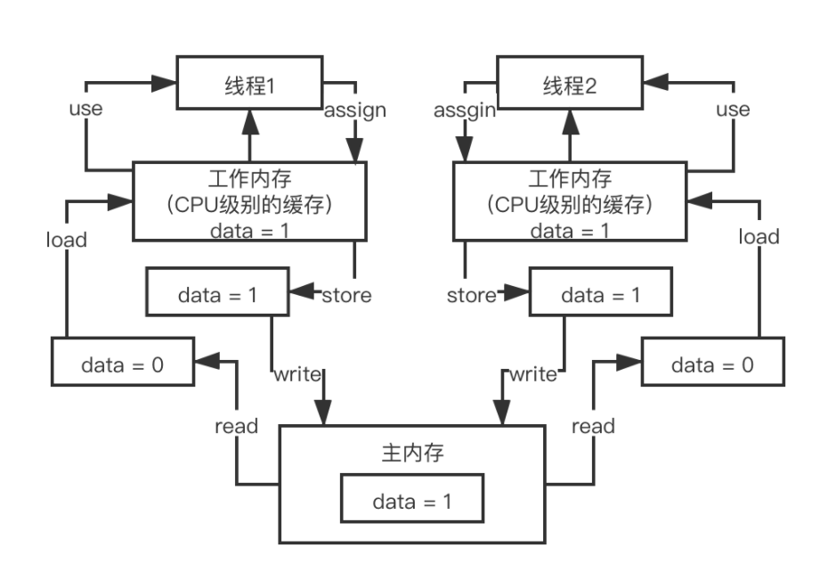

# Java 并发

- synchronized实现原理
- CAS无锁化的原理
- AQS是什么
- Lock锁
- ConcurrentHashMap的分段加锁的原理
- 线程池的原理
- java内存模型
- volatile说一下吗
- 对java并发包有什么了解？一连串的问题

写一些java web系统，运用一些框架和一些第三方技术，写一些类似于crud的业务逻辑，把各种技术整合一下，写一些crud而已，没什么技术含量。很多人可能写好几年的代码，都不会用到多少java并发包下面的东西。

如果说你要面试一些稍微好一点的公司，技术稍微好一点，你只要去做一个技术含量稍微高一点的系统，并发包下面的东西还是很容易会用到的。尤其是BAT，中大厂，有一定规模的公司，做出来的系统还是有一定的技术含量的。


## Synchronized 关键字

### moniterenter 

其实synchronized底层的原理，是跟jvm指令和monitor有关系的, 你如果用到了synchronized关键字，在底层编译后的jvm指令中，会有**monitorenter和monitorexit**两个指令

```java
monitorenter
// 代码对应的指令
monitorexit
```

monitorenter指令执行

- 一个线程加一次锁，monitor计数器就会往上加一。

- 每个对象都有一个关联的monitor，比如一个对象实例就有一个monitor，一个类的Class对象也有一个monitor，如果要对这个对象加锁，那么必须获取这个对象关联的monitor的lock锁

- monitor里面有一个计数器，从0开始的。

- 如果一个线程要获取monitor的锁，就看看他的计数器是不是0，如果是0的话，那么说明没人获取锁，他就可以获取锁了，然后对计数器加1

- 这个monitor的锁是支持重入加锁的。好比下面的代码片段

  ```java
  // 线程1
  synchronized(myObject) { -> 类的class对象来走的
    // 一大堆的代码
    synchronized(myObject) {
    // 一大堆的代码
    }
  }
  ```



+ 如果一个线程第一次synchronized那里，获取到了myObject对象的monitor的锁，计数器加1，然后第二次synchronized那里，会再次获取myObject对象的monitor的锁，这个就是重入加锁了，然后计数器会再次加1，变成2
+ 这个时候，其他的线程在第一次synchronized那里，会发现说myObject对象的monitor锁的计数器是大于0的，意味着被别人加锁了，然后此时线程就会进入block阻塞状态，什么都干不了，就是等着获取锁




### monitorexit

+ 接着如果出了synchronized修饰的代码片段的范围，就会有一个monitorexit的指令，在底层。此时获取锁的线程就会对那个对象的monitor的计数器减1，如果有多次重入加锁就会对应多次减1，直到最后，计数器是0
+ 然后后面block住阻塞的线程，会再次尝试获取锁，但是只有一个线程可以获取到锁




## CAS原理

**Get**：取值

**Compare**「询问」：先对比旧值是否还是0「当时取出来的值」

**Set**「修改」：如果还是0，那么就设置为1





```java
AtomicInteger i = new AtomicInteger(0)
i.incrementAndGet();
```

**synchronized**他的意思就是针对当前执行这个方法的myObject对象进行加锁。 **只有一个线程可以成功的对myObject加锁**，可以对他关联的monitor的计数器去加1，加锁，一旦多个线程并发的去进行synchronized加锁，**串行化，效率并不是太高**，很多线程，都需要排队去执行

**CAS在底层的硬件级别给你保证一定是原子的**，同一时间只有一个线程可以执行CAS，先比较再设置，其他的线程的CAS同时间去执行此时会失败。


## ConcurrentHashMap线程安全原理

JDK 1.8以后，优化细粒度，一个数组，每个元素进行CAS，如果失败说明有人了，此时synchronized对数组元素加锁，链表+红黑树处理，对数组每个元素加锁

JDK并发包里推出了一个ConcurrentHashMap，他默认实现了线程安全性，底层Bucket数组分为几分，称之为多个段，


### JDK 1.7之前版本分段加锁

分段**[数组1] , [数组2]，[数组3] -> 每个数组都对应一个锁，分段加锁**


### JDK 1.8之后版本元素CAS

[一个大的数组]，数组里每个元素进行put操作，都是有一个不同的锁，刚开始进行put的时候，如果两个线程都是在数组[5]这个位置进行put，这个时候，**对数组[5]这个位置进行put的时候，采取的是CAS的策略**

**同一个时间，只有一个线程能成功执行这个CAS**，就是说他刚开始先获取一下数组[5]这个位置的值，null，然后执行CAS，线程1，比较一下，put进去我的这条数据，同时间，其他的线程执行CAS，都会失败。 **通过对数组每个元素执行CAS的策略**，如果是很多线程对数组里不同的元素执行put，大家是没有关系的，如果其他人失败了，其他人此时会发现说，数组[5]这位置，已经给刚才有人放进去值了。就需要在这个位置基于**链表+红黑树来进行处理，synchronized(数组[5])加锁**，基于链表或者是红黑树在这个位置插进去自己的数据

**锁的升级策略：**

- 先CAS
- 出现CAS修改失败后，走Synchronized


## AQS - Abstract Queue Synchronizer

ReentrantLock, Semaphore 其他一些的并发包下的都是基于AQS「多线程同步器」实现的

```java
ReentrantLock lock = new ReentrantLock(true); => true：公平锁，默认为非公平锁
try{ lock.lock(); } final { lock.unlock();}
```



### 核心步骤

state变量 -> CAS -> 失败后进入队列等待 -> 释放锁后唤醒

- 核心变量 state
- lock底层加锁基于AQS实现
- 先CAS操作更新state ，只有一个线程可以成功
- 加锁成功之后，会更新加锁线程变量, 指向获取锁的线程对象
- AQS含义
  - 蕴含一个概念，会有一个Queue，等待队列
  - 加锁失败的线程会进入到等待队列中
  - 进入等待队列的线程就会挂起
- 当线程释放锁后，state会变为0，加锁线程更新为null
- 此时会唤醒等待队列排在队列头部的线程
- 依旧CAS进行加锁
  - 成功 state 为1，加锁线程修改为自己

### 非公平锁 - 默认策略

- 当持有锁线程的线程释放锁后
- 等待队列头部线程2被唤醒了，此时冒出来个线程3，进行加锁，还成功了
- 此时被唤醒的线程2进行CAS操作，失败了，只好继续排队等待锁

### 公平锁

- 那么突然冒出来的线程3，无法直接对线程进行加锁

- 会进入到AQS的等待队列中进行排队等待

  

## 线程池

频繁的创建线程，销毁线程，创建线程，销毁线程

买一个碗，吃完就砸掉，死循环....  何不循环利用？

```java
ExecutorService threadPool = Executors.newFixedThreadPool(3) -> 3: corePoolSize
threadPool.submit(new Callable() {
  	public void run() {}
})；
```

### 执行流程

- 提交任务，先看一下线程池里的线程数量是否小于corePoolSize，也就是3，如果小于，直接创建一个线程出来执行你的任务

- 如果执行完你的任务之后，这个线程是不会死掉的，**他会尝试从一个无界的LinkedBlockingQueue里获取新的任务，如果没有新的任务**，此时就会阻塞住，等待新的任务到来

- 你持续提交任务，上述流程反复执行，只要线程池的线程数量小于corePoolSize，都会直接创建新线程来执行这个任务，执行完了就尝试从无界队列里获取任务，直到线程池里有corePoolSize个线程

- 接着再次提交任务，会发现线程数量已经跟corePoolSize一样大了，此时就直接把任务放入队列中就可以了，线程会争抢获取任务执行的，如果所有的线程此时都在执行任务，那么无界队列里的任务就可能会越来越多

  

### 核心参数

```java
public ThreadPoolExecutor(int corePoolSize,
                              int maximumPoolSize,
                              long keepAliveTime,
                              TimeUnit unit,
                              BlockingQueue<Runnable> workQueue,
                              ThreadFactory threadFactory,
                              RejectedExecutionHandler handler) 
```

代表线程池的类是**ThreadPoolExecutor**， 创建一个线程池构造器，corePoolSize，maximumPoolSize，keepAliveTime，queue

**完整线程池工作原理**

- **CorePoolSize**第一道防线
- **队列**第二道防线
- **MaximumPoolSize** 第三道防线

这个时候假设你的maximumPoolSize是比corePoolSize大的，此时会继续创建额外的线程放入线程池里，来处理这些任务，然后超过corePoolSize数量的线程如果处理完了一个任务也会尝试从队列里去获取任务来执行



如果额外线程都创建完了去处理任务，队列还是满的，此时还有新的任务会根据策略拒绝

reject策略，可以传入 `RejectedExecutionHandler`

- AbortPolicy 抛异常 ⇒ Hystrix 线程池默认的策略
- DiscardPolicy 任务直接给你扔了
- DiscardOldestPolicy 扔掉在队列中排队最久的任务
- CallerRunsPolicy 返回给调用线程
- 自定义

如果后续慢慢的队列里没**任务了，线程空闲了，超过corePoolSize的线程会自动释放掉**，在keepAliveTime之后就会释放

根据上述原理去定制自己的线程池，考虑到corePoolSize的数量，队列类型，最大线程数量，拒绝策略，线程释放时间


### 无界队列

调用超时，队列变得越来越大，此时会导致**内存飙升**起来，而且还可能会导致你会OOM，内存溢出。 同时还**没有办法进行内存回收，必然内存溢出。**


### 线程队列蛮负荷

自定义一个reject策略，如果线程池无法执行更多的任务了，此时建议可以把这个**任务信息持久化写入磁盘里**去，后台专门启动一个线程，后续等待你的线程池的工作负载降低了，可以慢慢的从磁盘里读取之前持久化的任务，重新提交到线程池里去执行。

你可以**无限制的不停的创建额外的线程出来**，一台机器上，有几千个线程，甚至是几万个线程，每个线程都有自己的栈内存，占用一定的内存资源，**会导致内存资源耗尽，系统也会崩溃掉**。 即使内存没有崩溃，会导致你的机器的cpu load，负载，特别的高。


### 线程任务持久化

**线上机器宕机必然会导致线程池里的积压的任务实际上来说都是会丢失的**

如果说你要提交一个任务到线程池里去，在提交之前，先在数据库「持久化」里插入这个任务的信息，**更新他的状态：未提交、已提交、已完成**。提交成功之后，更新他的状态是已提交状态

系统重启，后台线程去扫描数据库里的未提交和已提交状态的任务，可以把任务的信息读取出来，重新提交到线程池里去，继续进行执行。


## 内存模型

```java
public class HelloWorld {
  private int data = 0;
  public void increment() {
    data++;
  }
}

HelloWorld helloworld = new HelloWorld();
new Thread(i -> hellowrld.increment()).start();
new Thread(i -> hellowrld.increment()).start();
```

以上代码在Java内存模型的运行过程：





### Java内存模型的六条指令

- READ, LOAD, USE
- ASSIGN, STORE, WRITE

主内存：对象，以及对象中的变量，都是存储在主内存中的

线程有自己的工作内存：其实本身来说，对应地就是CPU级别的缓存


### 可见性 & 原子性 & 有序性

#### 可见性

```java
new Thread(i -> data++).start();
new Thread(i -> {
  while (data == 0) {
    thread.sleep(100);
  }
}).start();
```

**没有可见性**

- 主内存中 data 为0
- 线程1需要更新它，线程2需要读取它的值
- 此时线程1，将data更新为1，并且写回到了主内存，此时data=1
  - 此时线程2的data一定等于1么？不一定
  - 会有一定的时间延迟, 不能够及时读取到主内存的最新值
  - 依旧是工作内存中缓存的旧的值

**有可见性**

- 主内存data为0
- 线程1需要更新它，线程2需要读取它的值
- 此时线程1，将data更新为1，并且写回到了主内存，此时data=1
  - 线程2读取data的时候
  - 会强制你去读取主内存中的最新的值，不允许使用CPU缓存「工作线程的旧的值」


#### 原子性

`data++` ，必须是独立执行的。一定是我自己执行成功之后，别人才能来进行下一次data++的执行

**有原子性**

- 线程1 ++ 的过程中，此时线程2是不可以执行 ++ 的相关操作的，会互斥
- 线程1 `read` `load` `use` `assign` `store` `write` 六条指令都执行完毕后，此时线程2才可以执行

**没有原子性**

- 两个线程都可以执行 `read` `load` `use` `assign` `store` `write`


#### 有序性

是指令重排序，编译器和指令器，有的时候为了提高代码执行效率，会将指令重排序，就是说比如下面的代码

```java
// 线程1
flag = true;
prepare();
flag = false;

// 线程2
while (!flag) {
}
execute();
```

- 具备有序性，**不会发生指令重排**导致我们的代码异常；
- 不具备有序性，可能会发生一些指令重排，导致代码可能会出现一些问题；

```java
flag = true;
// 线程1
prepare(); 

// 线程2
while (!flag) {
}
execute();
// 此时代码重排序，代码变异，发生异常
flag = false; // 这个时候就尴尬了，代码疯狂死循环...
```

重排序之后，让 `flag = true` 先执行了，会导致线程2直接跳过 `while` 等待，执行某段代码，结果 `prepare()`  方法还没执行，资源还没准备好呢，此时就会导致代码逻辑出现异常。


## Volatile原理

**volatile关键字是用来解决可见性和有序性**, 可以有限的保证原子性

### 可见性

```java
private volatile int data = 0;

new Thread(() -> data++).start();
new Thread(() -> while(data == 0) {Thread.sleep(100)}).start();
```


Volatile: 会保证，**一旦主内存data value change**，会**失效**其余线程工作内存中 data 的 value。 **类似于Cache aside pattern**，缓存与数据库双写一致性

在很多的开源中间件系统的源码里，大量的使用了volatile，每一个开源中间件系统，或者是大数据系统，都多线程并发，volatile

```java
public class Kafka {
   private volatile boolean running = true;
   public void shutdown() {
      running = false;
   }
  
    public static void main() {
       Kafka  kafka = new Kafka();
       while(kafka.running) { Thread.sleep(1000)};
    }
}
```


### 有序性

volatile关键字和有序性的关系，volatlie是如何保证有序性的，如何避免发生指令重排的

```java
// 线程1
flag = true;
prepare();
flag = false;

// 线程2
while (!flag) {
}
execute();
```

java中有一个happens-before原则：

编译器、指令器可能对代码重排序，乱排，要守一定的规则，happens-before原则，只要符合happens-before的原则，那就可以自己排序

+ **程序次序规则**：一个线程内，按照代码顺序，书写在前面的操作先行发生于书写在后面的操作
+ **锁定规则**：一个unLock操作先行发生于后面对**同一个锁的lock**操作
+ **volatile变量规则**：对一个volatile变量的写操作先行发生于后面对这个volatile变量的读操作，volatile变量写，再是读，必须保证是先写，再读
+ **传递规则**：如果操作A先行发生于操作B，而操作B又先行发生于操作C，则可以得出操作A先行发生于操作C
+ **线程启动规则**：Thread对象的start()方法先行发生于此线程的每个一个动作，先thread.start()，才有thread.interrupt()
+ **线程中断规则**：对线程**interrupt()方法的调用**先行发生于被中断线程的代码**检测到中断事件**的发生
+ **线程终结规则**：**线程中所有的操作都先行发生于线程的终止检测**，我们可以通过Thread.join()方法结束、Thread.isAlive()的返回值手段检测到线程已经终止执行
+ **对象终结规则**：一个对象的**初始化完成先行发生于他的finalize()**方法的开始

上面这8条原则的意思很显而易见，就是程序中的代码如果满足这个条件，就一定会按照这个规则来保证指令的顺序。

很多同学说：好像没听懂，模模糊糊，这些规则写的非常的拗口，晦涩难懂，在面试的时候比如面试官问你，happens-before原则，你必须把8条规则都背出来，反问，没有任何一个人可以随意把这个规则背出来的

规则制定了在一些特殊情况下，不允许编译器、指令器对你写的代码进行指令重排，必须保证你的代码的有序性

但是如果没满足上面的规则，那么就可能会出现指令重排，就这个意思。

这8条原则是避免说出现指令重排，要求是这几个重要的场景下，必须是按照顺序来，但是8条规则之外，可以随意重排指令。


比如这个例子，如果用volatile来修饰flag变量，一定可以让prepare()指令在flag = true之前先执行，这就禁止了指令重排。

因为volatile要求的是，volatile前面的代码一定不能指令重排到volatile变量操作后面，volatile后面的代码也不能指令重排到volatile前面。

指令重排 ⇒ happens-before ⇒ volatile起到避免指令重排


### 不保证原子性

volatile + 原子性：不能够保证原子性。

保证原子性，synchronized，lock，加锁


### 内存屏障

volatile底层原理「内存屏障」，如何实现保证可见性的呢？如何实现保证有序性的呢？

（1）lock指令：volatile保证可见性

对volatile修饰的变量，执行写操作的话，JVM会发送一条lock前缀指令给CPU，CPU在计算完之后会立即将这个值写回主内存，同时因为有MESI缓存一致性协议，所以各个CPU都会对总线进行嗅探，自己本地缓存中的数据是否被别人修改

如果发现别人修改了某个缓存的数据，那么CPU就会将自己本地缓存的数据过期掉，然后这个CPU上执行的线程在读取那个变量的时候，就会从主内存重新加载最新的数据了

```
lock前缀指令`  + `MESI缓存一致性协议
```

（2）内存屏障：volatile禁止指令重排序

volatille是如何保证有序性的？加了volatile的变量，可以保证前后的一些代码不会被指令重排，这个是如何做到的呢？指令重排是怎么回事，volatile就不会指令重排，简单介绍一下，内存屏障机制是非常非常复杂的，如果要讲解的很深入

```java
Load1：

int localVar = this.variable

Load2：

int localVar = this.variable2
```

LoadLoad屏障：Load1；LoadLoad；Load2，确保Load1数据的装载先于Load2后所有装载指令，他的意思，Load1对应的代码和Load2对应的代码，是不能指令重排的

```c++
Store1：
this.variable = 1

StoreStore屏障

Store2：
this.variable2 = 2
```

StoreStore屏障：Store1；StoreStore；Store2，确保Store1的数据一定刷回主存，对其他cpu可见，先于Store2以及后续指令

LoadStore屏障：Load1；LoadStore；Store2，确保Load1指令的数据装载，先于Store2以及后续指令

StoreLoad屏障：Store1；StoreLoad；Load2，确保Store1指令的数据一定刷回主存，对其他cpu可见，先于Load2以及后续指令的数据装载

```java
volatile的作用是什么呢？

volatile variable = 1

this.variable = 2 => store操作

int localVariable = this.variable => load操作
```

对于volatile修改变量的读写操作，都会加入内存屏障

每个volatile写操作前面，加StoreStore屏障，禁止上面的普通写和他重排；每个volatile写操作后面，加StoreLoad屏障，禁止跟下面的volatile读/写重排

每个volatile读操作后面，加LoadLoad屏障，禁止下面的普通读和voaltile读重排；每个volatile读操作后面，加LoadStore屏障，禁止下面的普通写和volatile读重排

并发这块，往深了讲

- synchronized、volatile，底层都对应着一套复杂的cpu级别的硬件原理，大量的内存屏障的原理；
- lock API，concurrenthashmap，都是各种复杂的jdk级别的源码，技术深度是很深入的