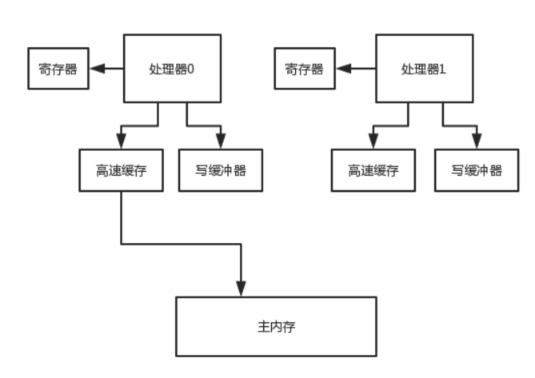
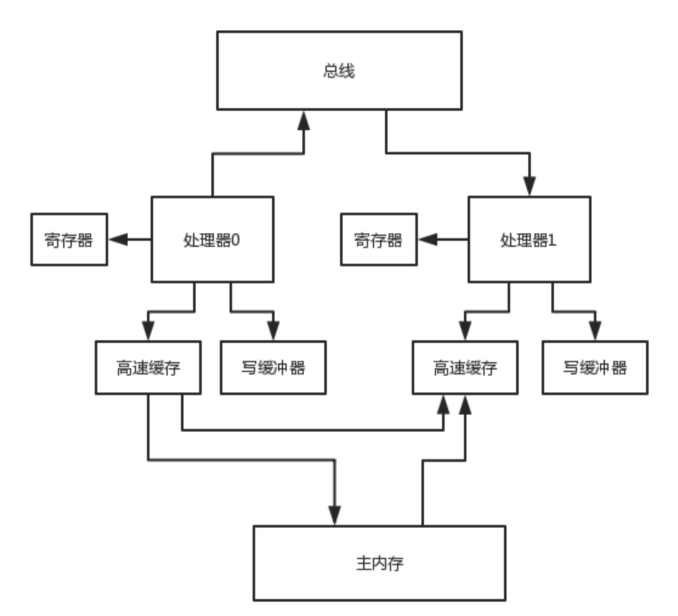

# 并发

- synchronized实现原理
- CAS无锁化的原理
- AQS是什么
- Lock锁
- ConcurrentHashMap的分段加锁的原理
- 线程池的原理
- java内存模型
- volatile说一下吗
- 对java并发包有什么了解？一连串的问题

写一些java web系统，运用一些框架和一些第三方技术，写一些类似于crud的业务逻辑，把各种技术整合一下，写一些crud而已，没什么技术含量。很多人可能写好几年的代码，都不会用到多少java并发包下面的东西。

如果说你要面试一些稍微好一点的公司，技术稍微好一点，你只要去做一个技术含量稍微高一点的系统，并发包下面的东西还是很容易会用到的。尤其是BAT，中大厂，有一定规模的公司，做出来的系统还是有一定的技术含量的。


## 1. Synchronized 关键字

### moniterenter 

其实synchronized底层的原理，是跟jvm指令和monitor有关系的, 你如果用到了synchronized关键字，在底层编译后的jvm指令中，会有**monitorenter和monitorexit**两个指令

```java
monitorenter
// 代码对应的指令
monitorexit
```

monitorenter指令执行

- 一个线程加一次锁，monitor计数器就会往上加一。
- 每个对象都有一个关联的monitor，比如一个对象实例就有一个monitor，一个类的Class对象也有一个monitor，如果要对这个对象加锁，那么必须获取这个对象关联的monitor的lock锁
- monitor里面有一个计数器，从0开始的。
- 如果一个线程要获取monitor的锁，就看看他的计数器是不是0，如果是0的话，那么说明没人获取锁，他就可以获取锁了，然后对计数器加1
- 这个monitor的锁是支持重入加锁的。好比下面的代码片段

```java
// 线程1
synchronized(myObject) { -> 类的class对象来走的
  // 一大堆的代码
  synchronized(myObject) {
  // 一大堆的代码
  }
}
```


+ 如果一个线程第一次synchronized那里，获取到了myObject对象的monitor的锁，计数器加1，然后第二次synchronized那里，会再次获取myObject对象的monitor的锁，这个就是重入加锁了，然后计数器会再次加1，变成2
+ 这个时候，其他的线程在第一次synchronized那里，会发现说myObject对象的monitor锁的计数器是大于0的，意味着被别人加锁了，然后此时线程就会进入block阻塞状态，什么都干不了，就是等着获取锁


### monitorexit

+ 接着如果出了synchronized修饰的代码片段的范围，就会有一个monitorexit的指令，在底层。此时获取锁的线程就会对那个对象的monitor的计数器减1，如果有多次重入加锁就会对应多次减1，直到最后，计数器是0
+ 然后后面block住阻塞的线程，会再次尝试获取锁，但是只有一个线程可以获取到锁


## 2. CAS原理

**Get**：取值

**Compare**「询问」：先对比旧值是否还是0「当时取出来的值」

**Set**「修改」：如果还是0，那么就设置为1


```java
AtomicInteger i = new AtomicInteger(0)
i.incrementAndGet();
```

**synchronized**他的意思就是针对当前执行这个方法的myObject对象进行加锁。 **只有一个线程可以成功的对myObject加锁**，可以对他关联的monitor的计数器去加1，加锁，一旦多个线程并发的去进行synchronized加锁，**串行化，效率并不是太高**，很多线程，都需要排队去执行

**CAS在底层的硬件级别给你保证一定是原子的**，同一时间只有一个线程可以执行CAS，先比较再设置，其他的线程的CAS同时间去执行此时会失败。

**通过MSEI最高速缓存对数据加锁，cache entry 的 flag 更改为E，就是独占锁**


## 3. ConcurrentHashMap线程安全原理

JDK 1.8以后，优化细粒度，一个数组，每个元素进行CAS，如果失败说明有人了，此时synchronized对数组元素加锁，链表+红黑树处理，对数组每个元素加锁

JDK并发包里推出了一个ConcurrentHashMap，他默认实现了线程安全性，底层Bucket数组分为几分，称之为多个段，


### JDK 1.7之前版本分段加锁

分段**[数组1] , [数组2]，[数组3] -> 每个数组都对应一个锁，分段加锁**


### JDK 1.8之后版本元素CAS

[一个大的数组]，数组里每个元素进行put操作，都是有一个不同的锁，刚开始进行put的时候，如果两个线程都是在数组[5]这个位置进行put，这个时候，**对数组[5]这个位置进行put的时候，采取的是CAS的策略**

**同一个时间，只有一个线程能成功执行这个CAS**，就是说他刚开始先获取一下数组[5]这个位置的值，null，然后执行CAS，线程1，比较一下，put进去我的这条数据，同时间，其他的线程执行CAS，都会失败。 **通过对数组每个元素执行CAS的策略**，如果是很多线程对数组里不同的元素执行put，大家是没有关系的，如果其他人失败了，其他人此时会发现说，数组[5]这位置，已经给刚才有人放进去值了。就需要在这个位置基于**链表+红黑树来进行处理，synchronized(数组[5])加锁**，基于链表或者是红黑树在这个位置插进去自己的数据

**锁的升级策略：**

- 先CAS
- 出现CAS修改失败后，走Synchronized


## 4. AQS - Abstract Queue Synchronizer

ReentrantLock, Semaphore 其他一些的并发包下的都是基于AQS「多线程同步器」实现的

```java
ReentrantLock lock = new ReentrantLock(true); => true：公平锁，默认为非公平锁
try{ lock.lock(); } final { lock.unlock();}
```


### 核心步骤

state变量 -> CAS -> 失败后进入队列等待 -> 释放锁后唤醒

- 核心变量 state
- lock底层加锁基于AQS实现
- 先CAS操作更新state ，只有一个线程可以成功
- 加锁成功之后，会更新加锁线程变量, 指向获取锁的线程对象
- AQS含义
  - 蕴含一个概念，会有一个Queue，等待队列
  - 加锁失败的线程会进入到等待队列中
  - 进入等待队列的线程就会挂起
- 当线程释放锁后，state会变为0，加锁线程更新为null
- 此时会唤醒等待队列排在队列头部的线程
- 依旧CAS进行加锁
  - 成功 state 为1，加锁线程修改为自己

### 非公平锁 - 默认策略

- 当持有锁线程的线程释放锁后
- 等待队列头部线程2被唤醒了，此时冒出来个线程3，进行加锁，还成功了
- 此时被唤醒的线程2进行CAS操作，失败了，只好继续排队等待锁

### 公平锁

- 那么突然冒出来的线程3，无法直接对线程进行加锁

- 会进入到AQS的等待队列中进行排队等待

  

## 5. 线程池

频繁的创建线程，销毁线程，创建线程，销毁线程

买一个碗，吃完就砸掉，死循环....  何不循环利用？

```java
ExecutorService threadPool = Executors.newFixedThreadPool(3) -> 3: corePoolSize
threadPool.submit(new Callable() {
  	public void run() {}
})；
```

### 执行流程

- 提交任务，先看一下线程池里的线程数量是否小于corePoolSize，也就是3，如果小于，直接创建一个线程出来执行你的任务

- 如果执行完你的任务之后，这个线程是不会死掉的，**他会尝试从一个无界的LinkedBlockingQueue里获取新的任务，如果没有新的任务**，此时就会阻塞住，等待新的任务到来

- 你持续提交任务，上述流程反复执行，只要线程池的线程数量小于corePoolSize，都会直接创建新线程来执行这个任务，执行完了就尝试从无界队列里获取任务，直到线程池里有corePoolSize个线程

- 接着再次提交任务，会发现线程数量已经跟corePoolSize一样大了，此时就直接把任务放入队列中就可以了，线程会争抢获取任务执行的，如果所有的线程此时都在执行任务，那么无界队列里的任务就可能会越来越多

  

### 核心参数

```java
public ThreadPoolExecutor(int corePoolSize,
                              int maximumPoolSize,
                              long keepAliveTime,
                              TimeUnit unit,
                              BlockingQueue<Runnable> workQueue,
                              ThreadFactory threadFactory,
                              RejectedExecutionHandler handler) 
```

代表线程池的类是**ThreadPoolExecutor**， 创建一个线程池构造器，corePoolSize，maximumPoolSize，keepAliveTime，queue

**完整线程池工作原理**

- **CorePoolSize**第一道防线
- **队列**第二道防线
- **MaximumPoolSize** 第三道防线

这个时候假设你的maximumPoolSize是比corePoolSize大的，此时会继续创建额外的线程放入线程池里，来处理这些任务，然后超过corePoolSize数量的线程如果处理完了一个任务也会尝试从队列里去获取任务来执行


如果额外线程都创建完了去处理任务，队列还是满的，此时还有新的任务会根据策略拒绝

reject策略，可以传入 `RejectedExecutionHandler`

- AbortPolicy 抛异常 ⇒ Hystrix 线程池默认的策略
- DiscardPolicy 任务直接给你扔了
- DiscardOldestPolicy 扔掉在队列中排队最久的任务
- CallerRunsPolicy 返回给调用线程
- 自定义

如果后续慢慢的队列里没**任务了，线程空闲了，超过corePoolSize的线程会自动释放掉**，在keepAliveTime之后就会释放

根据上述原理去定制自己的线程池，考虑到corePoolSize的数量，队列类型，最大线程数量，拒绝策略，线程释放时间


### 无界队列

调用超时，队列变得越来越大，此时会导致**内存飙升**起来，而且还可能会导致你会OOM，内存溢出。 同时还**没有办法进行内存回收，必然内存溢出。**


### 线程队列蛮负荷

自定义一个reject策略，如果线程池无法执行更多的任务了，此时建议可以把这个**任务信息持久化写入磁盘里**去，后台专门启动一个线程，后续等待你的线程池的工作负载降低了，可以慢慢的从磁盘里读取之前持久化的任务，重新提交到线程池里去执行。

你可以**无限制的不停的创建额外的线程出来**，一台机器上，有几千个线程，甚至是几万个线程，每个线程都有自己的栈内存，占用一定的内存资源，**会导致内存资源耗尽，系统也会崩溃掉**。 即使内存没有崩溃，会导致你的机器的cpu load，负载，特别的高。


### 线程任务持久化

**线上机器宕机必然会导致线程池里的积压的任务实际上来说都是会丢失的**

如果说你要提交一个任务到线程池里去，在提交之前，先在数据库「持久化」里插入这个任务的信息，**更新他的状态：未提交、已提交、已完成**。提交成功之后，更新他的状态是已提交状态

系统重启，后台线程去扫描数据库里的未提交和已提交状态的任务，可以把任务的信息读取出来，重新提交到线程池里去，继续进行执行。


## 6. 内存模型

```java
public class HelloWorld {
  private int data = 0;
  public void increment() {
    data++;
  }
}

HelloWorld helloworld = new HelloWorld();
new Thread(i -> hellowrld.increment()).start();
new Thread(i -> hellowrld.increment()).start();
```

以上代码在Java内存模型的运行过程：


### Java内存模型的六条指令

- READ, LOAD, USE
- ASSIGN, STORE, WRITE

主内存：对象，以及对象中的变量，都是存储在主内存中的

线程有自己的工作内存：其实本身来说，对应地就是CPU级别的缓存


### 可见性 & 原子性 & 有序性

#### 可见性

```java
new Thread(i -> data++).start();
new Thread(i -> {
  while (data == 0) {
    thread.sleep(100);
  }
}).start();
```

**没有可见性**

- 主内存中 data 为0
- 线程1需要更新它，线程2需要读取它的值
- 此时线程1，将data更新为1，并且写回到了主内存，此时data=1
  - 此时线程2的data一定等于1么？不一定
  - 会有一定的时间延迟, 不能够及时读取到主内存的最新值
  - 依旧是工作内存中缓存的旧的值

**有可见性**

- 主内存data为0
- 线程1需要更新它，线程2需要读取它的值
- 此时线程1，将data更新为1，并且写回到了主内存，此时data=1
  - 线程2读取data的时候
  - 会强制你去读取主内存中的最新的值，**不允许使用CPU缓存「工作线程的旧的值」**


#### 原子性

`data++` ，必须是独立执行的。一定是我自己执行成功之后，别人才能来进行下一次data++的执行

**有原子性**

- 线程1 ++ 的过程中，此时线程2是不可以执行 ++ 的相关操作的，会互斥
- 线程1 `read` `load` `use` `assign` `store` `write` 六条指令都执行完毕后，此时线程2才可以执行

**没有原子性**

- 两个线程都可以执行 `read` `load` `use` `assign` `store` `write`

#### 有序性

是指令重排序，编译器和指令器，有的时候为了提高代码执行效率，会将指令重排序，就是说比如下面的代码

```java
// 线程1
flag = true;
prepare();
flag = false;

// 线程2
while (!flag) {
}
execute();
```

- 具备有序性，**不会发生指令重排**导致我们的代码异常；
- 不具备有序性，可能会发生一些指令重排，导致代码可能会出现一些问题；

```java
flag = true;
// 线程1
prepare(); 

// 线程2
while (!flag) {
}
execute();
// 此时代码重排序，代码变异，发生异常
flag = false; // 这个时候就尴尬了，代码疯狂死循环...
```

重排序之后，让 `flag = true` 先执行了，会导致线程2直接跳过 `while` 等待，执行某段代码，结果 `prepare()`  方法还没执行，资源还没准备好呢，此时就会导致代码逻辑出现异常。


## 7. Volatile原理

**volatile关键字是用来解决可见性和有序性**, 可以有限的保证原子性

### 可见性

```java
private volatile int data = 0;

new Thread(() -> data++).start();
new Thread(() -> while(data == 0) {Thread.sleep(100)}).start();
```

Volatile: 会保证，**一旦主内存data value change**，会**失效**其余线程工作内存中 data 的 value。 **类似于Cache aside pattern**，缓存与数据库双写一致性

在很多的开源中间件系统的源码里，大量的使用了volatile，每一个开源中间件系统，或者是大数据系统，都多线程并发，volatile

```java
public class Kafka {
   private volatile boolean running = true;
   public void shutdown() {
      running = false;
   }
  
    public static void main() {
       Kafka  kafka = new Kafka();
       while(kafka.running) { Thread.sleep(1000)};
    }
}
```


### 有序性

volatile关键字和有序性的关系，volatlie是如何保证有序性的，如何避免发生指令重排的

```java
// 线程1
flag = true;
prepare();
flag = false;

// 线程2
while (!flag) {
}
execute();
```


### 原子性

volatile + 原子性：不能够保证原子性。**64bit long 类型不一定能保证原子性**

volatile对原子性保障的语义，在java里很有限的。**32位的java虚拟机里面，对long/double变量的赋值写是不原子的，此时如果对变量加上了volatile，就可以保证在32位java虚拟机里面，对long/double变量的赋值写是原子的了**。

保证原子性，synchronized，lock，加锁


### 内存屏障

#### Lock指令：volatile保证可见性

对volatile修饰的变量，执行写操作的话，**JVM会发送一条lock前缀指令给CPU，CPU在计算完之后会立即将这个值写回主内存，同时因为有MESI缓存一致性协议，所以各个CPU都会对总线进行嗅探**，自己本地缓存中的数据是否被别人修改

如果发现别人修改了某个缓存的数据，那么CPU就会将自己本地缓存的数据过期掉，然后这个CPU上执行的线程在读取那个变量的时候，就会从主内存重新加载最新的数据了

**lock前缀指令 + MESI缓存一致性协议**


#### 内存屏障：volatile禁止指令重排序

volatille是如何保证有序性的？加了volatile的变量，可以保证前后的一些代码不会被指令重排，这个是如何做到的呢？指令重排是怎么回事，volatile就不会指令重排。

```java
//Load1：
int localVar = this.variable
//Load2：
int localVar = this.variable2
 
//Store1：
this.variable = 1
//StoreStore屏障
//Store2：
this.variable2 = 2
```

+ LoadLoad屏障：Load1；LoadLoad；Load2，确保Load1数据的装载先于Load2后所有装载指令，他的意思，Load1对应的代码和Load2对应的代码，是不能指令重排的
+ StoreStore屏障：Store1；StoreStore；Store2，确保Store1的数据一定刷回主存，对其他cpu可见，先于Store2以及后续指
+ LoadStore屏障：Load1；LoadStore；Store2，确保Load1指令的数据装载，先于Store2以及后续指令
+ StoreLoad屏障：Store1；StoreLoad；Load2，确保Store1指令的数据一定刷回主存，对其他cpu可见，先于Load2以及后续指令的数据装载

```java
volatile的作用是什么呢？

volatile variable = 1
this.variable = 2 => store操作
int localVariable = this.variable => load操作
```

对于volatile修改变量的读写操作，都会加入内存屏障

**volatile写**

+ 操作前面加StoreStore屏障，禁止上面的普通写和他重排
+ 每个volatile写操作后面，加StoreLoad屏障，禁止跟下面的volatile读/写重排

**volatile读**

+ 操作前面加LoadLoad屏障，禁止下面的普通读和voaltile读重排
+ 每个volatile读操作后面，加LoadStore屏障，禁止下面的普通写和volatile读重排


## 8. Java语言规范的原子性

### 保证原子性

Java语言规范里面，需要对简单赋值保证原子性

```java
int i = 0;
resource = loadedResoures;
flag = true;
```

各种变量的简单的赋值操作，规定都是原子的。**但是很多复杂的一些操作，i++，先读取i的值，再更新i的值**，i = y + 2，先读取y的值，再更新i的值，这种复杂操作，不是简单赋值写，**他是有计算的过程在里面的，此时java语言规范默认是不保证原子性的**。

### 不保证原子性

原子性这块，特例，32位虚拟机里的long/double类型的变量的简单赋值写操作，不是原子的，long i = 30，double c = 45.0，**在32位虚拟机里就不是原子的，因为long和double是64位的**

如果多个线程同时并发的执行long i = 30，

- long是64位的
- 就会导致有的**线程在修改i的高32位**
- 有的线程在**修改i的低32位**
- 多线程并发给long类型的变量进行赋值操作，在32位的虚拟机下，是有问题的

就可能会导致多线程给long i = 30赋值之后

- 导致i的值不是30，可能是-3333344429，乱码一样的数字
- 就是因为高低32位赋值错了
- 就导致二进制数字转换为十进制之后是一个很奇怪的数字


## 9. 可见性的底层硬件

### 可见性问题



#### Register

**每个处理器都有自己的寄存器（register）**，所以多个处理器各自运行一个线程的时候，可能导致某个变量给放到寄存器里去，接着就会导致各个**线程没法看到其他处理器寄存器里的变量的值修改**了。可见性的第一个问题，首先，就有可能在**寄存器**的级别，导致变量副本的更新，无法让其他处理器看到

#### 写缓存

然后一个处理器运行的线程对变量的写操作都是针对**写缓冲来的（store buffer）并不是直接更新主内存**，所以很可能导致一个线程更新了变量，但是仅仅是在写缓冲区里罢了，没有更新到主内存里去

这个时候，其他处理器的线程是没法读到他的**写缓冲区**的变量值的，所以此时就是会有可见性的问题，这是第二个可见性发生的场景

#### 高速缓存

然后即使这个时候一个处理器的线程更新了写缓冲区之后，将更新同步到了自己的高速缓存里（cache，或者是主内存），然后还把这个更新通知给了其他的处理器，但是**其他处理器可能就是把这个更新放到无效队列里去，没有更新他的高速缓存**

此时其他处理器的线程从高速缓存里读数据的时候，读到的还是过时的旧值


### 可见性解决方案：MESI 协议



**Modified，Exclusive，Shared，Invalid**

如果要实现可见性的话，其中一个方法就是**通过MESI协议**，这个MESI协议实际上有很多种不同的实现，因为他不过就是一个协议罢了，具体的实现机制要靠具体底层的系统如何实现。根据具体底层硬件的不同，MESI协议的实现是有区别的

协议有一种实现，就是一个处理器将另外一个处理器的高速缓存中的更新后的数据拿到自己的高速缓存中来更新一下，这样大家的缓存不就实现同步了，然后各个处理器的线程看到的数据就一样了

为了实现MESI协议，有两个配套的专业机制要给大家说一下：**flush处理器缓存、refresh处理器缓存。**

**Flush处理器缓存**，他的意思就是把自己更新的值**刷新到高速缓存里去（或者是主内存）**，因为必须要刷到高速缓存（或者是主内存）里，才有可能在后续通过一些特殊的机制让其他的处理器从自己的高速缓存（或者是主内存）里读取到更新的值。除了flush以外，他还会发送一个**消息到总线（bus），通知其他处理器，某个变量的值被他给修改了**

**Refresh处理器缓存**，他的意思就是说，处理器中的线程在读取一个变量的值的时候，**如果发现其他处理器的线程更新了变量的值，必须从其他处理器的高速缓存（或者是主内存）里**，读取这个最新的值，更新到自己的高速缓存中

所以说，为了保证可见性，在底层是通过MESI协议、flush处理器缓存和refresh处理器缓存，这一整套机制来保障的

要记住，flush和refresh，这两个操作，

- flush是强制刷新数据到高速缓存（主内存），不要仅仅停留在写缓冲器里面；
- refresh是从总线嗅探发现某个变量被修改，必须强制从其他处理器的高速缓存（或者主内存）加载变量的最新值到自己的高速缓存里去;


```java
volatile boolean isRunning = true;
```

isRunning = false; ⇒写volatile变量

+ 会通过**执行一个内存屏障，在底层会触发flush处理器缓存的操作**；while(isRunning) {}
+ 读volatile变量，**也会通过执行一个内存屏障，在底层触发refresh操作**

之前给大家讲过那个volatile关键字的作用，对一个变量加了volatile修饰之后，对这个变量的写操作，会执行flush处理器缓存，把数据刷到高速缓存（或者是主内存）中，然后对这个变量的读操作，会执行refresh处理器缓存，从其他处理器的高速缓存（或者是主内存）中，读取最新的值

当然跟我们之前说的有一点点不一样，因为之前说的是写volatile变量的时候，一个是强制刷主内存，一个是过期掉其他处理器的高速缓存中的数据；读volatile变量的时候，会发现高速缓存中的值过期，然后强制从主内存加载最新值

其实效果是一样的，**本质都是让一个线程写了volatie变量之后，另外一个变量立马可以读到volatile变量的值**，只不过MESI协议的底层具体实现，根据cpu等硬件的不同，有多种不同的实现方式罢了


## 10. 重排序

### 指令重排的触发

我们写好的代码在实际执行的时候那个顺序可能在很多环节都会被人给重排序，一旦重排序之后，在多线程并发的场景下，就有可能会出现一些问题。自己写的源代码中的执行顺序：这个是我们自己写的代码，一般来说就是按照我们自己脑子里想的样子来写


+ 编译后的代码的执行顺序：java里有两种编译器，**一个是静态编译器（javac），一个是动态编译器（JIT）**。javac负责把.java文件中的源代码编译为.class文件中的字节码，这个一般是程序写好之后进行编译的。**JIT负责把.class文件中的字节码编译为JVM所在操作系统支持的机器码，一般在程序运行过程中进行编译。**

  在这个编译的过程中，编译器是很有可能调整代码的执行顺序的，为了提高代码的执行效率，很可能会调整代码的执行顺序，JIT编译器对指令重排的还是挺多的

+ 处理器的执行顺序：哪怕给处理器一个代码的执行顺序，**但是处理器还是可能会重排代码**，更换一种执行顺序，JIT编译好的指令的时候，还是可能会调整顺序

+ 内存重排序：有可能你这个处理器在实际执行指令的过程中，在高速缓存和写缓冲器、无效队列等等，硬件层面的组件，也可能会导致你的指令的执行看起来的顺序跟想象的不太一样


#### 编译器重排序

上述就是在我们写好java代码之后，从编译到执行的过程中，可能代码的执行顺序可能会有指令重排的地方，只要有指令重排就有一定可能造成程序执行异常

```java
public class MyObject {

	private Resource resource;

	public MyObject() {

		// 从配置文件里加载数据构造Resource对象
		this.resource = loadResource();		
	}

	public void execute() {
		this.resource.execute();
	}
}

// 线程1:
MyObject myObj = new MyObject(); => 这个是我们自己写的一行代码

// 线程2：
myObj.execute();

// 步骤1：以MyObject类作为原型，
// 给他的对象实例分配一块内存空间
//objRef就是指向了分配好的内存空间的地址的引用，指针
objRef = allocate(MyObject.class);

// 步骤2：就是针对分配好内存空间的一个对象实例，执行他的构造函数，对这个对象实例进行初始化的操作，
// 执行我们自己写的构造函数里的一些代码，对各个实例变量赋值，初始化的逻辑
invokeConstructor(objRef);

// 步骤3：上两个步骤搞定之后，一个对象实例就搞定了，此时就是把objRef指针指向的内存地址，
// 赋值给我们自己的引用类型的变量，
// myObj就可以作为一个类似指针的概念指向了MyObject对象实例的内存地址
myObj = objRef;
```

有可能JIT动态编译为了加速程序的执行速度，因为步骤2是在初始化一个对象实例，这个步骤是有可能很耗时的，比如说你可能会在里面执行一些网络的通信，磁盘文件的读写，都有可能

**JIT动态编译，指令重排，为了加速程序的执行性能和效率，可能会重排为，步骤1 -> 步骤3 -> 步骤2**

+ 线程1，刚刚执行完了步骤1和步骤3，**步骤2还没执行**，此时myObj已经不是null了，但是MyObject对象实例内部的resource是null
+ 线程2，直接调用myObj.execute()方法， 此时内部会调用resource.execute()方法，但是此时resource是null，直接导致空指针

double check单例模式里面，就是可能会出现这样的JIT指令重排，如果你不加volatile关键字，会导致一些问题的发生**，volatile是避免说步骤1、步骤3、步骤2，必须全部执行完毕了，此时才能使用myObj对象实例**


#### 处理器重排序

指令不一定说是拿到了一个指令立马可以执行的，**比如有的指令是要进行网络通信、磁盘读写，获取锁，很多种，有的指令不是立马就绪可以执行的，为了提升效率**，在**现代处理器里面都是走的指令的乱序执行机制**

把编译好的指令一条一条读取到处理器里，但是哪个指令先就绪可以执行，就先执行，不是按照代码顺序来的。**每个指令的结果放到一个重排序处理器中，重排序处理器把各个指令的结果按照代码顺序应用到主内存或者写缓冲器里**


这就导致处理器可能压根儿就是乱序在执行我们代码编译后的指令

**另外还有一个猜测执行，比如说if判断中有一坨代码，很可能先去执行if里的代码算出来结果，然后最后再来判断if是否成立**

```java
int sum = 0
if(flag) {
	for(int i = 0; i < 10; i++) {}
}
```


#### 高速缓存和写缓冲重排序


- **处理器会将数据写入写缓冲器，这个过程是store；**
- **处理器从高速缓存里读数据，这个过程是load。**

写缓冲器和高速缓存执行load和store的过程，都是按照处理器指示的顺序来的，处理器的重排处理器也是按照程序顺序来load和store的

但是有个问题，就是在其他的处理器看到的一个视觉假象而言，有可能会出现看到的load和store是重排序的，也就是内存重排序

处理器的乱序执行和推测执行，都是指令重排序，这次说的是内存重排序，因为都是发生在内存层面的写缓冲器和高速缓存中的

**这个内存重排序，有4种可能性：**

- LoadLoad重排序：一个处理器先执行一个L1读操作，再执行一个L2读操作；但是另外一个处理器看到的是先L2再L1
- StoreStore重排序：一个处理器先执行一个W1写操作，再执行一个W2写操作；但是另外一个处理器看到的是先W2再W1
- LoadStore重排序：一个处理器先执行一个L1读操作，再执行一个W2写操作；但是另外一个处理器看到的是先W2再L1
- StoreLoad重排序：一个处理器先执行一个W1写操作，再执行一个L2读操作；但是另外一个处理器看到的是先L2再W1

给大家举个例子，比如说**写缓冲器为了提升性能，有可能先后到来W1和W2操作了之后，他先执行了W2操作，再执行了W1操作。**那这个时候其他处理器看到的可不就是先W2再W1了，这就是**StoreStore重排序**

共享变量：

```java
Resource resource = null;
Boolean resourceLoaded = false;

//处理器0：
resource = loadResoureFromDisk();
resourceLoaded = true;

//处理器1：
while(!resourceLoaded) {
	try {
		Thread.sleep(1000);
	} catch(Exception) {
	}
}

resource.execute();
```

类似上面的代码，**很可能处理器0先写了resource，再写了resourceLoaded。结果呢，写缓冲器进行了内存重排序**，先落地了resourceLoaded = true了，**此时resource还是null。此时处理器1就会看到resourceLoaded = true，就会对resource对象执行execute()方法，此时就会有空指针异常的问题**

反正类似的情况，高速缓存和写缓冲器都可以自己对Load和Store操作的结果落地到内存进行各种不同的重排序，进而造成上述4种内存重排序问题的发生


### 重排序遵循原则

#### 数据依赖原则

编译器和处理器不是胡乱的重排序的，他们会遵循一个关键的规则，就是**数据依赖规则**，如果说一个变量的结果依赖于之前的代码执行结果，那么就不能随意进行重排序，要遵循数据的依赖

比如说：

```
int a = 3;
int b = 5;
int c = a * b;
```

那第三行代码依赖于上面两行代码，第一行和第二行代码可以重排序，但是第三行代码必须放在最下面。此外，之前给大家介绍过**happens-before原则**，就是有一些基本的规则是要遵守的，不会让你胡乱的重排序

在遵守一定的规则的前提下，有好几个层面的代码和指令都可能出现重排序

#### Happens-before原则

编译器、指令器可能对代码重排序，乱排，要守一定的规则，happens-before原则，只要符合happens-before的原则，那就可以自己排序

+ **程序次序规则**：一个线程内，按照代码顺序，书写在前面的操作先行发生于书写在后面的操作
+ **锁定规则**：一个unLock操作先行发生于后面对**同一个锁的lock**操作
+ **volatile变量规则**：对一个volatile变量的写操作先行发生于后面对这个volatile变量的读操作，volatile变量写，再是读，必须保证是先写，再读
+ **传递规则**：如果操作A先行发生于操作B，而操作B又先行发生于操作C，则可以得出操作A先行发生于操作C
+ **线程启动规则**：Thread对象的start()方法先行发生于此线程的每个一个动作，先thread.start()，才有thread.interrupt()
+ **线程中断规则**：对线程**interrupt()方法的调用**先行发生于被中断线程的代码**检测到中断事件**的发生
+ **线程终结规则**：**线程中所有的操作都先行发生于线程的终止检测**，我们可以通过Thread.join()方法结束、Thread.isAlive()的返回值手段检测到线程已经终止执行
+ **对象终结规则**：一个对象的**初始化完成先行发生于他的finalize()**方法的开始


## 11. Synchronized锁

### 原子性

有一个加锁和释放锁的机制，加锁了之后，同一段代码就只有他可以执行了


之前给大家简单说过synchronized加锁的原理，说白了，就是在进入加锁代码块的时候加一个monitorenter的指令，然后针对锁对象关联的monitor累加加锁计数器，同时标识自己这个线程加了锁。**通过monitor里的加锁计数器可以实现可重入的加锁**。在出锁代码块的时候，**加一个monitorexit的指令，然后递减锁计数器，如果锁计数为0，就会标志当前线程不持有锁，释放锁**

然后wait和notify关键字的实现也是依托于monitor实现的，有线程执行wait之后，自己会加入一个waitset中等待唤醒获取锁，notifyall操作会从monitor的waitset中唤醒所有的线程，让他们竞争获取锁

```java
MyObject lock = new MyObject();
synchronized(lock) { }
```

java对象都是分为对象头和实例变量两块的，其中实例变量就是大家平时看到的对象里的那些变量数据。然后对象头包含了两块东西，

+ Mark Word（包含hashCode、锁数据、GC数据，等等）
+ Class Metadata Address（包含了指向类的元数据的指针）

在**Mark Word里就有一个指针，是指向了这个对象实例关联的monitor的地址**，这个monitor是c++实现的，不是java实现的。这个monitor实际上是c++实现的一个ObjectMonitor对象，里面包含了一个_owner指针，指向了持有锁的线程。

**ObjectMonitor里还有一个entrylist，想要加锁的线程全部先进入这个entrylist等待获取机会尝试加锁，实际有机会加锁的线程，就会设置_owner指针指向自己**，然后对_count计数器累加1次

**加锁：**各个线程尝试竞争进行加锁，此时竞争加锁是在JDK 1.6以后优化成了基于CAS来进行加锁，理解为跟之前的Lock API的加锁机制是类似的，CAS操作，操作_count计数器，比如说将_count值尝试从0变为1。如果成功了，那么加锁成功了；如果失败了，那么加锁失败了

**释放锁：**然后释放锁的时候，先是对_count计数器递减1，如果为0了就会设置_owner为null，不再指向自己，代表自己彻底释放锁

**如果获取锁的线程执行wait，就会将计数器递减，同时_owner设置为null，然后自己进入waitset中等待唤醒**，别人获取了锁执行notify的时候就会唤醒waitset中的线程竞争尝试获取锁。JDk 1.6之后，对synchronized内的加锁机制做了大量的优化，这里就是优化为CAS加锁的

你如果说在之前把ReentrantLock底层的源码都读懂了，AQS的机制都读懂了之后，那么synchronized底层的实现差不多的，**synchronized的ObjectMonitor的地位就跟ReentrantLock里的AQS是差不多的**

### 可见性

通过加入一些内存屏障，他在同步代码块对变量做的写操作，都会在释放锁的时候，全部强制执行flush操作，在进入同步代码块的时候，对变量的读操作，全部会强制执行refresh的操作更新的数据，别的线程只要进入代码块，就一定可以读到的

```java
int b = 0;
int c = 0;

synchronized(this) { -> monitorenter

	Load内存屏障
	Acquire内存屏障
	
	int a = b;
	c = 1; => synchronized代码块里面还是可能会发生指令重排
	
	Release内存屏障
} -> monitorexit
Store内存屏障
```

按照可见性来划分的话：内存屏障可以分为**Load屏障和 Store屏障**。

#### Load

**执行refresh处理器缓存的操作**，就是对别的处理器更新过的变量，从其他处理器的高速缓存（或者主内存）加载数据到自己的高速缓存来，确保自己看到的是最新的数据。

#### Store

**是执行flush处理器缓存的操作**，就是把自己当前处理器更新的变量的值，都刷新到高速缓存（或者主内存）里去

在monitorexit指令之后，会有一个Store屏障，让线程把自己在同步代码块里修改的变量的值都执行flush处理器缓存的操作，刷到高速缓存（或者主内存）里去；然后在monitorenter指令之后会加一个Load屏障，执行refresh处理器缓存的操作，把别的处理器修改过的最新值加载到自己高速缓存里来

所以说通过Load屏障和Store屏障，就可以让synchronized保证可见性。


### 有序性

synchronized关键字，他会通过加各种各样的**内存屏障**，来保证说，解决LoadLoad、StoreStore等等重排序

#### Acquire

在monitorenter指令之后，Load屏障之后, 会加一个Acquire屏障，这个屏障的作用是**禁止synchronized之内读操作和synchronized之前读写操作之间发生指令重排序。**

#### Release

在monitorexit指令之前, 会加一个Release屏障，这个屏障的作用是**禁止synchronized之内写操作和synchronized读写操作之间发生指令重排序。**

- 原子性：加锁和释放锁，ObjectMonitor
- 可见性：加了Load屏障和Store屏障，释放锁flush数据，加锁会refresh数据。
- 有序性：Acquire屏障和Release屏障，保证同步代码块内部的指令可以重排，但是同步代码块内部的指令和外面的指令是不能重排的


### 锁优化

synchronized说是锁，但是他的底层加锁的方式可能不同

- 偏向锁的方式来加锁
- 自旋锁的方式来加锁
- 轻量级锁的方式来加锁

这些东西本身你只要了解一个概念就可以了，JDK 1.6开始对synchronized关键字做过哪些优化，有哪些加锁的方式，效果是什么，作用是什么，在实际的开发和使用中，根本就不需要你去过多的care一些东西

```java
synchronized(this) {}
```

#### 锁消除

锁消除是JIT编译器对synchronized锁做的优化，在编译的时候，JIT会通过逃逸分析技术，来分析synchronized锁对象，是不是只可能被一个线程来加锁，没有其他的线程来竞争加锁，这个时候编译就不用加入monitorenter和monitorexit的指令

这就是，仅仅一个线程争用锁的时候，就可以消除这个锁了，提升这段代码的执行的效率，因为可能就只有一个线程会来加锁，不涉及到多个线程竞争锁

#### 锁粗化

```java
synchronized(this) {}
synchronized(this) {}
synchronized(this) {}
```

这个意思就是，JIT编译器如果发现有代码里连续多次加锁释放锁的代码，会给合并为一个锁，就是锁粗化，把一个锁给搞粗了，避免频繁多次加锁释放锁

#### 偏向锁

**避免monitorenter和monitorexit是要使用CAS操作加锁和释放锁的**，开销较大，因此如果发现大概率只有一个线程会主要竞争一个锁，那么会给这个锁**维护一个偏好（Bias）**，后面他加锁和释放锁，基于Bias来执行，不需要通过CAS。性能会提升很多

但是如果有偏好之外的线程来竞争锁，就要收回之前分配的偏好。可能只有一个线程会来竞争一个锁，但是也有可能会有其他的线程来竞争这个锁，但是其他线程来竞争锁的概率很小。**如果有其他的线程来竞争这个锁，此时就会收回之前那个线程分配的那个Bias偏好**

#### 轻量级锁

**如果偏向锁没能成功实现，就是因为不同线程竞争锁太频繁了，此时就会尝试采用轻量级锁的方式来加锁**，就是将对象头的**Mark Word里有一个轻量级锁指针，尝试指向持有锁的线程**，然后判断一下是不是自己加的锁。如果是自己加的锁，那就执行代码就好了。如果不是自己加的锁，**那就是加锁失败，说明有其他人加了锁，这个时候就是升级为重量级锁**

#### 适应性锁

这是JIT编译器对锁做的另外一个优化，如果各个线程持有锁的时间很短**，那么一个线程竞争锁不到，就会暂停，发生上下文切换，让其他线程来执行。但是其他线程很快释放锁了，然后暂停的线程再次被唤醒**。也就是说在这种情况下，线程会频繁的上下文切换（用户态和内核态的切换），**导致开销过大**

所以对这种线程持有锁时间很短的情况，是可以采取忙等策略的，也就是一个线程没竞争到锁，**进入一个while循环不停等待，不会暂停不会发生线程上下文切换，等到机会获取锁就继续执行好了。这样可以大幅度减少线程上下文的切换，而这种自旋等待获取锁的方式，就是所谓自旋锁，就是不断的自旋尝试获取锁**

如果一个线程持有锁的时间很长，那么其他线程获取不到锁，就**会暂停，发生上下文切换，让其他线程来执行，这种自己暂停获取锁的方式，就是所谓的重量级锁**


## 12. 高速缓存

### 数据结构

处理器高速缓存的底层数据结构实际是一个拉链散列表的结构，就是有很多个bucket，每个bucket挂了很多的cache entry，每个cache entry由三个部分组成：tag、cache line和flag，

- 其中的**cache line就是缓存的数据**
- **tag指向了这个缓存数据在主内存中的数据的地址，**
- **flag标识了缓存行的状态，另外要注意的一点是，cache line中可以包含多个变量的值**


那么处理器在读写高速缓存的时候，实际上会**根据变量名执行一个内存地址解码的操**作，解析出来3个东西，**index、tag和offset。**

- index用于定位到拉链散列表中的某个bucket
- tag是用于定位cache entry
- offset是用于定位一个变量在cache line中的位置

如果说可以成功定位到一个高速缓存中的数据，而且flag还标志着有效，则缓存命中；否则不满足上述条件，就是缓存未命中。如果是读数据未命中的话，会从主内存重新加载数据到高速缓存中，现在处理器一般都有三级高速缓存，L1、L2、L3，越靠前面的缓存读写速度越快


### 缓存一致性协议

MESI协议规定：对一个共享变量的读操作可以是多个处理器并发执行的，但是如果是对一个共享变量的写操作，只有一个处理器可以执行，其实也会通过排他锁的机制保证就一个处理器能写

**之前说过那个cache entry的flag代表了缓存数据的状态**，MESI协议中划分为：

- **invalid**：无效的，标记为I，这个意思就是当前cache entry无效，里面的数据不能使用
- **shared**：共享的，标记为S，这个意思是当前cache entry有效，而且里面的数据在各个处理器中都有各自的副本，但是这些副本的值跟主内存的值是一样的，各个处理器就是并发的在读而已
- **exclusive**：独占的，标记为E，这个意思就是当前处理器对这个数据独占了，只有他可以有这个副本，其他的处理器都不能包含这个副本
- **modified**：修改过的，标记为M，只能有一个处理器对共享数据更新，所以只有更新数据的处理器的cache entry，才是exclusive状态，**表明当前线程更新了这个数据，这个副本的数据跟主内存是不一样的**


**MESI协议规定了一组消息**，就说各个处理器在操作内存数据的时候，都会往总线发送消息，而且各个处理器还会不停的从总线嗅探最新的消息，**通过这个总线的消息传递来保证各个处理器的协作**

+ 处理器0读取某个变量的数据时，首先会根据index、tag和offset从高速缓存的拉链散列表读取数据，如果**发现状态为I，也就是无效的**，此时就会发送read消息到总线

+ 接着主内存会返回对应的数据给处理器0，处理器0就会把数据放到高速缓存里，**同时cache entry的flag状态是S**

+ **在处理器0对一个数据进行更新的时候**，如果数据状态是S，**则此时就需要发送一个invalidate消息到总线**，尝试让其他的处理器的高速缓存的cache entry全部变为I，**以获得数据的独占锁。**

+ **其他的处理器1会从总线嗅探到invalidate消息**，此时就会把自己的cache entry设置为I，也就是过期掉自己本地的缓存，然后就是返回invalidate ack消息到总线，传递回处理器0，处理器0必须收到所有处理器返回的ack消息

+ **接着处理器0就会将cache entry先设置为E，独占这条数据**，在独占期间，别的处理器就不能修改数据了，因为别的处理器此时发出invalidate消息，这个处理器0是不会返回invalidate ack消息的，除非他先修改完再说

+ **接着处理器0就是修改这条数据，接着将数据设置为M**，也有可能是把数据此时强制写回到主内存中，具体看底层硬件实现

+ 然后**其他处理器此时这条数据的状态都是I了**，那如果要读的话，全部都需要重新发送read消息，从主内存（或者是其他处理器）来加载，这个具体怎么实现要看底层的硬件了，都有可能的

这套机制其实就是缓存一致性在硬件缓存模型下的完整的执行原理


## 13. 写缓冲器

MESI协议如果每次写数据的时候都要发送invalidate消息等待所有处理器返回ack，然后获取独占锁后才能写数据，那可能就会导致性能很差了，因为这个对共享变量的写操作，实际上在硬件级别变成串行的了。所以为了解决这个问题，**硬件层面引入了写缓冲器和无效队列「类似于MQ异步化提升性能」**


写缓冲器的作用是，**一个处理器写数据的时候，直接把数据写入缓冲器，同时发送invalidate消息，然后就认为写操作完成了**，接着就干别的事儿了，不会阻塞在这里。接着这个处理器如果之后收到其他处理器的**ack消息之后。才会把写缓冲器中的写结果拿出来，通过对cache entry设置为E加独占锁，同时修改数据，然后设置为M**

其实写缓冲器的作用，就是**处理器写数据的时候直接写入缓冲器，不需要同步阻塞等待其他处理器的invalidate ack返回，这就大大提升了硬件层面的执行效率了**

包括查询数据的时候，会先从写缓冲器里查，因为有可能刚修改的值在这里，然后才会从高速缓存里查，这个就是存储转发 ⇒ 是不是和Cache Aside Pattern很像很像？

**引入无效队列，就是说其他处理器在接收到了invalidate消息之后，不需要立马过期本地缓存，直接把消息放入无效队列**，**就返回ack给那个写处理器了**，这就进一步加速了性能，然后之后从无效队列里取出来消息，过期本地缓存即可

通过引入写缓冲器和无效队列一个处理器要写数据的话，这个性能其实很高的，他直接写数据到写缓冲器，发送一个invalidate消息出去，就立马返回，执行别的操作了；其他处理器收到invalidate消息之后直接放入无效队列，立马就返回invalidate ack


## 14. 内存屏障

### 可见性问题

**写缓冲器和无效队列导致的**，写数据不一定立马写入自己的高速缓存（或者主内存），是因为可能写入了写缓冲器；读数据不一定立马从别人的高速缓存（或者主内存）刷新最新的值过来，invalidate消息在无效队列里面

### 有序性问题

#### StoreLoad 重排序

```java
int a = 0;
int c = 1;

线程1:
a = 1;
int b = c;
```

这个很简单吧，第一个是Store，第二个是Load。**但是可能处理器对store操作先写入了写缓冲器，此时这个写操作相当于没执行，然后就执行了第二行代码，第二行代码的b是局部变量，那这个操作等于是读取a的值，是load操作**

**这就导致好像第二行代码的load先执行了，第一行代码的store 后执行**

第一个store操作写到写缓冲器里去了，导致其他的线程是读不到的，看不到的，好像是第一个写操作没执行一样；第二个load操作成功的执行了

StoreLoad重排，Store先执行，Load后执行 ⇒ Load先执行，Store后执行

#### StoreStore重排序

```java
resource = loadResource();
loaded = true;
```

两个写操作，**但是可能第一个写操作写入了写缓冲器，然后第二个写操作是直接修改的高速缓存，这个时候就导致了两个写操作顺序颠倒。**

可见性问题也是一样的，**写入写缓冲器之后，没刷入高速缓存，导致别人读不到**；读数据的时候，可能invalidate消息在无效队列里，导致没法立马感知到过期的缓存，立马加载最新的数据


### 解决可见性问题

Store屏障+ Load屏障

**如果加了Store屏障之后，就会强制性要求你对一个写操作必须阻塞等待到其他的处理器返回invalidate ack之后，对数据加锁，然后修改数据到高速缓存中，必须在写数据之后，强制执行flush操作**他的效果，要求一个写操作必须刷到高速缓存（或者主内存），不能停留在写缓冲里

**如果加了Load屏障之后，在从高速缓存中读取数据的时候，如果发现无效队列里有一个invalidate消息，此时会立马强制根据那个invalidate消息把自己本地高速缓存的数据，设置为I（过期），然后就可以强制从其他处理器的高速缓存中加载最新的值了**。这就是refresh操作


### 解决有序性问题

内存屏障，Acquire屏障，Release屏障，但是都是由基础的StoreStore屏障,StoreLoad屏障，可以避免指令重排序的效果

**StoreStore屏障，强制让写数据的操作全部按照顺序写入写缓冲器里**，他不会让你第一个写到写缓冲器里去，第二个写直接修改高速缓存了

```java
resocue = loadResource();
StoreStore屏障
loaded = true;
```

**StoreLoad屏障，强制先将写缓冲器里的数据写入高速缓存中，接着读数据的时候强制清空无效队列，对里面的invalidate消息全部过期掉高速缓存中的条目，然后强制从主内存里重新加载数据**

```java
a = 1; //强制要求必须直接写入高速缓存，不能停留在写缓冲器里，清空写缓冲器里的这条数据
int b = c;
```

java内存模型是对底层的硬件模型，cpu缓存模型，做了大幅度的简化，提供一个抽象和统一的模型给java程序员易于理解，很多时候如果要理解一些技术的本质，还是要深入到底层去研究的


## 8. ThreadLocal内存泄露

我们的每个线程可以通过ThreadLocal来存取自己线程专属的一个变量副本，**ThreadLocalMap，Key-Value，Key是WeakReference，弱引用，value就是你自己放的变量副本**

比如说你的线程长期存活，**ThreadLocal里会一直有你这个线程的key-value对**，万一说出现一些内存不够的情况，进行了gc，此时就会自动把很多线程在ThreadLocal里存放的key-value对的key，弱引用，都会进行回收。null -> value

 

JDK团队都有解决的方案了，**你在通过ThreadLocal，set、get、remove，他会自动清理掉map里值为null的key**，**确保不要有很多的null值引用了你的value造成内存的泄漏问题**，这个就是一个他的自己的解决方案

你不要老是让一个长期存活的线程，线程池里的线程，要不然可能是你自己开启的线程在后台长期运行，尽量避免在ThreadLocal长期放入数据，你不使用的时候最好及时的进行remove，自己主动把数据给删除了