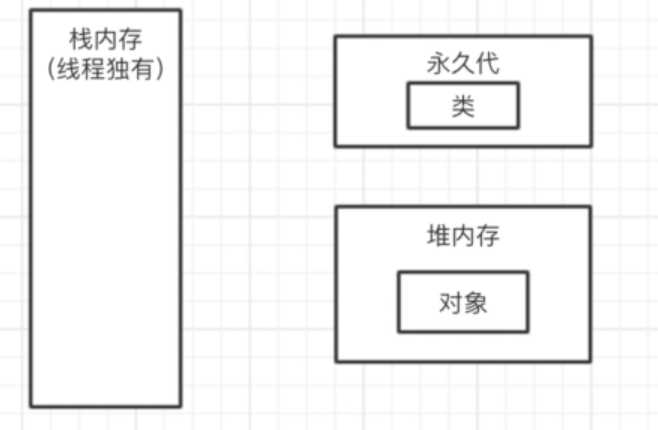
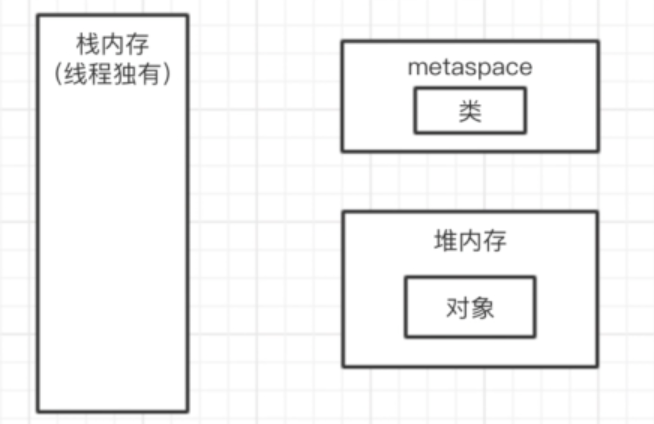
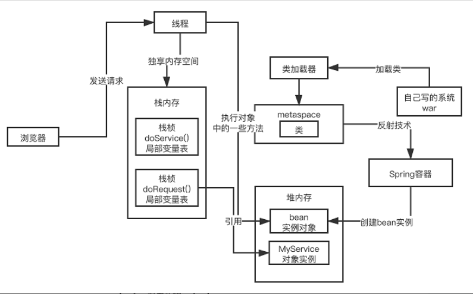
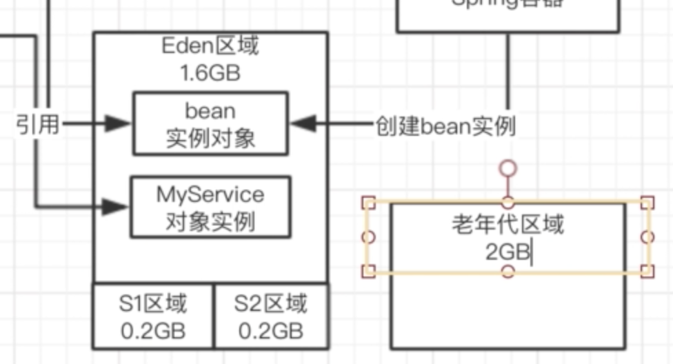
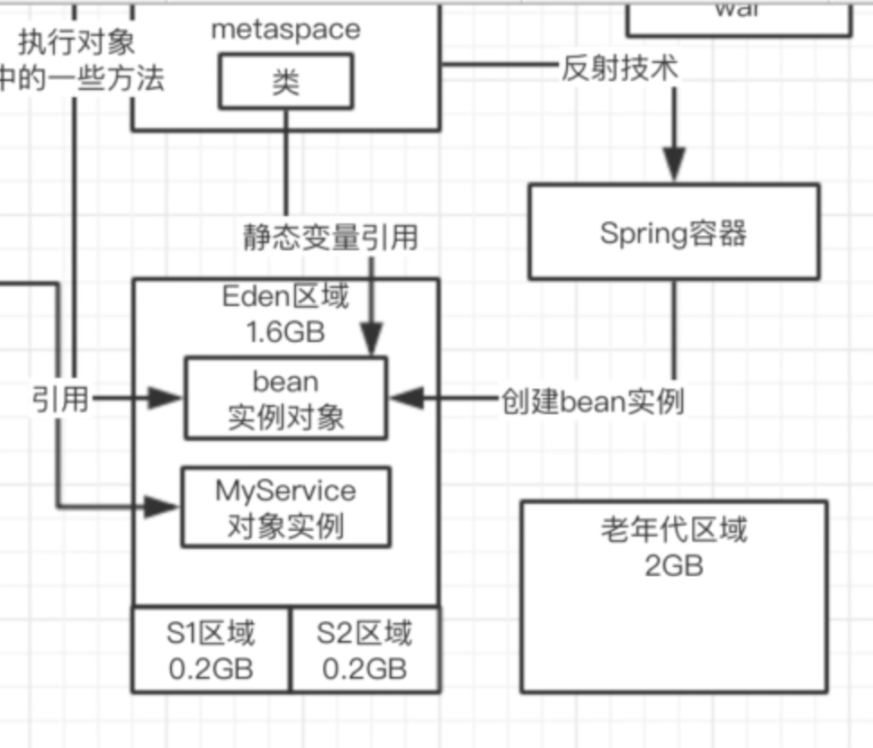

# JVM 基础

## 1. 内存模型

### JDK8 内存分区

tomcat部署，tomcat自己就是基于java来开发的，**我们启动的不是自己的系统，是一个tomcat是一个jvm进程**，我们写的系统只不过是一些代码，放在tomcat的目录里，tomcat会去加载我们的代码到jvm里去

执行我们的一些对象的方法，执行代码的时候肯定会有很多的线程，tomcat里就有很多自己的工作线程，去执行我们写的代码，每个工作线程都会有自己的一块数据结构，栈内存，这个里面是存放一些东西

java 8以后的内存分代的改进，**永久代里放了一些常量池+类信息**

+ 常量池 -> 堆里面
+ 类信息 -> metaspace（元区域）

### 对象内存

比如说我们有一个类里面包含了一个main方法，你去执行这个main方法，此时会自动启动一个jvm进程，他会默认就会有一个main线程，这个main线程就负责执行这个main方法的代码，进而创建各种对象。 tomcat，类都会加载到jvm里去，spring容器而言都会对我们的类进行实例化成bean

+ **spring容器bean堆内存**
+ **工作线程栈内存**

## 2. 垃圾回收

### 垃圾回收时机

我们的jvm的内存其实是有限制的，2核4G的机器，堆内存也就2GB左右，4核8G的机器，堆内存可能也就4G左右，栈内存也需要空间，metaspace区域放类信息也需要空间

+ 堆内存满了，就垃圾回收
+ **eden区域满了**，就会young gc

在jvm里必然是有一个内存分代模型，年轻代和老年代

比如说给年轻代一共是2GB内存，给老年代是2GB内存，默认情况下**eden和2个s的比例：8:1:1**，eden是1.6GB，S是0.2GB

堆内存 = 年轻代内存 + 老年代内存

### Young GC

- 刚开始所有对象都放在Eden区域
- Eden区域放满了，触发垃圾回收（young gc， ygc），回收年轻代
  - 谁可以是回收的垃圾对象呢？ ⇒ 没有人引用的对象
    - 被正在执行的方法局部变量引用的对象绝对不是垃圾对象
    - 被类级别引用的静态成员变量，绝对不是垃圾，类信息是存放在metaspace的，类没有被卸载，其持有的静态成员变量绝对不允许被回收，否则你置我于何地呢

#### Survivoir区域

被回收的对象，在内存区域干掉，腾出一块内存区域。

- 如果说你让代码一边运行，一边有变动，一边判断哪些对象是可以回收的，这个是不现实的
- 垃圾回收的时候有一个概念，叫做stop the world，停止你的jvm里的工作线程的运行，然后扫描所有的对象，判断哪些可以回收，哪些不可以回收的

年轻代，大部分情况下，对象生存周期是很短的，可能在0.01ms之内，线程执行了3个方法，创建了几个对象，0.01ms之后就方法都执行结束了，此时那几个对象就会在0.01ms之内变成垃圾，可以回收的

#### 复制算法

一次young gc，年轻代的垃圾回收

- Eden区和另一个Survivor区域存活的对象，挪动到一个Survivor区域中
- 清空Eden区域
- 此时一次Young GC完毕
- stop the world结束，此时继续运行工作线程
- 下一次垃圾回收中，会将Eden区域存活的对象，之前一个Survivor区域存活的对象
  - 复制到另外一个空白的Survivor区域中，清空Eden和另一个Survivor区域

##### 三种场景年轻代移动至老年代

- 年轻代存活15次
- Survivor区域放不下的对象

- Eden区域放不下的对象

### Full GC

老年代对象越来越多，是不是会发现说，老年代的内存空间也会满的

可以不可以使用类似年轻代的复制算法，不合适的
- 生存周期很长, 因为老年代里的对象，很多都是被长期引用的，如spring容器管理的各种bean
- 占用空间比较大，可能甚至有几百MB

#### 老年代垃圾收集算法

- 标记-清理，找出来那些垃圾对象，然后直接把垃圾对象在老年代里清理掉 ⇒ 内存碎片「内存空间不连续，没有连续可用的内存区域」
- 标记-整理，把老年代里的存活对象标记出来，移动到一起，存活对象压缩到一片内存空间里去 ⇒ 可以解决内存碎片问题
  - 剩余的空间都是垃圾对象整个给清理掉，剩余的都是连续的可用的内存空间，解决了内存碎片的一个问题

#### 垃圾收集器组合

- **parnew**「核心是多线程并发进行回收」+**cms**的组合
- **g1**直接分代回收，新版本，慢慢的就是主推g1垃圾回收器了
- 以后会淘汰掉parnew+cms的组合，jdk 8~jdk 9比较居多一些，parnew+cms的组合比较多一些，是这么一个情况。

CMS

- 分成好几个阶段
- 初始标记
- 并发标记
- 并发清理

老年代垃圾回收是比较慢的，**一般起码比年轻代垃圾回收慢个10倍以上**

cms的垃圾回收算法，刚开始用标记-清理，标记出来垃圾对象，清理掉一些垃圾对象，后面还得进行整理，把一些存活的对象压缩到一起，避免内存碎片的产生

如果要执行一个比较慢的垃圾回收，还要**stop the world，需要100ms，此时就会让系统停顿100ms，不能处理任何请求**，尽可能的让垃圾回收和工作线程的运行，并发着来执行

## 3. Tomcat JVM参数设置

面试的时候，面试官很多时候都是针对jvm的一些运行原理去深扣，结合我讲的东西，然后去把jvm专栏里面的内容仔细看一下，应付面试都是很容易的，一般来说都会这么问，你们线上系统的生产环境的jvm参数是怎么来配置的，为什么要这么配置，在你们配置的这个参数之下，线上系统jvm运行的情况如何

- 看一下你当前生产系统的jvm参数都是如何设置的，如果说你是tomcat部署的java web系统，jvm进程对应的tomcat自己，你的系统仅仅是在tomcat的jvm进程来执行
- 比如通过java命令直接启动你的一个main方法跑起来的系统，就是你自己启动的时候，java命令可以带上一些jvm参数
- 对自己系统的jvm参数有一个了解
  - 内存区域大小的分配
  - 每个线程的栈大小
  - metaspace大小
  - 堆内存的大小
  - 年轻代和老年代分别的大小
  - eden和survivor区域的大小分别是多少，如果没有设置，会有一些默认值

**进行压测，在压测的时候，其实就需要去观察jvm运行的情况**，jstat工具去分析jvm运行的情况，他的年轻代里的eden区域的对象增长的情况，ygc的频率，每次ygc过后有多少对象存活，s能否放的下，老年代对象增长速率，老年代多久会触发一次fgc。 就可以根据压测的情况去进行一定的jvm参数的调优，

## 4. Out of Memory

oom可能发生在哪几个区域，解决的一个思路，在jvm里可以设置几个参数，如果一旦jvm发生了oom之后，就会导出一份内存快照，就会有当时的线上内存里的对象的一个情况，可以用MAT这样的工具，可以去分析

- 无非就是找出来当时的时候占用内存最大的对象都是谁
- 找出来那些对象是在代码中哪些地方创建出来的，一般来说就是可能会对内存去做一个调优

**一定要把案例的业务、背景和思想给吸收了，就得融入到自己的业务里去，我负责的业务系统，在什么样的情况下，可能说会出现一大批的对象卡在内存里，无法回收，导致我系统没法放更多的对象了**

产生OOM

- 内存泄漏的问题
- 少数场景在互联网公司，超高并发下的oom问题，瞬时大量存活对象占据内存， 导致没法创建更多的对象了
- oom不是你自己的代码，可能是你依赖的第三方的组件，netty导致的，结合自己的项目去一步一步的分析，oom问题的产生，和解决的过程

