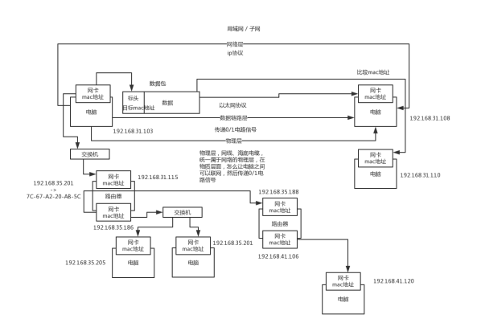
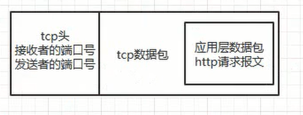

# 网络与IO

不可避免要跟机器、网络、cpu、磁盘、内存，成天打交道。而线上系统，计算基础的一些东西，网络、cpu、磁盘、内存，都是关联很大的，比如说你线上系统会不会因为网络故障导致一些问题？cpu负载达到100%了咋办？磁盘读写很慢快满了咋办？内存使用率过高咋办？

有一套自己的计算机功底去支撑你玩儿线上系统吧。所以很多人呢，都说计算机基础没啥用.如果当个高工，带几个小弟干高并发有压力的线上系统，机器负载很高，很容易出问题，结果你连机器都不敢摸，或者也不知道怎么摸，那不是尴尬了么。 所以说，计算机基础，网络、磁盘、cpu、内存，还是得会一点儿基础的


## 1. 四层模型 vs 七层模型

首先要说一下，四层模型和七层模型，我们往往是可以一块儿来聊的。

首先我们要明白，为啥要有协议

设想一下，各个电脑厂商，比如IBM、苹果啥的，都弄自己的协议，

- 结果就苹果电脑和苹果电脑自己可以通信，和IBM电脑就不可以通信
- 所以搞一个**国际通行的协议，大家都按照这个来，所有电脑都可以通信**。
- 此时就必须搞一个**标准的网络模型出来**，大家都按照这个来走，大家都要遵守统一的规范。

### OSI七层模型

- **应用层**
- 表示层
- 会话层
- **传输层**
- **网络层**
- **数据链路层**
- 物理层

### TCP/IP四层模型

- 数据链路层
- 网络层
- 传输层
- 应用层


### 物理层

- 是在电脑上**插根线**是吧，然后才能上网，结果现在就是联个**wifi**就行了

- 中国美国之前联网靠的是海底的光缆。

- 就是怎么把各个电脑给联结起来，形成一个网络。物理层负责传输0和1的电路信号。学过一些计算机的同学，计算机的最最底层，就是0/1，电信号。

  


### 数据链路层

- **定义一下电路信号咋分组**
- 数据链路层，物理层给各个电脑连接起来了，还传输最底层的0和1电路信号

**以太网协议**

- **叫一个帧（frame）**
- 每个帧分成两个部分
  - 标头（head），标头包含一些说明性的东西，比如说发送者、接收者和数据类型之类的。
  - 数据（data）
- 每台电脑要往另外一台电脑发送数据，一堆0/1电路信号，封装成数据包, 包含头和数据
  - **头里包含了从哪儿来到哪儿去**，必须从一台电脑的一个网卡，发送到另外一个电脑的一个网卡
  - 所以以太网发送的**数据包**必须得指定，目标电脑的网卡的mac地址**。**

**以太网规定了，每个网卡必须得包含一个mac地址，mac地址就是这个网卡的唯一标识**

以太网协议规定了，接入网络里的所有设备，都得有个网卡，以太网协议里的那个数据包，在数据链路层传输的数据包，必须从一个电脑的网卡传输到另外一个电脑的网卡，而这个网卡地址就叫做所谓的mac地址。每块网卡出厂的时候，就有一个唯一的

mac地址，**48位的二进制**， 一般用**12个16进制数字**表示

- 前6个16进制是厂商编号
- 后6个16进制是网卡流水号。

windows上，ipconfig /all，看看物理地址，就是mac地址，7C-67-A2-20-AB-5C

+ 以太网里传输数据包的时候，必须指定**接收者的mac地址**才能传输数据。

- 以太网里面，如果一个电脑发个数据包出去，**会广播给局域网内的所有电脑设备的网卡**, 然后每台电脑都从数据包里获取接收者的mac地址，跟自己的mac地址对比一下，如果一样，就说明这是发给自己的数据包。

上面这种广播的方式，**仅仅针对一个局域网内的电脑，会广播**，否则一个电脑不能广播数据包给**全世界所有的其他电脑吧**，**是仅仅广播给一个子网里面的电脑的。**


### 网络层

电脑在哪一个子网里

- 这就得靠网络层了，这里就有一套IP地址，IP地址就可以让我们区分哪些电脑是一个子网的。
- 网络层里有IP协议，IP协议定义的地址就叫做IP地址。
  - IP地址有IPv4和IPv6两个版本
  - 目前广泛使用的是IPv4，是32个二进制数字组成的，但是一般用4个十进制数字表示，范围从0.0.0.0到255.255.255.255之间。

从ip地址是看不出来哪些机器是一个子网的，因为从10进制是判断不出来的。需要通过ip地址的二进制来判断，结合一个概念来判断，叫做**子网掩码。**

比如说ip地址是192.168.56.1，子网掩码是255.255.255.0。知道了子网掩码之后，如果要判断两个ip地址是不是一个子网的，就分别把两个ip地址和自己的子网掩码进行二进制的与运算，与运算之后，比较一下代表网络的那部分。

192.168.56.1和192.168.32.7，判断是不是一个子网的，拿子网掩码255.255.255.0，跟两个ip地址的二进制做与运算(**AND**)

> 11000000.10101000.00111000.00000001
> 11111111.11111111.11111111.00000000 
> 11000000.10101000.00111000.00000000

**然后就跟ip地址的二进制做与好了，通过二进制来比较网络部分的地址是不是一模一样的。**

有了**网络层的ip**地址之后，两台在子网内的电脑终于可以**通过广播+mac地址判断来传输数据包进行通信**了。

+ 如果发现要接受数据包的计算机**不在子网内**，那么就不能通过广播来发送数据包，**需要通过路由器**来发送数据包。

- 路由器**负责将多个子网进行连接**，因为比如你在自己家里。你要是访问网站啥的，是跟那个网站机器所在的子网进行通信。

机器上的网卡，会发到路由器的mac地址上面， 网关其实是就是路由器的一种，运作在网络层，这个概念不多解释了，大家可以就把**路由器上的ip地址认为是网关**，路**由器上每个网卡都有mac地址和对应的ip地址**。**路由器虽然有mac地址，但是不能通过mac地址寻址的，必须通过ip地址寻址，所以路由器其实是工作在网络层的设备**。

#### 路由器 vs 网络交换机

+ **网络交换机工作在数据链路层**，是通过mac地址来寻址和传输数据包的, 网络交换机主要用在局域网的通信，一般你架设一个局域网，里面的电脑通信是通过数据链路层发送数据包，通过mac地址来广播的，广播的时候就是通过网络交换机这个设备来把数据广播到局域网内的其他机器上去的；

+ **路由器工作在网络层**，通过ip地址寻址和传输数据包的, 路由器一般用来让你连入英特网

**路由器是包含了交换机和路由的两个功能的**，如果是连接到局域网内的设备就把线插LAN那儿；如果是连接到英特网，就把线插在WAN那儿。

大概过程就是，路由器配置了两块网卡，每个网卡可以连到一个局域网内。这样两个局域网就可以通信

**局域网内的每台机器都有自己的ARP cache**，这个ARP就是用来在一个局域网内让各个设备都知道每个设备的ip地址和mac地址的对应关系的，一般就是某个机器发送广播通知自己的ip地址和mac地址的对应关系，然后每个机器给他一个回应。以此类推，**大家都互相这样广播一把ip地址和mac地址的对应关系**。

**一个子网内的机器之间通信，就是在数据包里写上对方的mac地址**，然后交换机广播出去ok了；但是如果是**跨子网的通信，就是写上对方的ip地址，然后先通过mac地址广播到路由器**，让**路由器再根据另外一个子网的ip地址转换为mac地址**，通过另外一个子网的交换机广播过去


### 传输层

一台机器上多个进程占用一个ip地址，是很多个程序用一个网卡进行网络通信的，比如说浏览器、QQ、视频直播，这些软件都用了一个网卡往外面发送数据，然后从网卡接收数据，对吧。所以**还需要一个端口号的概念**，就是你得发送数据包到某个机器的一个网卡的某个端口上去，然后那个机器上监听那个端口的程序，就可以提取发送到这个端口的数据，知道是自己的数据。**端口号是0~65536的范围内，0~1023被系统占用了，别的应用程序就用1024以上的端口就可以了**。

电脑1，是在端口48362监听的，通过网卡发送了一条数据 -> 电脑2的ip地址的20386这个端口 -> 电脑2的上面的某个QQ，监听着20386的端口 -> 电脑2的网卡接收到一条数据之后，发现人家找的是20386这个端口，就去找谁哪个哥儿们在监听20386端口，QQ在监听，我就把这个网卡过来的数据，传递给QQ，通过端口知道，哪条数据是给你的

**TCP协议引入了端口号的概念 ⇒ 实现点对点通信**

+ 网络层: 是基于ip协议，进行主机和主机间的寻址和通信的

+ 传输层: 其实是建立某个主机的某个端口，到另外一个主机的某个端口的连接和通信的。

**Socket就可以基于ip协议完成而且会建立一个端口到另外一个端口的连接。**

udp和tcp都是传输层的协议，作用就是在数据包里加入端口号，可以通过端口号进行点对点的通信了。

**UDP协议是不可靠**的，发出去人家收到没有就不知道了；

**TCP协议是可靠的，要求三次握手**，而且要求人家接收到数据必须回复你。

- 包括如何建立连接
- 如何发送和读取消息
- 但是实际上如果你要基于tcp协议来开发，你一般是用socket「它是一套TCP编程规范」，java socket网络编程， 如下图：



### 应用层

收到数据之后如何解释, 比如说收到个邮件你怎么处理？收到个网页你怎么处理？

应用层，综合了会话层、表示层和应用层了，3层合成1层。

```bash
电脑1走tcp协议发送了一段东西过来，发送到电脑2的20386端口
GET <http://localhost:8080/> http/1.1
key:valuel
key:value

电脑2走tcp协议读取到了属于自己这个20386端口 的一段数据
GET <http://localhost:8080/> http/1.1
key:valuel
key:value
发送了一段响应
200
key;value
key:value

又通过底层的tcp发了出去，电脑1的30987端口，ip电脑1，网卡，走以太网协议收到一个数据包
200
key;value
key:value
```

比如最常见的，应用层的协议就是http协议，进行网络通信。

**应用层协议就是告诉你按照什么规则来读取TCP协议传出来的东西。**

然后我们看下自己的网络设置，一般包含了ip地址、子网掩码、网关地址、DNS地址。

前面3个我们其实都知道啥意思了。

- ip地址和子网掩码用来划分子网的，判断哪些ip地址在一个子网内。
- 同时你的ip地址和mac地址关联起来的，唯一定位了你的网卡。
- 网关地址，你就认为是路由器上的那个网卡的ip地址吧
  - 路由器的网卡也有mac地址，mac地址对应了一个ip地址。

#### DNS是Domain Name System

因为我们一般定位是通过ip地址+mac地址+端口号来定位一个通信目标的，[但是如果在浏览器上输入一个www.baidu.com](http://xn--www-p18dvb2l99ef2g44n3zbgyltu6bv4dw5y4t1h9mta.baidu.com)，咋整？这个时候是先把www.baidu.com发给DNS服务器，然后DNS服务器告诉你www.baidu.com对应的ip地址的。

**8.8.8.8 DNS服务器，会把DNS翻译成ip地址**


## 2. TCP握手挥手

### TCP3次握手

建立三次握手的时候，TCP报头用到了下面几个东西: **ACK, SYN, FIN**

第一次握手，客户端发送连接请求报文

- seq = x, SYN=1
- 接着客户端处于SYN_SENT状态，等待服务器响应。

第二次握手, 服务端收到SYN=1的请求报文，需要返回一个确认报文

- ack = x + 1，seq = y, SYN=1，ACK = 1， 发送给客户端
- 自己处于SYN_RECV状态。

第三次握手, 客户端收到了报文

- 将ack = y + 1，seq = x + 1， ACK = 1，

其实三次握手说白了，就是来回来去三次请求，每次请求带上一堆TCP报文头，根据报文头是否正确，就是越好的协议来建立连接。简单说就是这样。


#### 2次或者4次握手问题

假设两次握手就ok了，要是客户端第一次握手过去，结果卡在某个地方了，没到服务端；完了客户端再次重试发送了第一次握手过去，服务端收到了，ok了，大家来回来去，二次握手建立了连接。结果，尴尬的是，后来那个卡在哪儿的老的第一次握手发到了服务器，服务器直接就返回一个第二次握手，这个时候服务器开辟了资源准备客户端发送数据啥的。客户端根本就不会理睬这个发回去的二次握手，因为之前都通信过了。

但是如果是三次握手，那个二次握手发回去，客户端发现根本不对，就会发送个复位的报文过去，让服务器撤销开辟的资源，别等着了。

**2次握手避免网络卡端，服务器浪费开辟资源**

**3次握手就够了，不需要4次或者5次浪费资源了**。


### TCP4次挥手

- 第一次挥手
  - 客户端发送报文
  - FIN=1，seq=u
  - 此时进入FIN-WAIT-1状态
- 第二次挥手
  - 服务端收到报文，这时候进入CLOSE_WATI状态
  - 返回一个报文，ACK=1，ack=u+1，seq=v。
  - 客户端收到这个报文之后，直接进入FIN-WAIT-2状态，此时客户端到服务端的连接就释放了。
- 第三次挥手
  - 服务端发送连接释放报文
  - FIN=1，ack=u+1，seq=w
  - 服务端进入LAST-ACK状态
- 第四次挥手
  - 客户端收到连接释放报文之后
  - 发应答报文，ACK=1，ack=w+1，seq=u+1，进入TIME_WAIT状态
  - 等待一会儿客户端进入CLOSED状态
  - 服务端收到报文之后就进入CLOSED状态。


## 3. HTTP协议

### 访问流程

访问到那个网站对应的机器，然后人家再给你一个响应的全过程。现在我们先假设，我们给电脑设置了几个东西：

+ ip地址： `192.168.31.37`

+ 子网掩码： `255.255.255.0`

+ 网关地址： `192.168.31.1`

+ DNS地址： `8.8.8.8`


#### 应用层

打开一个浏览器，请求www.baidu.com地址，这个时候找DNS服务器，DNS服务器解析域名之后，返回一个ip地址，比如 `172.194.26.108`。接着会判断两个ip地址是不是一个子网的，用子网掩码255.255.255.0，对两个ip地址做与运算，拿到192.168.31.0和172.194.26.0，明显不是一个子网的。

那就得发送一个数据包给网关，其实你就认为是我们的路由器吧，就是192.168.31.1

应用层出发，通过浏览器访问一个网站，是走应用层的http协议的, **把浏览器发出的HTTP请求打包成数据**

- 数据包里就放了http请求报文，这个时候会将这个http请求报文打包成一个数据包
- 根据http协议搞一个http请求报文，然后搞一个数据包出来，就是应用层干责任

**http协议分为几个部分：**

```properties
GET http://172.194.26.108/test HTTP/1.1
Host:upload.jiangsu.io
Proxy-Connection:keep-alive
User-Agent:Mozilla/5.0
```

#### 传输层

传输层来了是tcp协议，这个tcp协议会让你设置端口，发送方的端口随机选一个，接收方的端口一般是默认的80端口。会**把应用层数据包给封装到tcp数据包中去，而且会加一个tcp头**，这个tcp数据包是对应一个tcp头的，**这个tcp头里就放了端口号信息**：



#### 网络层

网络层走ip协议，这个时候会把tcp头和tcp数据包，放到ip数据包里去，然后再搞一个ip头，ip头里本机和目标机器的ip地址。

> 这里本机ip地址是192.168.31.37
> 目标机器是172.194.26.108

**通过ip协议，可以判断说，两个ip地址不是在一个子网内的，所以此时只能将数据包先通过以太网协议广播到网关上去，通过网关再给他发送出去，如图：**


#### 数据链路层

链路层，这块走以太网协议

+ 这里是把**ip头和ip数据包封到以太网数据包**里去
+ **再加一个以太网数据包的头**, 头里放了本机网卡mac地址，和网关的mac地址。
+ 以太网数据包的限制是1500个字节，但是假设这个时候ip数据包都5000个字节了，那么需要将ip数据包切割一下。
  + 每个数据包包含了以太网头、ip头和切割后的ip数据包
  + 4个数据包的大小分别是1500，1500, 1500，500。

+ 以太网数据包都会通过交换机发到你的网关上
  + 然后你的路由器是可以联通别的子网的
  + 路由器就会转发到别的子网的可能也是某个路由器里去

  + 最后跑到百度的某台服务器，接收到4个以太网数据包。


#### 百度服务器接收到以太网数据包

- 根据ip头的序号，把4个以太网数据包里的ip数据包给拼起来，就还原成一个完整的ip数据包了。
- 接着就从ip数据包里面拿出来tcp数据包
- 再从tcp数据包里取出来http数据包，读取出来http数据包里的各种协议内容
- 接着就是做一些处理，然后再把响应结果封装成http响应报文，封装在http数据包里
- 再一样的过程
  - 封装tcp数据包
  - 封装ip数据包
  - 封装以太网数据包
  - 接着通过网关给发回去。


### HTTP 1.0 vs HTTP 1.1

**http 1.0 和 1.1 之间的长短链接区别在于底层的tcp链接是长连接还是短连接。**

互联网初期，一般一个网页几乎都没什么图片，当时就是挂一些文字，一个网页里就是一大坨的文字。http 1.0版本。

浏览器 -> 网站，互相之间是先要通过tcp三次握手，建立一个连接，浏览器和网站互相都给对方留出一份资源，浏览器发起http请求 -> tcp -> ip -> 以太网，网站上面去，网站返回一个响应，连接关闭，tcp四次挥手。释放掉浏览器和网站各自给对方保持的一份资源。

#### HTTP 1.0

**http 1.0 要指定keep-alive来开启持久连接，默认是短连接**，就是浏览器每次请求都要重新建立一次tcp连接，完事儿了就释放tcp连接。但是现在，一个网页打开之后，还要加载大量的图片、css、js，这就坑爹了，发送多次请求。

早期，2000年之前，那个时候网页，都很low，当时你打开一个网页，就是说现场底层tcp三次握手，跟网站建立一个tcp连接，然后通过这个tcp连接，发送一次http请求，网站返回一个http响应（网页的html，里面有一大段文字），浏览器收到html渲染成网页，浏览器就走tcp四次挥手，跟网站断开连接了

到了后面，发现说2000之后，2010之后更不用说了，网页发展很迅猛，一个网页包含着大量的css、js、图片等资源。比如你请求一个网页，这个网页的html先过来，过来之后，浏览器再次发起大量的请求去加载css、js、图片，打开一个网页可能浏览器要对网站服务器发送几十次请求。

**http 1.0，刚开始请求网页的html，tcp三次握手建立连接 -> 请求/响应 -> tcp四次挥手断开连接，接着再次要加载css、js、图片，要发送30个请求，上面的过程来30次，30次频繁的建立tcp连接以及释放tcp连接**。很慢很慢。

其实最慢的不是说发送请求和获取响应，**而是打开和释放连接，这都是很重的过程**

#### HTTP 1.1

**http 1.1默认支持长连接**，就是说，浏览器打开一个网页之后，**底层的tcp连接就保持着，不会立马断开，之后加载css、js之类的请求**，都会基于这个tcp连接来走。

http 1.1还支持host头，也就可以支持虚拟主机；

而且对断点续传有支持。

浏览器，第一次请求去一个网站的一个页面的时候，就会打开一个tcp连接，接着就在一段时间内都不关闭了，然后接下来这个网页加载css、js、图片大量的请求全部走同一个tcp连接，频繁的发送请求获取响应，最后过了一段时间，这些事儿都完了，然后才会去释放那一个tcp连接。**大幅度的提升复杂网页的打开的速度，性能。**

#### HTTP 2.0

支持多路复用

基于一个tcp连接并行发送多个请求以及接收响应

解决了http 1.1对同一时间同一个域名的请求有限制的问题。

二进制分帧

- 将传输数据拆分为更小的帧（数据包），frame（数据包，帧）
- 提高了性能，实现低延迟高吞吐。


### HTTP 规范

#### 请求

```properties
GET /search?hl=zh-CN&source=hp&q=domety&aq=f&oq= HTTP/1.1  
Accept-Language: zh-cn  
Accept-Encoding: gzip, deflate  
User-Agent: Mozilla/4.0 (compatible; MSIE 6.0; Windows NT 5.1; SV1; .NET CLR 2.0.50727; TheWorld)  
Host: <a href="http://www.google.cn">www.google.cn</a>  
Connection: Keep-Alive  
```

**请求行**：动词 路径 协议/版本号 比如： GET /index.html HTTP/1.1

**请求头**：

- Host（主机）: 1.2.3.4
- Accept（文件类型）: html, xhtml, xml
- User-Agent（用户代理）: Chrome / Mac
- Content-Type（内容类型）： application/x-www-form-urlencoded

- 消息体：username=xxxx&password=yyyyy

#### 响应

```properties
HTTP/1.1 200 OK
Date: Sat, 31 Dec 2005 23:59:59 GMT
Content-Type: text/html;charset=ISO-8859-1
Content-Length: 122
```

状态行：协议/版本号 状态码 状态描述

响应头：

- Content-Type(内容类型): text/html;charset=utf-8
- Server(服务器): bfe/1.0.8.18
- Date(返回当日的日期和时间): Thu, 23 Feb 2017 13:57:26 Date:
  - 功能：设置或显示 系统日期
  - 类型：内部命令
  - 格式：DATE 年/月/日


### HTTPS

之前是基于SSL协议对http进行加密，后来又升级到了TSL协议来加密，现在称之为SSL / TSL吧。

https的工作原理大概是这样的：

- 浏览器把自己支持的加密规则发送给网站
- 服务器从这套加密规则里选出来一套加密算法和hash算法, 然后把自己的身份**信息用证书(网站地址、加密公钥、证书颁发机构)**的方式发回给浏览器
- 浏览器验证证书的合法性，然后浏览器地址栏上会出现一把小锁；
  - 浏览器接着生成一串随机数密码，然后用证书里的公钥进行加密，这块走的非对称加密；
  - **然后用公钥对密码进行加密，用约定好的hash算法生成握手消息的hash**值
- 服务器从消息里面可以取出来公钥加密后的随机密码
  - **用本地的私钥对消息解密取出来密码**
  - 然后用密码解密浏览器发来的握手消息
  - **计算消息的hash值，并验证与浏览器发送过来的hash值是否一致**
  - **最后用密码加密一段握手消息，发给浏览器**
- 浏览器解密握手消息
  - **然后计算消息的hash值**
  - 如果跟网站发来的hash一样，握手就结束
  - 之后所有的数据都会由之前浏览器生成的随机密码
    - 然后用对称加密来进行进行加密。

常用的非对称加密是RSA算法，对称加密是AES、RC4等，hash算法就是MD5

- 有个人说我加密的时候是用了一个公钥去加密，然后你解密的时候是用私钥去解密；
- 我加密的时候用的算法，跟解密的时候用的算法，是一样的，对称加密


### HTTP 长连接底层

**http本身没什么所谓的长连接短连接之说，其实说白了都是http下层的tcp连接是长连接还是短连接**，tcp连接保持长连接，那么多个http请求和响应都可以通过一个链接来走。其实http 1.1之后，默认都是走长连接了，就是底层都是一个网页一个tcp连接，一个网页的所有图片、css、js的资源加载，都走底层一个tcp连接，来多次http请求即可。

http 1.0的时候，底层的tcp是短连接，一个网页发起的请求，每个请求都是先tcp三次握手，然后发送请求，获取响应，然后tcp四次挥手断开连接；每个请求，都会先连接再断开。短连接，建立连接之后，发送个请求，直接连接就给断开了

http 1.1，tcp长连接，tcp三次握手，建立了连接，**无论有多少次请求都是走一个tcp连接的，走了n多次请求之后，然后tcp连接被释放掉了**

长连接场景：

- 网页客服在线聊天
- 浏览器加载页面资源


## 4. 进程切换

进程间的通信有很多种方式

#### 管道

unix操作系统里面，有一个fork操作，可以创建进程的子进程，或者说是复制一个进程完全一样的子进程，共享代码空间，但是各自有**独立的数据空间，不过子进程的数据空间是拷贝父进程的数据空间的**。

**管道机制要求的是两个进程之间是有血缘关系的，就比如fork出来的父子进程。**

linux操作系统里，管道用来缓存要在进程间传输的数据，管道是一个固定大小的缓冲区，是4kb。管道中的数据一旦被读取出来，就不在管道里了。

但是如果管道满了，那么写管道的操作就阻塞了，直到别人读了管道的数据；反之如果管道是空的，那么读操作就阻塞了。就这个意思。管道一边连着一个进程的输出，一边连着一个进程的输入，然后就一个进程写数据，另外一个进程读数据，两个进程都没了，管道也就没了。**管道是半双工的**，就是数据只能流向一个方向，比如说你架设一个管道，只能一个进程写，另外一个进程读。类似于 `SynchronousQueue`

linux里面对管道的实现，是用了两个文件，指向了一个VFS（虚拟文件系统）的索引节点inode，然后VFS索引节点指向一个物理页面，接着一个进程通过自己关联的那个文件写数据，另外一个进程通过自己关联的那个文件读数据。

#### 命名管道（fifo）

这个命名管道，**相当于是一个有名字的文件，是有路径的**，所以没有血缘关系的进程多可以通过这个命名管道来通信，**名字在文件系统上，数据在内存里**。其他的跟管道一样，一**个进程写，一个进程读**，也是半双工的，数据只能单向流动。

#### 消息队列

linux的消息队列可以认为是个链表结构，linux内核有一个**msgque链表**，这个链表里每个指针指向一个msgid_ds结构，这个结构就描述了一个消息队列。然后进程之间就通过这个消息队列通信就可以，一样是写入数据和消费数据。消息队列的好处就是对每个消息可以指定类型，消费的时候就消费指定类型的消息就行了，功能更多一些。这种方式其实用的不多的。

#### 共享内存

一块物理内存被映射到两个进程的进程地址空间，所以进程之间互相都可以立即看到对方在共享内存里做出的修改，但是因为是共享内存，所以需要锁来保证同步。这个说多了很复杂，我在这里就不多说了，我觉得如果被人问到这个问题，短期内突击的话，回答到这个程度就行了，就是知道有哪些方式。如果你要深入理解各种机制，那是要好好学习linux的各种东西了。


## 5. BIO vs NIO vs AIO

### BIO

这个其实就是最传统的网络通信模型，就是BIO，同步阻塞式IO，简单来说大家如果参加过几个月的培训班儿应该都知道这种BIO网络通信方式。就是服务端创建一个ServerSocket，然后客户端用一个Socket去连接那个ServerSocket，然后ServerSocket接收到一个Socket的连接请求就创建一个Socket和一个线程去跟那个Socket进行通信。

然后客户端和服务端的socket，就进行同步阻塞式的通信，客户端socket发送一个请求，服务端socket进行处理后返回响应，响应必须是等处理完后才会返回，在这之前啥事儿也干不了，这可不就是同步么。

**这种方式最大的坑在于，每次一个客户端接入，都是要在服务端创建一个线程来服务这个客户端的，这会导致大量的客户端的时候，服务端的线程数量可能达到几千甚至几万，几十万，这会导致服务器端程序的负载过高，最后崩溃死掉。**

**要么你就是搞一个线程池，固定线程数量来处理请求，但是高并发请求的时候，还是可能会导致各种排队和延时，因为没那么多线程来处理。**


### NIO

JDK 1.4中引入了NIO，这是一种同步非阻塞的IO，基于Reactor模型。

NIO中有一些概念：

+ **Buffer，缓冲区的概念**，一般都是将数据写入Buffer中，然后从Buffer中读取数据，有IntBuffer、LongBuffer、CharBuffer等很多种针对基础数据类型的Buffer。

+ **Channel**，**NIO中都是通过Channel来进行数据读写的**。
  + 一个客户端对应一个channel。
  + 一次请求结束之后，服务的线程就会被销毁掉，这是很关键的一点。

+ **Selector**，这是多路复用器，**selector会不断轮询注册的channel**，如果某个channel上发生了读写事件，selector就会将这些channel获取出来，我们通过SelectionKey获取有读写事件的channel，就可以进行IO操作。**一个Selector就通过一个线程，就可以轮询成千上万的channel**，这就意味着你的服务端可以接入成千上万的客户端。

这里的核心就是非阻塞，就那个selector一个线程就可以不停轮询channel，所有**客户端请求都不会阻塞，直接就会进来，大不了就是等待一下排着队**而已。

这里的核心就是因为，一个客户端不是时时刻刻都要发送请求的，没必要死耗着一个线程不放吧，所以NIO的优化思想就是一个请求一个线程。只有某个客户端发送了一个请求的时候，才会启动一个线程来处理。

非阻塞: **因为无论多少客户端都可以接入服务端，客户端接入并不会耗费一个线程, 不会创建额外的线程去处理客户端请求**，只会创建一个连接然后**注册到selector上去**，**一个selector线程不断的轮询所有的socket连接**，发现有事件了就通知你，然后你就启动一个线程处理一个请求即可，但是这个处理的过程中，你还是要先读取数据，**处理，再返回的，这是个同步的过程**。所以NIO是同步非阻塞的。


### AIO

AIO是基于**Proactor模型的**，就是异步非阻塞模型。

每个连接发送过来的请求，都会绑定一个buffer，然后通知操作系统去异步完成读，此时你的程序是会去干别的事儿的，等**操作系统完成数据读取之后，就会回调你的接口**，给你操作系统异步读完的数据。然后你对这个数据处理一下，接着将结果往回写。

写的时候也是给操作系统一个buffer，让操作系统自己获取数据去完成写操作，写完以后再回来通知你。

- **工作线程，读取数据的时候，是说，你提供给操作系统一个buffer，空的，然后你就可以干别的事儿了**，你就把读数据的事儿，交给操作系统去干，**操作系统内核，读数据将数据放入buffer中，完事儿了，来回调你的一个接口**，告诉你说，buffer交给你了，这个数据我给你读好了
- 写数据的时候也是一样的的，把**放了数据的buffer交给操作系统的内核去处理，你就可以去干别的事儿了，操作系统完成了数据的写之后，就会来回调你**，告诉你说，你交给我的数据，我都给你写回到客户端去了


### 同步阻塞 vs 同步非阻塞 vs 异步非阻塞

**BIO的这个同步阻塞**

- 不是完全针对的网络通信模型去说的，针对的是磁盘文件的IO读写，FileInputStream，BIO，卡在那儿，直到你读写完成了才可以

**NIO为啥是同步非阻塞**

- 就是说通过NIO的FileChannel发起个文件IO操作
- 其实发起之后就返回了，你可以干别的事儿，这就是非阻塞
- 但是接下来你还得不断的去轮询操作系统，看IO操作完事儿了没有。
- 也可以使用FileChannel这种NIO的模型，去读写磁盘文件，读数据，发起读数据的请求之后，你不是阻塞住的，你可以干别的事儿，但是你在干别的事儿的同时，还得来时不时的自己去轮询操作系统读数据的状态，看看人家读好了没有「核心：始终需要时不时自己问OS，干好了吗？干好了吗？主要是OS完成之后不会主动回调通知你」

**AIO为啥是异步非阻塞**

- 就是说通过AIO发起个文件IO操作之后
- 你立马就返回可以干别的事儿了，接下来你也不用管了
- 操作系统自己干完了IO之后，告诉你说ok了。
- 同步就是自己还得主动去轮询操作系统，异步就是操作系统反过来通知你。


## 6. Netty

主要是一些中间件系统，比如分布式存储系统，分布式消息系统

- 比较典型的，RocketMQ
- 底层做网络通信这一块就是基于Netty来的
- 分布式服务框架，服务之间进行远程通信，也可以基于Netty来

crud的业务系统，一般是不会用netty的，比如说API网关系统，IM即时通讯系统。 SocketChannel 与 NioSocketChannel代表一组链接


## 7. 堆外内存

### 堆外内存创建


堆内和堆外的概念：**堆内内存「JVM自己管理的」，heap，off-heap「堆外内存**」

```java
ByteBuffer buffer = ByteBuffer.allocateDirect(1024);
// 传入的是你要申请的堆外内存的大小
// 你可以直接把你的数据写入到堆外内存DirectByteBuffer里去
// 把这块数据通过Socket发送，就是直接发送就可以了，不需要走一个拷贝
```

#### 堆外内存优势

- 堆内的数据，要网络IO写出去，要先拷贝到堆外内存
- 再写入到socket里发送出去；
- 如果直接数据分配在堆外内存，
- 是不需要有一次额外的拷贝的，性能是比较高的
- 堆内内存读写文件也是同理的，都可以节约数据拷贝次数

### 堆外内存分配

会发现说，堆外内存已经不够了，此时不能直接分配堆外内存了

DirectByteBuffer，这个对象是JVM堆内存里的一个对象，但是这个DirectByteBuffer里面包含指针，引用了一块堆外的内存

+ 如果堆外内存足够，就直接预留一部分内存
+ 如果堆外内存不足，则将已经被 JVM 垃圾回收的 DirectByteBuffer 对象的堆外内存释放
+ 如果进行一次堆外内存资源回收后，还不够进行本次堆外内存分配的话，则进行 System.gc()
+ 如果 9 次尝试后依旧没有足够的可用堆外内存，则抛异常
+ 实际分配内存

jvm一般分为young gc和full gc，无论是发生哪种gc，**都可能会回收掉一些没有GC roots变量引用的DirectByteBuffer对象，回收掉了之后，就会主动释放他们引用的那些堆外内存**。DirectByteBuffer回收，就会回收关联的堆外内存，或者是内部有一个cleaner对象，可以用反射获取他，然后调用他的clean方法来主动释放内存

**如果依靠jvm gc机制，可能DirectByteBuffer躲过N次minor gc进入了老年代**，然后**老年代迟迟没有放满**，因此迟迟没有回收，此时可能会导致DirectByteBuffer对象一直在引用堆外内存。 这样当你要分配更多的堆外内存时，无法腾出来更多的内存，就会有堆外内存溢出了

堆内内存的OOM一样，out of memory，内存耗尽，实在是没有空闲的内存空间给你来使用了，因为所有的内存此时都被别人在使用，你要申请一块新的内存空间，实在是没有了，所以就OOM。 堆外内存的溢出，也是一样的。


## 8. 零拷贝

### 普通读写


```java
File file = new File("xxx.txt");
RandomAccessFile raf = new RandomAccessFile(file, "rw");
byte[] arr = new byte[(int) file.length()];
raf.read(arr);
Socket socket = new ServerSocket(8080).accept();
socket.getOutputStream().write(arr);
```

+ 用户态：JVM进程

+ 内核态：OS

**使用read读取数据的时候，会有一次用户态到内核态的切换**，也就是说从用户角度切换到了内核角度去执行，这个时候基于DMA引擎把**磁盘上的数据拷贝到内核缓冲里去**；**接着会从内核态切换到用户态**，**基于CPU把内核缓冲里的数据拷贝到用户缓冲区里去**

接着我们调用了Socket的输出流的write方法，此时会从用户态切换到内核态，同时基于CPU把用户缓冲区里的数据拷贝到Socket缓冲区里去，接着会有一个异步化的过程，基于DMA引擎从Socket缓冲区里把数据拷贝到网络协议引擎里发送出去。

**一共要经过4次拷贝；所以说，这4次切换和4次拷贝，让普通的IO操作都性能较低**

### 内存映射


把一个**磁盘文件映射到内存里来**，然后把映射到内存里来的数据通过socket发送出去。 有一种mmap技术，也就是内存映射，**直接将磁盘文件数据映射到内核缓冲区**，这个映射的过程是基于DMA引擎拷贝的，**同时用户缓冲区是跟内核缓冲区共享一块映射数据的**，建立共享映射之后，就不需要从内核缓冲区拷贝到用户缓冲区了

就可以避免一次拷贝了，但是这个过程中还是会用户态切换到内核态去进行映射拷贝，接着再次从内核态切换到用户态，建立用户缓冲区和内核缓冲区的映射。接着把数据通过Socket发送出去，还是要再次切换到内核态。接着直接把内核缓冲区里的数据拷贝到Socket缓冲区里去，然后再拷贝到网络协议引擎里，发送出去就可以了，最后切换回用户态

**减少一次拷贝，但是并不减少切换次数，一共是4次切换，3次拷贝**

mmap技术是主要在RocketMQ里来使用的，公众号：狸猫技术窝，《从0开始带你成为消息中间件高手》的专栏，RocketMQ，里面剖析了一下，RocketMQ底层主要就是基于mmap技术来提升了磁盘文件的读写，性能

### 零拷贝


**linux提供了sendfile**，也就是零拷贝技术. 在你的代码里面，如果说你基于零拷贝技术来读取磁盘文件，同时把读取到的数据通过Socket发送出去的话。

**这个零拷贝技术，就是先从用户态切换到内核态，在内核态的状态下，把磁盘上的数据拷贝到内核缓冲区，同时从内核缓冲区拷贝一些offset和length到Socket缓冲区**；接着从内核态切换到用户态，**从内核缓冲区直接把数据拷贝到网络协议引擎里去**

同时从Socket缓冲区里拷贝一些offset和length到网络协议引擎里去，但是这个offset和length的量很少，几乎可以忽略

**只要2次切换，2次拷贝，就可以了**

**kafka、tomcat，都是用的零拷贝技术**，**rocketmq用的是mmap技术**，mmap还是要多2次切换和1次拷贝的，在Java代码中如何进行mmap和零拷贝。

