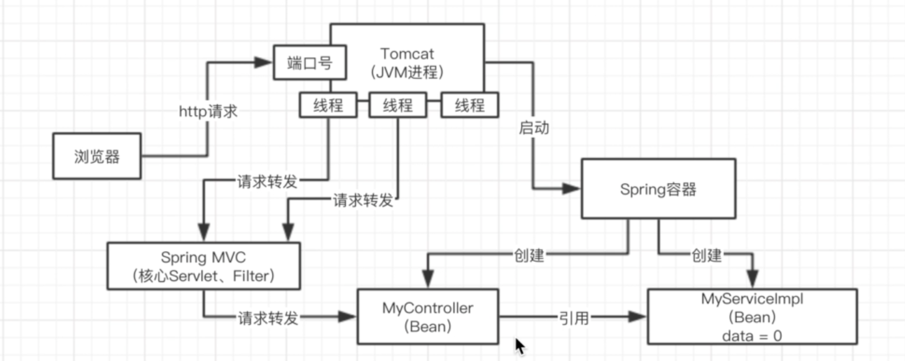

# 开源框架

## 1. Spring IOC

没有Spring框架的时候：

- 写一套系统，web服务器，tomcat，一旦启动之后，他就可以监听一个端口号的http请求
- 然后可以把请求转交给你的servlet，jsp，配合起来使用的，servlet处理请求

最基础的tomcat + servlet编码原理

- Tomcat是一个JVM进程
- 浏览器发起http请求给Tomcat


- Tomcat解析Http请求，转交给Servlet
- Servlet处理的时候，怎么进行处理的？

```java
public class MyServlet {
  private MyService myService = new MyServiceImpl();
  
  public void doPost(HttpServletRequest request) {
    myservice.doService(request);
  }
}

public interface MyService {}
public class MyServiceImpl implements MyService {}
public class NewServiceImpl implements MyService {}
```


- 比如在我们的一个tomcat+servlet有几十个地方，都是直接用MyService myService = new MyServiceImpl()，直接创建、引用和依赖了一个MyServiceImpl这样的一个类的对象。
- 有几十个地方都跟MyServiceImpl类直接耦合在一起了
- 如果现在不想要用MyServiceImpl了，希望用的是NewServiceManagerImpl，implements MyService这个接口的，所有的实现逻辑都不同了，此时我都去修改对应的MyServiceImpl这个类，切换为NewServiceManagerImpl这个类
- 改动代码成本很大，改动完以后的测试的成本很大，改动的过程中可能很复杂，出现一些bug，此时就会很痛苦，**归根结底，代码里，各种类之间完全耦合在一起，出现任何一丁点的变动，都需要改动大量的代码，重新测试，可能还会有bug**

**解决这种类耦合性的方法：**

```java
@Controller
public class Controller {
  @Resource
  private MyService myService;
  
  public void doPost(HttpServletRequest request) {
    myservice.doService(request);
  }
}

public interface MyService {}
@Serivce public class MyServiceImpl implements MyService {}
@Serivce public class NewServiceImpl implements MyService {}
```

- Spring IOC框架，控制反转，依赖注入
- xml文件或者注解来进行一个配置
- 在这个工程里通过maven引入一些spring框架的依赖，ioc功能

- tomcat在启动的时候，直接会启动spring容器
- spring ioc，spring容器，根据xml配置或者注解，去实例化你的一些bean对象，然后根据xml配置或者注解，去对bean对象之间的引用关系，去进行依赖注入，某个bean依赖了另外一个bean
- **底层的核心技术，反射，通过反射的技术，直接根据你的类去自己构建对应的对象出来，用的就是反射技术**
- **spring ioc最大的贡献 ⇒ 系统的类与类之间彻底的解耦合**
- 有几十个类都使用了@Resource这个注解去标注MyService myService，几十个地方都依赖了这个类，如果要修改实现类为NewServiceManagerImpl
  - 直接把 MyServiceImple的@Service的注解取消掉即可**「一处修改，处处生效」**
  - NewSerivceManagerImpl机上@Serivce

- 把接口标记为 @Resource注解，这个接口的实现类带上@Service注解，Spring容器就会理解你的注解，配置好他们的继承关系

  


## 2. Spring AOP

spring核心框架里面，最关键的两个机制，就是ioc和aop

spring已经管理了我们代码里所有的这个类的对象实例，bean

- 直接用的是基于MyServiceA与其切面类(里面定义好了**前置通知和后置通知**)两者整合后Spring生成的代理实例
- **事务代码，全部交给动态代理类来去实现**
- 有几十个Service组件，类似的一样的代码，重复的代码，必须在几十个地方都去写一模一样的东西 「开启事务，根据是否抛出异常决定是回滚还是提交事务，减少重复代码，在Service层抛的异常其实可以利用Spring AOP机制」

```java
@Controller
public class Controller {
  @Resource
  private MyService myService;
  
  public void doPost(HttpServletRequest request) {
    myservice.doService(request);
  }
}

@Serivce public class MyServiceImpl implements MyService {
   public void doServiceA() {}
}
```

+ AOP，**一次书写，处处生效**

+ IOC，**一次改动，处处生效**

**spring aop机制**

- 有几个概念，可以做一个切面，语法、用法、术语和概念，完整、详细的了解

- 做一个切面定义，MyServiceXXXX的这种类，在这些类的所有方法中，都去织入一些代码，在所有这些方法**刚开始运行的时候，都先去开启一个事务**，在所有这些方法运行完毕之后，去根据是否抛出异常来判断一下，如果抛出**异常，就回滚事务**，如果**没有异常，就提交事务**。

  

**面向切面编程Aspect**

spring在运行的时候，动态代理技术，AOP的核心技术，就是动态代理, 他会给你的那些类生成动态代理


**Spring底层生成的动态代理类：**

- 事务相关的代码生成是根据你之前在AOP切面类当中声明的前置和后置通知的逻辑来进行生成的
- 先走增强代码
- 再去调用你自己的代码

```java
public class ProxyMyServiceA implmennts MyServiceA {
  private MyServiceA mySerivceA;
  public void doServiceA() {
    myservice.doServiceA();
  }
}
```

事务，mysql，数据库里都提供一个事务机制，我们如果开启一个事务，在这个事务里执行多条增删改的sql语句，这个过程中，如果任何一个sql语句失败了，会导致这个事务的回滚，把其他sql做的数据更改都恢复回去

**在一个事务里的所有sql，要么一起成功，要么一起失败**，事务功能可以保证我们的数据的一致性，所以都会在业务逻辑组件里去加入这个事务。


## 3. JDK vs Cglib 动态代理

### JDK 动态代理

生成一个跟你实现同样接口的一个代理类，构造一个实例对象出来，jdk动态代理

```java
package com.wzq.demo01;

public class ServiceInvocationHandler implements InvocationHandler {

    private Object target;
    public ServiceInvocationHandler(Object target) {
        super();
        this.target = target;
    }

    /**
     * 实现InvocationHandler接口的方法     * 
     * 执行目标对象的方法，并进行增强
     */
    @Override
    public Object invoke(Object proxy, Method method, Object[] args) throws Throwable {

        Object result = null;
        System.out.println("代理类方法，进行增强。。。");
        System.out.println("事务开始。。。");
        // 执行目标方法对象
        result = method.invoke(target, args);
        System.out.println("事务结束。。。");
        return result;
    }

    /**
     * 创建代理实例
     * @return
     * @throws Throwable
     */
    public Object getProxy() throws Throwable {
        return Proxy.newProxyInstance(Thread.currentThread().getContextClassLoader(),
                this.target.getClass().getInterfaces(), this);
    }

}

public class Test {
    /**
     * jdk动态代理会生成一个动态代理类，生成相应的字节码，然后通过ClassLoader加载字节码；
     * 该实例继承了Proxy类，并实现了业务接口，在实现的方法里通过反射调用了InvocationHandler接口实现类的invoke()回调方法；
     */
    public static void main(String[] args) throws Throwable {
        UserService userService = new UserServiceImpl();
        ServiceInvocationHandler handler = new ServiceInvocationHandler(userService);

        // 根据目标生成代理对象
        UserService proxy = (UserService) handler.getProxy();
        proxy.addUser();
    }
}
```


### Cglib 动态代理

生成的类的一个子类，可以动态生成字节码，覆盖你的一些方法

```java
public class UserServiceCglib implements MethodInterceptor {

    private Object target;

    public Object getInstance(Object target) {
        this.target = target;
        Enhancer enhancer = new Enhancer();
        enhancer.setSuperclass(this.target.getClass());
        // 设置回调方法
        enhancer.setCallback(this);
        // 创建代理对象
        return enhancer.create();
    }

    /**
     * 实现MethodInterceptor接口中重写的方法
     * 回调方法
     */
    @Override
    public Object intercept(Object object, Method method, Object[] args, MethodProxy proxy) throws Throwable {
        System.out.println("事务开始。。。");
        Object result = proxy.invokeSuper(object, args);
        System.out.println("事务结束。。。");
        return result;
    }
}

public class TestCglib {
    public static void main(String[] args) {
        UserServiceCglib cglib = new UserServiceCglib();
        UserServiceImpl bookFacedImpl = (UserServiceImpl) cglib.getInstance(new UserServiceImpl());
        bookFacedImpl.addUser();
    }
}
```


其实就是动态的创建一个代理类出来，创建这个代理类的实例对象，在这个里面引用你真正自己写的类，所有的方法的调用，都是先走代理类的对象，他负责做一些代码上的增强，再去调用你写的那个类

spring里使用aop，比如说你对一批类和他们的方法做了一个切面，定义好了要在这些类的方法里增强的代码，spring必然要对那些类生成动态代理，在动态代理中去执行你定义的一些增强代码

+ **如果你的类是实现了某个接口的，spring aop会使用jdk动态代理**，生成一个跟你实现同样接口的一个代理类，构造一个实例对象出来，jdk动态代理，他其实是在你的类有接口的时候，就会来使用

+ **某个类是没有实现接口的，spring aop会改用cglib来生成动态代理**，他是生成你的类的一个子类，他可以动态生成字节码，覆盖你的一些方法，在方法里加入增强的代码


## 4. Spring事务传播机制

spring ioc和aop，动态代理技术，bean的线程安全问题，事务机制

- 事务的实现原理 ⇒ `AOP` ⇒ 动态代理 ⇒ `JDK动态代理` or `Cglib动态代理`
- 事务传播机制，如果说你给方法加了一个@Transactional注解，此时就spring会使用AOP思想，对你的这个方法在执行之前，先去开启事务，执行完毕之后，根据你方法是否报错，来决定回滚还是提交事务

```java
@Transactional(propagation = Propagation.REQUIRED)
public void methodA() {
   doSthPre();
   methodB();
   doSthPost():
}

@Transactional(propagation = Propagation.NESTED)
public void methodB() {
}


// 开启一个事务
// 执行方法A的代码，接着执行方法B的代码
// 提交或者回滚事务
REQUIRES_NEW
// 开启一个事务1
// 执行方法A里的一些代码，doSomethingPre()
// 开启一个事务2
// 执行方法B里的一些代码
// 提交或者回滚事务2
// 执行方法A里的一些代码，doSomethingPost()
// 提交或者回滚事务1
 

NESTED
// 开启一个事务
// 执行方法A里的一些代码，doSomethingPre()
// 设置一个回滚点，savepoint
// 执行方法B里的一些代码
// 如果方法B里抛出了异常，此时进行回滚，回滚到之前的savepoint
// 执行方法A里的一些代码，doSomethingPost()
// 提交或者回滚事务
```

**嵌套事务**

- 外层的事务如果回滚，会导致内层的事务也回滚；
- 但是内层的事务如果回滚，仅仅是回滚自己的代码
- **PROPAGATION_REQUIRED**：如果当前没有事务，就创建一个新事务，如果当前存在事务，就加入该事务，该设置是最常用的设置。
- **PROPAGATION_SUPPORTS**：支持当前事务，如果当前存在事务，就加入该事务，如果当前不存在事务，就以非事务执行。
- **PROPAGATION_MANDATORY**：支持当前事务，如果当前存在事务，就加入该事务，如果当前不存在事务，就抛出异常。
- **PROPAGATION_REQUIRES_NEW**：创建新事务，无论当前存不存在事务，都创建新事务。
- **PROPAGATION_NOT_SUPPORTED**：以非事务方式执行操作，如果当前存在事务，就把当前事务挂起。
- **PROPAGATION_NEVER**：以非事务方式执行，如果当前存在事务，则抛出异常。
- **PROPAGATION_NESTED**：如果当前存在事务，则在嵌套事务内执行。如果当前没有事务，则按REQUIRED属性执行。执行前创建一个**savepoint**，执行方法， 如果异常则回滚到之前的**savepoint**

出去面试，事务传播机制

**REQUIRES_NEW**: 方法A调用方法B，我希望的是如果说方法A出错了，此时仅仅回滚方法A，不能回滚方法B，必须得用REQUIRES_NEW，传播机制，让他们俩的事务是不同的

**NESTED**: 方法A调用方法B，如果出错，方法B只能回滚他自己，方法A可以带着方法B一起回滚，NESTED嵌套事务


## 5. Spring Bean 线程安全

Spring反射创建的时候究竟创建多少个实例。 request, session, global session，在开发的时候一般都不会用，99.99%的时候都是用singleton单例作用域

- **singleton**：默认，每个容器中只有一个bean的实例
- **prototype**：为每一个bean请求提供一个实例

- **request**：为每一个网络请求创建一个实例，在请求完成以后，bean会失效并被垃圾回收器回收
- **session**：与request范围类似，确保每个session中有一个bean的实例，在session过期后，bean会随之失效
- **global-session**


### Bean线程不安全

- 答案是否定的，绝对不可能是线程安全的
- spring bean默认来说，singleton，都是线程不安全的
- java web系统，一般来说很少在spring bean里放一些实例变量**「没有实例变量就是无状态的」**
- 一般来说他们都是多个组件互相调用，最终去访问数据库的
- **多线程对于同一个bean实例的成员变量进行操作，一定会出现并发冲突，导致最终数据最终不一致**




### Bean工作内存

- 每个方法都有自己的一个栈帧，自己的工作内存空间，是私有的，不会出现并发安全问题
- Spring 就是利用了这一点，做到了bean不是线程安全的情况下，依旧可以保证数据的一致性


## 6. Spring核心架构

spring核心源码，spring核心架构图，里面包含了各种类和API之间的调用，引入一个别的点，把spring的核心的东西再梳理一下

**spring bean生命周期，从创建 -> 使用 -> 销毁**


### 生命周期

#### 实例化Bean

如果要使用一个bean的话


#### 设置对象属性

查看bean依赖了谁，把你依赖的bean也创建出来，给你进行一个注入，比如说通过构造函数，setter


#### 处理Aware接口

如果这个Bean已经实现了 `ApplicationContextAware` 接口，spring容器就会调用我们的bean的  ``setApplicationContext(ApplicationContext)`  方法，传入Spring上下文，把spring容器给传递给这个bean


#### BeanPostProcessor - postProcessBeforeInit

如果我们想在bean实例构建好了之后，此时在这个时间带你，我们想要对Bean进行一些自定义的处理，那么可以让Bean实现了BeanPostProcessor接口，那将会调用    `postProcessBeforeInitialization(Object obj, String s)`     方法。


#### initializingBean 与 init-method

如果Bean在Spring配置文件中配置了 init-method 属性，则会自动调用其配置的初始化方法。


#### BeanPostProcessor - postProcessAfterInit

如果这个Bean实现了 `BeanPostProcessor` 接口，将会调用 `postProcessAfterInitialization(Object obj, String s)` 方法


#### DisposableBean

当Bean不再需要时，会经过清理阶段，如果Bean实现了 `DisposableBean` 这个接口，会调用其实现的 `destroy()`方法。destroy 方法可以定义一些回调方法，比如资源的释放。


#### destroy-method

最后，如果这个Bean的Spring配置中配置了 `destroy-method`属性，会自动调用其配置的销毁方法。

创建+初始化一个bean -> spring容器管理的bean长期存活 -> 销毁bean（两个回调函数）


## 7. Spring 设计模式

Spring源码底层去看，很多种设计模式的一个运用

### 工厂模式

spring ioc核心的设计模式的思想体现，他自己就是一个大的工厂，把所有的bean实例都给放在了spring容器里（大工厂），如果你要使用bean，就找spring容器就可以了，你自己不用创建对象了**

```java
public class MyController {
  	private MyService myService = new MyServiceFactory.getMyService();
}

public class MyServiceFactory {
  	public static MyService getMyService(){
      return new MyServiceImpl();
    }
}
```


### 单例模式

对每个bean走的都是一个单例模式，确保说你的一个类在系统运行期间只有一个实例对象，只有一个bean，用到了一个单例模式的思想，保证了每个bean都是单例的

```java
public class MyService {
  	private static volatile MyService myService;
    
    public static MyService getInstance() {
       if (myService == null) {
         synchronized(MyService.class) {
         		if (myService == null) {
              myService = new MyService();
            }  
         }
       }
      return myService;
    }
}
```


### 代理模式

- 如果说你要对一些类的方法切入一些增强的代码，会创建一些动态代理的对象，让你对那些目标对象的访问，先经过动态代理对象，动态代理对象先做一些增强的代码，接着调用你的目标对象
- 在设计模式里，就是一个代理模式的体现和运用，让动态代理的对象，去代理了你的目标对象，在这个过程中做一些增强的访问，你可以把面试突击的内容作为一个抛砖引玉的作用，去更加深入的学习一些技术


## 8. Spring Web MVC 核心架构

tomcat的工作线程将请求转交给spring mvc框架的**DispatcherServlet**

**DispatcherServlet查找@Controller注解的controller**，我们一般会给controller加上你@RequestMapping的注解，标注说哪些controller用来处理哪些请求，此时根据请求的uri，去定位到哪个controller来进行处理

**根据@RequestMapping去查找，使用这个controller内的哪个方法来进行请求的处理**，对每个方法一般也会加@RequestMapping的注解

直接调用我们的controller里面的某个方法来进行请求的处理

controller的方法会有一个返回值，以前的时候，一般来说还是走jsp、模板技术，我们会把前端页面放在后端的工程里面，返回一个页面模板的名字，**spring mvc的框架使用模板技术，对html页面做一个渲染；返回一个json串，前后端分离**，可能前端发送一个请求过来，我们只要返回json数据

再把渲染以后的html页面返回给浏览器去进行显示；前端负责把html页面渲染给浏览器就可以了


## 9. Spring Boot核心架构


**spring开源社区，就发起了一个项目，spring boot，我们基于spring boot直接进行开发，里面还是使用spring + spring mvc + mybatis一些框架，我们可以一定程度上来简化我们之前的开发流程**

Spring Boot 做好了框架整合的工作，帮助我们屏蔽掉了集成框架时候的繁琐工作，类似于Expedia的primer模板，有人已经配置好了，直接拉取下来就可以用。

没有Spring Boot之前，为了整合其他框架，类库，需要做很多的配置，自己去定义一些bean，流程比较繁琐

### 核心功能

#### 内嵌web容器

去直接把写好的java web系统给启动起来，直接运行一个main方法，spring boot就直接把tomcat服务器给跑起来，把我们的代码运行起来了

#### 自动装配starter

比如说我们可以引入mybatis，其实主要引入一个starter依赖，他会一定程度上个自动完成mybatis的一些配置和定义，不需要我们手工去做大量的配置了，一定程度上简化我们搭建一个工程的成本

没有Spring Boot之前：引入一些mybatis的jar包，还有mybatis依赖的一些其他的jar包，然后动手编写一些xml配置文件，然后定义一些bean，写一些sql语句，写一些dao代码，此时就可以使用mybatis去执行sql语句了

只要引入一个starter，他会自动给你引入需要的一些jar包，做非常简单的、必须的一些配置，他会自动帮你去进行一些配置，定义和生成对应的bean。生成的bean自动注入比如你的dao里去，让你免去一些手工配置+定义bean的一些工作