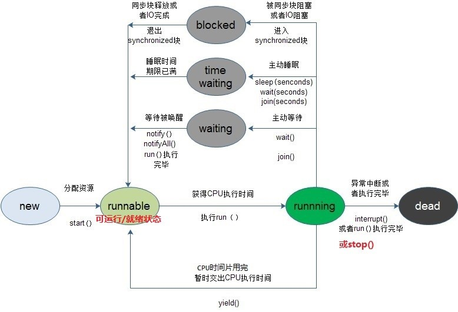

## 操作系统基本特征

### 1. 并发

并发性是指宏观上在一段时间内能同时运行多个程序，而并行性则指同一时刻能运行多个指令。

并行需要硬件支持，如多流水线或者多处理器。

操作系统通过引入进程和线程，使得程序能够并发运行。

### 2. 共享

共享是指系统中的资源可以供多个并发的进程共同使用。

有两种共享方式：互斥共享和同时共享。

互斥共享的资源称为临界资源，例如打印机等，在同一时间只允许一个进程访问，否则会出现错误，需要用同步机制来实现对临界资源的访问。

### 3. 虚拟

虚拟技术把一个物理实体转换为多个逻辑实体。主要有两种虚拟技术：时分复用技术和空分复用技术，例如多个进程能在同一个处理器上并发执行使用了时分复用技术，让每个进程轮流占有处理器，每次只执行一小个时间片并快速切换，这样就好像有多个处理器进行处理。

### 4. 异步

异步是指进程不是一次性执行完毕，而是走走停停，以不可知的速度向前推进。

## 系统调用

如果一个进程在用户态需要用到操作系统的一些功能，就需要使用系统调用从而陷入内核，由操作系统代为完成。

可以由系统调用请求的功能有设备管理、文件管理、进程管理、进程通信、存储器管理等。

## 中断分类

### 1. 外中断

由 CPU 执行指令以外的事件引起，如 I/O 结束中断，表示设备输入/输出处理已经完成，处理器能够发送下一个输入/输出请求。此外还有时钟中断、控制台中断等。

### 2. 异常

由 CPU 执行指令的内部事件引起，如非法操作码、地址越界、算术溢出等。

### 3. 陷入

在用户程序中使用系统调用。

# 第二章 进程管理

## 进程与线程

### 1. 进程

进程是操作系统进行资源分配的基本单位。

进程控制块 (Process Control Block, PCB) 描述进程的基本信息和运行状态，所谓的创建进程和撤销进程，都是指对 PCB 的操作。

### 2. 线程

一个线程中可以有多个线程，是独立调度的基本单位。同一个进程中的多个线程之间可以并发执行，它们共享进程资源。

### 3. 区别

+ 拥有资源：进程是资源分配的基本单位，但是线程不拥有资源，线程可以访问率属进程的资源。
+ 调度：线程是独立调度的基本单位，在同一进程中，线程的切换不会引起进程切换，从一个进程内的线程切换到另一个进程中的线程时，会引起进程切换。
+ 系统开销：由于创建或撤销进程时，系统都要为之分配或回收资源，如内存空间、I/O 设备等，因此操作系统所付出的开销远大于创建或撤销线程时的开销。类似地，在进行进程切换时，涉及当前执行进程 CPU 环境的保存及新调度进程 CPU 环境的设置。而线程切换时只需保存和设置少量寄存器内容，开销很小。此外，由于同一进程内的多个线程共享进程的地址空间，因此，这些线程之间的同步与通信非常容易实现，甚至无需操作系统的干预。
+ 通信方面：进程间通信 (IPC) 需要进程同步和互斥手段的辅助，以保证数据的一致性，而线程间可以通过直接读/写进程数据段（如全局变量）来进行通信。

举例：QQ 和 浏览器是两个进程，浏览器进程里面有很多线程，例如 http 请求线程、事件响应线程、渲染线程等等，线程的并发执行使得在浏览器中点击一个新链接从而发起 http 请求时，浏览器还可以响应用户的其它事件。

## 进程状态的切换

- 就绪状态：进程已获得除处理机以外的所需资源，等待分配处理机资源；
- 运行状态：占用处理机资源运行，处于此状态的进程数小于等于CPU数；
- 阻塞状态： 进程等待某种条件，在条件满足之前无法执行；


## 线程状态的切换

+ 创建(new)
+ 就绪(runnable/start)
+ 运行(running)
+ 阻塞(blocked)
+ 等待(waiting)
+ 时间等待(time waiting)
+ (dead/terminated)。在给定的时间点上，一个线程只能处于一种状态，各状态的含义如下图所示




## 调度算法

需要针对不同环境来讨论调度算法。

### 1. 批处理系统中的调度

#### 1.1 先来先服务（FCFS）

first-come first-serverd。

调度最先进入就绪队列的作业。

有利于长作业，但不利于短作业，因为短作业必须一直等待前面的长作业执行完毕才能执行，而长作业又需要执行很长时间，造成了短作业等待时间过长。

#### 1.2 短作业优先（SJF）

shortest job first。

调度估计运行时间最短的作业。

长作业有可能会饿死，处于一直等待短作业执行完毕的状态。如果一直有短作业到来，那么长作业永远得不到调度。

#### 1.3 最短剩余时间优先（SRTN）

shortest remaining time next。

### 2. 交互式系统中的调度

#### 2.1 优先权优先

除了可以手动赋予优先权之外，还可以把响应比作为优先权，这种调度方式叫做高响应比优先调度算法。

响应比 = (等待时间 + 要求服务时间) / 要求服务时间 = 响应时间 / 要求服务时间

这种调度算法主要是为了解决 SJF 中长作业可能会饿死的问题，因为随着等待时间的增长，响应比也会越来越高。

#### 2.2 时间片轮转

将所有就绪进程按 FCFS 的原则排成一个队列，每次调度时，把 CPU 分配给队首进程，该进程可以执行一个时间片。当时间片用完时，由计时器发出时钟中断，调度程序便停止该进程的执行，并将它送往就绪队列的末尾，同时继续把 CPU 分配给队首的进程。

时间片轮转算法的效率和时间片有很大关系。因为每次进程切换都要保存进程的信息并且载入新进程的信息，如果时间片太短，进程切换太频繁，在进程切换上就会花过多时间。

#### 2.3 多级反馈队列

+ 设置多个就绪队列，并为各个队列赋予不同的优先级。第一个队列的优先级最高，第二个队列次之，其余各队列的优先权逐个降低。该算法赋予各个队列中进程执行时间片的大小也各不相同，在优先权越高的队列中，为每个进程所规定的执行时间片就越小。
+ 当一个新进程进入内存后，首先将它放入第一队列的末尾，按 FCFS 原则排队等待调度。当轮到该进程执行时，如它能在该时间片内完成，便可准备撤离系统；如果它在一个时间片结束时尚未完成，调度程序便将该进程转入下一个队列的队尾。
+ 仅当前 i -1 个队列均空时，才会调度第 i 队列中的进程运行。

优点：实时性好，也适合运行短作业和长作业。

#### 2.4 短进程优先

### 3. 实时系统中的调度

实时系统要一个服务请求在一个确定时间内得到响应。

分为硬实时和软实时，前者必须满足绝对的截止时间，后者可以容忍一定的超时。

## 进程同步

### 1. 临界区

对临界资源进行访问的那段代码称为临界区。

为了互斥访问临界资源，每个进程在进入临界区之前，需要先进行检查。

```c
// entry section
// critical section;
// exit section
```

### 2. 同步与互斥

同步指多个进程按一定顺序执行；互斥指多个进程在同一时刻只有一个进程能进入临界区。

同步是在对临界区互斥访问的基础上，通过其它机制来实现有序访问的。

### 3. 信号量

**信号量（Samaphore）**是一个整型变量，可以对其执行 down 和 up 操作，也就是常见的 P 和 V 操作。

- **down** : 如果信号量大于 0 ，执行 - 1 操作；如果信号量等于 0，将进程睡眠，等待信号量大于 0；
- **up**：对信号量执行 + 1 操作，并且唤醒睡眠的进程，让进程完成 down 操作。

down 和 up 操作需要被设计成原语，不可分割，通常的做法是在执行这些操作的时候屏蔽中断。

如果信号量的取值只能为 0 或者 1，那么就成为了**互斥量（Mutex）**，0 表示临界区已经加锁，1 表示临界区解锁。

```c
typedef int samaphore;
samaphore mutex = 1;
void P1() {
    down(mutex);
    // 临界区
    up(mutex);
}

void P2() {
    down(mutex);
    // 临界区
    up(mutex);
}
```

**使用信号量实现生产者-消费者问题**

使用一个互斥量 mutex 来对临界资源进行访问；empty 记录空缓冲区的数量，full 记录满缓冲区的数量。

注意，必须先执行 down 操作再用互斥量对临界区加锁，否则会出现死锁。如果都先对临界区加锁，然后再执行 down 操作，考虑这种情况：生产者对临界区加锁后，执行 down(empty) 操作，发现 empty = 0，此时生成者睡眠。消费者此时不能进入临界区，因为生产者对临界区加锁了，也就无法对执行 up(empty) 操作，那么生产者和消费者就会一直等待下去。

```c
#define N 100
typedef int samaphore;
samaphore mutex = 1;
samaphore empty = N;
samaphore full = 0;

void producer() {
    while(TRUE){
        int item = produce_item;
        down(empty);
        down(mutex);
        insert_item(item);
        up(mutex);
        up(full);
    }
}

void consumer() {
    while(TRUE){
        down(full);
        down(mutex);
        int item = remove_item(item);
        up(mutex);
        up(empty);
        consume_item(item);
    }
}
```

### 4. 管程

使用信号量机制实现的生产者消费者问题需要客户端代码做很多控制，而管程把控制的代码独立出来，不仅不容易出错，也使得客户端代码调用更容易。

c 语言不支持管程，下面的示例代码使用了类 Pascal 语言来描述管程。示例代码中的管程提供了 insert() 和 remove() 方法，客户端代码通过调用这两个方法来解决生产者-消费者问题。

```c
monitor ProducerConsumer
    integer i;
    condition c;
    
    procedure insert();
    begin
    
    end;
    
    procedure remove();
    begin
    
    end;
end monitor;
```

管程有一个重要特性：在一个时刻只能有一个进程使用管程。进程在无法继续执行的时候不能一直占用管程，必须将进程阻塞，否者其它进程永远不能使用管程。

管程引入了 **条件变量** 以及相关的操作：**wait()** 和 **signal()** 来实现同步操作。对条件变量执行 wait() 操作会导致调用进程阻塞，把管程让出来让另一个进程持有。signal() 操作用于唤醒被阻塞的进程。

**使用管程实现生成者-消费者问题**

```c
monitor ProducerConsumer
    condition full, empty;
    integer count := 0;
    condition c;

    procedure insert(item: integer);
    begin
        if count = N then wait(full);
        insert_item(item);
        count := count + 1;
        if count = 1 ten signal(empty);
    end;

    function remove: integer;
    begin
        if count = 0 then wait(empty);
        remove = remove_item;
        count := count - 1;
        if count = N -1 then signal(full);
    end;
end monitor;

procedure producer
begin
    while true do
    begin
        item = produce_item;
        ProducerConsumer.insert(item);
    end
end;

procedure consumer
begin
    while true do
    begin
        item = ProducerConsumer.remove;
        consume_item(item);
    end
end;
```

## 进程通信

进程通信可以看成是不同进程间的线程通信，对于同一个进程内线程的通信方式，主要使用信号量、条件变量等同步机制。

### 1. 管道

管道是单向的、先进先出的、无结构的、固定大小的字节流，它把一个进程的标准输出和另一个进程的标准输入连接在一起。写进程在管道的尾端写入数据，读进程在管道的首端读出数据。数据读出后将从管道中移走，其它读进程都不能再读到这些数据。

管道提供了简单的流控制机制，进程试图读空管道时，在有数据写入管道前，进程将一直阻塞。同样地，管道已经满时，进程再试图写管道，在其它进程从管道中移走数据之前，写进程将一直阻塞。

Linux 中管道是通过空文件来实现。

管道有三种：

+ 普通管道：有两个限制：一是只支持半双工通信方式，即只能单向传输；二是只能在父子进程之间使用；

+ 流管道：去除第一个限制，支持双向传输；

+ 命名管道：去除第二个限制，可以在不相关进程之间进行通信。

### 2. 信号量

信号量是一个计数器，可以用来控制多个进程对共享资源的访问。它常作为一种锁机制，防止某进程正在访问共享资源时，其它进程也访问该资源。因此，主要作为进程间以及同一进程内不同线程之间的同步手段。

### 3. 消息队列

消息队列克服了信号传递信息少、管道只能承载无格式字节流以及缓冲区大小受限等缺点。

### 4. 信号

信号是一种比较复杂的通信方式，用于通知接收进程某个事件已经发生。

### 5. 共享内存

共享内存就是映射一段能被其它进程所访问的内存，这段共享内存由一个进程创建，但多个进程都可以访问。共享内存是最快的 IPC 方式，它是针对其它进程间通信方式运行效率低而专门设计的。它往往与其它通信机制（如信号量）配合使用，来实现进程间的同步和通信。

### 6. 套接字

套接字也是一种进程间通信机制，与其它通信机制不同的是，它可用于不同机器间的进程通信。

## 经典同步问题

生产者和消费者问题前面已经讨论过。

### 1. 读者-写者问题

允许多个进程同时对数据进行读操作，但是不允许读和写以及写和写操作同时发生。

一个整型变量 count 记录在对数据进行读操作的进程数量，一个互斥量 count_mutex 用于对 count 加锁，一个互斥量 data_mutex 用于对读写的数据加锁。

```c
typedef int semaphore;
semaphore count_mutex = 1;
semaphore data_mutex = 1;
int count = 0;

void reader() {
    while(TRUE) {
        down(count_mutex);
        count++;
        if(count == 1) down(data_mutex); // 第一个读者需要对数据进行加锁，防止写进程访问
        up(count_mutex);
        read();
        down(count_mutex);
        count--;
        if(count == 0) up(data_mutex);
        up(count_mutex);
    }
}

void writer() {
    while(TRUE) {
        down(data_mutex);
        write();
        up(data_mutex);
    }
}
```

# 第三章 死锁

## 死锁的条件

1. 互斥
2. 请求与保持：一个进程因请求资源而阻塞时，对已获得的资源保持不放。
3. 不可抢占
4. 环路等待

## 死锁的处理方法

### 1. 鸵鸟策略

把头埋在沙子里，假装根本没发生问题。

这种策略不可取。

### 2. 死锁预防

- 打破互斥条件：允许进程同时访问某些资源。但是，有些资源是不能被多个进程所共享的，这是由资源本身属性所决定的，因此，这种办法通常并无实用价值。
- 打破占有并等待条件：可以实行资源预先分配策略(进程在运行前一次性向系统申请它所需要的全部资源，若所需全部资源得不到满足，则不分配任何资源，此进程暂不运行；只有当系统能满足当前进程所需的全部资源时，才一次性将所申请资源全部分配给该线程)或者只允许进程在没有占用资源时才可以申请资源（一个进程可申请一些资源并使用它们，但是在当前进程申请更多资源之前，它必须全部释放当前所占有的资源）。但是这种策略也存在一些缺点：在很多情况下，无法预知一个进程执行前所需的全部资源，因为进程是动态执行的，不可预知的；同时，会降低资源利用率，导致降低了进程的并发性。
- 打破非抢占条件：允许进程强行从占有者哪里夺取某些资源。也就是说，但一个进程占有了一部分资源，在其申请新的资源且得不到满足时，它必须释放所有占有的资源以便让其它线程使用。这种预防死锁的方式实现起来困难，会降低系统性能。
- 打破循环等待条件：实行资源有序分配策略。对所有资源排序编号，所有进程对资源的请求必须严格按资源序号递增的顺序提出，即只有占用了小号资源才能申请大号资源，这样就不回产生环路，预防死锁的发生

死锁避免的基本思想是动态地检测资源分配状态，以确保循环等待条件不成立，从而确保系统处于安全状态。所谓安全状态是指：如果系统能按某个顺序为每个进程分配资源（不超过其最大值），那么系统状态是安全的，换句话说就是，如果存在一个安全序列，那么系统处于安全状态。资源分配图算法和银行家算法是两种经典的死锁避免的算法，其可以确保系统始终处于安全状态。其中，资源分配图算法应用场景为每种资源类型只有一个实例(申请边，分配边，需求边，不形成环才允许分配)，而银行家算法应用于每种资源类型可以有多个实例的场景。

### 3. 死锁避免

死锁解除的常用两种方法为进程终止和资源抢占。所谓进程终止是指简单地终止一个或多个进程以打破循环等待，包括两种方式：终止所有死锁进程和一次只终止一个进程直到取消死锁循环为止；所谓资源抢占是指从一个或多个死锁进程那里抢占一个或多个资源，此时必须考虑三个问题：

+ 选择一个牺牲品
+ 回滚：回滚到安全状态
+ 饥饿（在代价因素中加上回滚次数，回滚的越多则越不可能继续被作为牺牲品，避免一个进程总是被回滚）

### 4. 死锁检测与死锁恢复

不试图组织死锁，而是当检测到死锁发生时，采取措施进行恢复。

#### 4.1 死锁检测算法

死锁检测的基本思想是，如果一个进程所请求的资源能够被满足，那么就让它执行，释放它拥有的所有资源，然后让其它能满足条件的进程执行。

上图中，有三个进程四个资源，每个数据代表的含义如下：

E 向量：资源总量A 向量：资源剩余量C 矩阵：每个进程所拥有的资源数量，每一行都代表一个进程拥有资源的数量R 矩阵：每个进程请求的资源数量

进程 P1 和 P2 所请求的资源都得不到满足，只有进程 P3 可以，让 P3 执行，之后释放 P3 拥有的资源，此时 A = (2 2 2 0)。P1 可以执行，执行后释放 P1 拥有的资源， A = (4 2 2 2) ，P2 也可以执行。所有进程都可以顺利执行，没有死锁。

算法总结如下：

每个进程最开始时都不被标记，执行过程有可能被标记。当算法结束时，任何没有被标记的进程都是死锁进程。

① 寻找一个没有标记的进程 Pi，它所请求的资源小于等于 A。② 如果找到了这样一个进程，那么将 C 矩阵的第 i 行向量加到 A 中，标记该进程，并转回 ①。③ 如果有没有这样一个进程，算法终止。

#### 4.2 死锁恢复

① 利用抢占恢复② 杀死进程

# 第四章 存储器管理

## 虚拟内存

每个程序拥有自己的地址空间，这个地址空间被分割成多个块，每一块称为一 页。这些页被映射到物理内存，但不需要映射到连续的物理内存，也不需要所有页都必须在物理内存中。

当程序引用到一部分在物理内存中的地址空间时，由硬件立即执行必要的映射。当程序引用到一部分不在物理内存中的地址空间时，由操作系统负责将缺失的部分装入物理内存并重新执行失败的指令。

## 分页与分段

### 1. 分页

用户程序的地址空间被划分为若干固定大小的区域，称为“页”。相应地，内存空间分成若干个物理块，页和块的大小相等。可将用户程序的任一页放在内存的任一块中，实现了离散分配，由一个页表来维护它们之间的映射关系。

### 2. 分段

一个编译器在编译过程中建立的多个表，有 4 个表是动态增长的，如果使用分页系统的一维地址空间，动态递增的特点会导致覆盖问题的出现。

分段的做法是把每个表分成段，一个段构成一个独立的地址空间。每个段的长度可以不同，可以动态改变。

每个段都需要程序员来划分。

### 3. 段页式

用分段方法来分配和管理虚拟存储器。程序的地址空间按逻辑单位分成基本独立的段，而每一段有自己的段名，再把每段分成固定大小的若干页。

用分页方法来分配和管理实存。即把整个主存分成与上述页大小相等的存储块，可装入作业的任何一页。程序对内存的调入或调出是按页进行的。但它又可按段实现共享和保护。

### 4. 分页与分段区别

+ 对程序员的透明性：分页透明，但是分段需要程序员显示划分每个段。
+ 地址空间的维度：分页是一维地址空间，分段是二维的。
+ 大小是否可以改变：页的大小不可变，段的大小可以动态改变。
+ 出现的原因：分页主要用于实现虚拟内存，从而获得更大的地址空间；分段主要是为了使程序和数据可以被划分为逻辑上独立的地址空间并且有助于共享和保护。

## 页面置换算法

在程序运行过程中，若其所要访问的页面不在内存而需要把它们调入内存，但是内存已无空闲空间时，系统必须从内存中调出一个页面到磁盘对换区中，并且将程序所需要的页面调入内存中。页面置换算法的主要目标是使页面置换频率最低（也可以说缺页率最低）。

### 1. 最佳（Optimal）

所选择的被换出的页面将是最长时间内不再被访问，通常可以保证获得最低的缺页率。

是一种理论上的算法，因为无法知道一个页面多长时间会被再访问到。

举例：一个系统为某进程分配了三个物理块，并有如下页面引用序列：

7，0，1，2，0，3，0，4，2，3，0，3，2，1，2，0，1，7，0，1

进程运行时，先将 7,0,1 三个页面装入内存。当进程要访问页面 2 时，产生缺页中断，会将页面 7 换出，因为页面 7 再次被访问的时间最长。

### 2. 先进先出（FIFO）

所选择换出的页面是最先进入的页面。

该算法会将那些经常被访问的页面也被换出，从而使缺页率升高。

### 3. 最近最久未使用（LRU, Least Recently Used）

虽然无法知道将来要使用的页面情况，但是可以知道过去使用页面的情况。LRU 将最近最久未使用的页面换出。

可以用栈来实现该算法，栈中存储页面的页面号。当进程访问一个页面时，将该页面的页面号从栈移除，并将它压入栈顶，这样，最近被访问的页面的页面号总是在栈顶，而最近最久未使用的页面的页面号总是在栈底。

4，7，0，7，1，0，1，2，1，2，6

### 4. 时钟（Clock）

Clock 页面置换算法需要用到一个访问位，当一个页面被访问时，将访问为置为 1。

首先，将内存中的所有页面链接成一个循环队列，当缺页中断发生时，检查当前指针所指向页面的访问位，如果访问位为 0，就将该页面换出；否则将该页的访问位设置为 0，给该页面第二次的机会，移动指针继续检查。

# 第五章 设备管理

## 磁盘调度算法

当多个进程同时请求访问磁盘时，需要进行磁盘调度来控制对磁盘的访问。磁盘调度的主要目标是使磁盘的平均寻道时间最少。

### 1. 先来先服务（FCFS, First Come First Serverd）

根据进程请求访问磁盘的先后次序来进行调度。优点是公平和简单，缺点也很明显，因为未对寻道做任何优化，使平均寻道时间可能较长。

### 2. 最短寻道时间优先（SSTF, Shortest Seek Time First）

要求访问的磁道与当前磁头所在磁道距离最近的优先进行调度。这种算法并不能保证平均寻道时间最短，但是比 FCFS 好很多。

### 3. 扫描算法（SCAN）

SSTF 会出现进行饥饿现象。考虑以下情况，新进程请求访问的磁道与磁头所在磁道的距离总是比一个在等待的进程来的近，那么等待的进程会一直等待下去。

SCAN 算法在 SSTF 算法之上考虑了磁头的移动方向，要求所请求访问的磁道在磁头当前移动方向上才能够得到调度。因为考虑了移动方向，那么一个进程请求访问的磁道一定会得到调度。

当一个磁头自里向外移动时，移到最外侧会改变移动方向为自外向里，这种移动的规律类似于电梯的运行，因此又常称 SCAN 算法为电梯调度算法。

### 4. 循环扫描算法（CSCAN）

CSCAN 对 SCAN 进行了改动，要求磁头始终沿着一个方向移动。