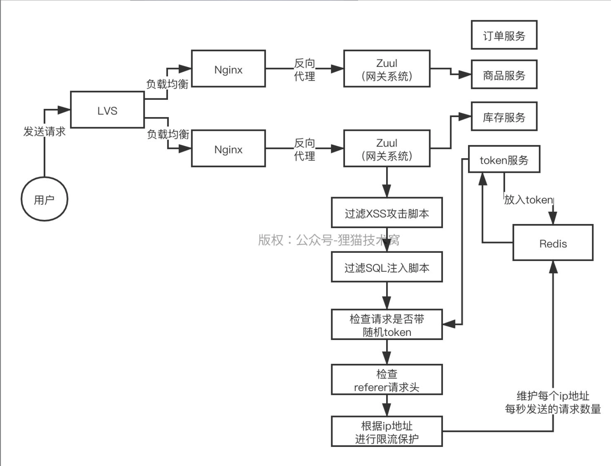

# 系统安全


能不能聊聊平时我们开发的系统，有可能被黑客以哪些方式来攻击呢？

XSS攻击方式背后的原理是什么，SQL注入背后的原理是什么，等等，各种攻击方式背后的原理是什么？

针对常见的黑客攻击方式，你平时开发系统的时候都有哪些方案可以去保护你的系统安全，避免被黑客攻破

平时你们微服务架构里，网关系统用的是什么？在网关层面如何防止黑客攻击？

哪怕网关不是你负责的，你负责的一些系统的接口，如何保证你设计的接口的安全性呢？

缓存穿透，假如说有黑客攻击你，每次使用的缓存的Key是不同的，传统的缓存穿透的方案无法防御，此时怎么办呢？

加密算法，公钥密钥是怎么回事，如何进行加密的网络通信？数据加密？

除了公钥密钥以外，你们有没有完整的一套系统安全性防御机制呢，防火墙，网站安全漏洞扫描，密钥存储是如何做的

技术公众号，挺知名的，是一个独角兽公司，估值也是很高的，删库跑路，威胁的都是系统的安全性，数据的安全性，就有业内很知名的互联网大厂，在某一个领域是绝对的巨头，删库跑路事件

多年以前微博受到了XSS攻击，用户自动关注一个病毒用户，然后病毒用户自动发布病毒微博，大量的人点击之后，再度扩散；很多曾经重要的网站，都遭遇攻击，几百万、上千万的用户数据泄露

直到现在有时候大家还会听到XX网站、XX APP的用户数据泄露的问题，曾经互联网顶级大厂早期也被黑客威胁要攻破系统

现在都经常还有同学会找到我说，老师，我们部署在云的几台机器感觉被攻击了，系统负载很高，有时候会挂掉

所以系统的安全问题现在是一个非常重要的系统架构设计的话题，你的系统如何保证安全性？如何避免被黑客攻击导致系统故障？如何避免你系统的核心数据遭到泄漏？这是非常重要的一个事情

所以说，现在出去面试，其实作为面试官，有时候就会考察你对基本的网络攻击手段是否了解，对网络攻击手段背后的原理是否了解，对常见的防止网络攻击的方法是否了解，如果你一无所知的话，那么可能有时候面试就不理想了

当然，现在我们比较推崇的，其实是应用架构师或者工程师，对网络攻击有一定的了解，但是现在更多的一个趋势，是安全这块交给专业的公司和团队去做，我们购买他们的服务，但是我们要了解常见的网络攻击手段，知道如何使用一些云公司的安全产品来保护我们的系统，同时我们自己的系统有时候也可能要做一些简单的防御措施

常见的网络攻击手段包括了：

- XSS（跨站点脚本攻击）
- SQL注入
- CSRF（跨站点请求伪造）
- 错误回显
- HTML注释
- 文件上传
- 路径遍历，等等
- 每一种攻击手段都有办法可以避免，所以我们最近就是学习一下系统安全性的问题和常见防御手段

还会学习一下防火墙和网站安全漏洞扫描的概念

同时我们还会学习一些数据加密技术，包括公钥密钥的机制，还有垃圾内容过滤、黑名单机制一些常见的安全防护机制

如果学习完了这些之后，你就知道平时你开发系统在安全性上哪些地方需要注意了，如果你再加上一些云安全产品的使用，那么基本系统可以说安全性很强，就固若金汤了


## 1. XSS攻击

XSS网络攻击的原理, XSS的全称是**Cross Site Script**，就是跨站点脚本攻击

- 在里面注入一些他自己的html+javascript的脚本和代码
- 然后你比如在访问那个网站的网页的时候，他注入的那些恶意脚本就会运行了

恶意脚本运行的时候就会控制你的浏览器，这个时候他的脚本就可以做很多很多的事情了

#### 反射型攻击


- 是想办法让你点击一个URL链接
- 在这个URL链接里就嵌入他自己的恶意脚本
- 点击那个URL链接之后，那个URL指向的是黑客自己的服务器上的一段恶意脚本

可能给你展示的是一个什么什么图片，或者是一个flash的动图，或者是一个小视频的东西，诱惑性，引诱你去点击

然后恶意脚本被返回到你的浏览器里就会运行，然后就可以控制你的浏览器里的行为了，这个控制行为就很恐怖了，他可以干很多的事儿，比如说脚本可以**自动让你关注某个用户ID，然后控制你自动发布一个带有病毒的微博**，这是比较简单的

实际上来说，**一段恶意的js脚本一旦控制了你的浏览器就可以得到大量的东西。大家都知道浏览器里包含了你的一些cookie，有的浏览器可能还存储了你的密码，通过知道你的cookie，就可以利用cookie伪造你的用户登录的session状态**，去以你这个用户的名义干一些事儿


#### 持久型攻击


- 不是你可以发布一些帖子啊或者是评论啥的内容么
- 此时黑客就可以在里面写一段恶意脚本
- 然后把恶意脚本混杂在评论内容里提交到你的网站的数据库里去

然后后面比如其他用户在社交网站里浏览到了你的这个评论，评论内容会被返回到浏览器里去，此时评论内容是包含恶意js脚本的，马上恶意脚本运行，又可以干坏事儿了，干的坏事儿就跟之前是一样的

#### 防止XSS攻击

- 包含恶意URL链接的图片、视频、动图、flash动画，平时自己注意一下，少点，尽量使用正规的网站 「针对反射性XSS攻击」
- 消毒机制「后端代码进行消毒」
  - 如果黑客在一些评论之类的内容里混入恶意脚本
  - 那么你的代码里必须对内容进行消毒，就是进行一些转义
    - 比如说把>转义为&gt之类的，这样就可以把恶意脚本里的html标签、js代码之类的东西，都给转义掉，让这些恶意脚本失效

```html
<html><script>// 包含恶意脚本</script></html>
```


这样的话，转义以后的脚本被其他用户看到的时候也不会在浏览器里运行了

HttpOnly方式，这个意思是说如果你在浏览器里存放cookie的时候，可以设置一个HttpOnly属性，比如说存放用户加密认证信息的cookie，这样的话，在**浏览器里运行的js脚本是被禁止访问这些HttpOnly cookie的**，他就无法窃取你在浏览器里存储的cookie了


## 2. SQL 注入

黑客如何通过SQL注入来攻击我们的系统。系统在数据库里执行SQL语句的时候，可能也存在漏洞，导致黑客把一些恶意的SQL语句注入进去让你的系统在你的数据库来执行这样子


> 正常请求：http://www.xxx.com/goods?goodsSkuNo=xxxxx
> 底层SQL语句：select * from eshop_goods_sku where goods_sku_no='xxxxx

执行SQL语句的时候，手动进行拼接，比较low

> http://www.xxx.com/goods?goodsSkuNo=xxxxx’ ;drop table eshop_goods_sku;
> select * from eshop_goods_sku where goods_sku_no=’xxxxx’;drop table eshop_goods_sku;--‘;

这样就直接恶意给你造成删库跑路的效果了。关键是这种SQL语句里可以拼接进去各种支持的SQL语法，包括对数据库施加的命令，甚至通过附加一些脚本直接窃取你的数据。但是如果要给你搞SQL注入，其实也不是那么容易的， **`因为必须要知道你的数据库表结构才行`** ，一般获取数据库表结构的方式就下面几种：

- 开源软件，比如开源的博客系统，论坛系统，或者别的什么系统，那么人家自然知道你的表结构了，这种情况是比较少见的
- **错误回显**，直接在浏览器页面上显示出来了你的异常堆栈信息，包括有错误的SQL语句。黑客直接就知道你的表结构了
- 根据你的请求参数的名称，大致推测你的数据库表结构，**这个一般不太现实**

- 看见到一个站点内部的SQL语句报错的异常
- 直接可以看到SQL语句的语法
  - 通过SQL语句，就可以反过来推测出来你的表结构
  - 此时就可以观察你的系统有哪些http接口
  - 然后可以通过postman那种工具，去构造一个请求发送过去执行

在参数里可以拼接进去一个恶意的SQL语句进行注入

***要防止SQ\*L注入:**

- 保密数据表结构
  - 关闭web服务器的错误回显
  - 显示一个400，500之类的就可以了
- 要用预编译的方法
  - 现在mybatis、hibernate都是支持预编译的
  - 放到底层的JDBC里，**PreparedStatement**，对SQL进行预编译
  - 如果你给SQL的某个参数传入进去的是一个恶意SQL语句， **预编译过后，会让你的恶意SQL语句是无法执行的**

```
insert into xxx_table(xx,xxx,xx) values(?,?,?)
```

- 对这个SQL进行预编译，然后给他里面把各个参数设置进去
- 此时参数里如果带有恶意SQL是不会作为SQL去执行的

对这个方法比如传递进去了一个map或者是对象，mybatis，根据你的占位符的变量名字，从你的Map里或者是对象里提取出来一个一个的参数的值，进行预编译SQL的参数值的设置。 这个预编译，就是说把黑客在参数里混进来来的SQL语句当做一个参数，而绝对不会作为独立的SQL语句去执行，这就避免了SQL注入攻击了

所以说，平时开发系统，我们一定要注意这两件事情，包括**关闭web服务器错误回显**，包括**mybatis之类的用预编译**，不要直接拼接SQL语句


## 3. Cross Site Request Forgery

Cross Site Request Forgery，跨站点请求伪造。 这个就是**黑客想办法去伪造成你这个用户去发送请求到某个系统上去**，然后查询你的数据，转账交易之类的，伪装成你，也有很多办法，比如利用XSS搞一个恶意脚本让你执行，然后盗取你的浏览器里的cookie

利用你的cookie伪装成你登录的状态，然后去执行一些请求

利用XSS跨站点脚本攻击，获取cookie，然后再利用postman发送跨站点伪造请求


**防御CSRF的方法主要是以下几种：**

- **防止Cookie被窃取**：最最根本的，其实还是说防止cookie被窃取，可以给你的网站的**cookie设置HttpOnly**属性，禁止被别人的script脚本窃取，那么别人就无法伪造用户登录请求了
- **随机Token**：每次返回一个页面给你的时候，都生成一个随机token附加在页面的隐藏元素里，同时在你的redis里可以存一下，然后页面发送请求的时候附加随机token，验证通过才能执行请求，你要是自己用postman构造请求就不知道随机token是什么了
- **验证码**：页面提交必须搞一个验证码，那种图形的，现在比较流行的还有拖动一个拼图什么的，必须验证码通过了才能执行你的请求，**避免黑客直接伪造请求发送过来**，这个其实是比较常见的，最好是在用户进行支付交易的时候，要求必须在页面上拖拽一个拼图验证码
- **Referer请求头**：这个是**http请求里有一个referer请求头，带有这个请求的来源**，你可以验证一下这个请求是不是从自己的页面里来的，如果是的话才执行，否则就不要执行了


## 4. 上传文件潜在危险

很多时候如果我们的网站允许别人上传文件，那么文件可能是可执行的脚本，可能是病毒或者木马文件，其实这个是非常危险的，如果是脚本的话，可能会在服务器执行，搞很多破坏，比如黑客黑掉你的服务器，勒索你给他比特币之类的

比如把**自己的文件后缀改成.jpg、.txt之类的东西，来上传，其实本质病毒文件**

病毒脚本是非常的可怕的，因为原则上来说，只要黑客掌握底层的一些技术，就可以利用病毒脚本干各种各样的事情，比如连接你的数据库之类的

对于文件上传这块，核心的就是要进行**白名单校验**

- 限制上传文件的类型，只能是我们指定的
- 而且要限制文件的大小，还要对文件重命名
- 限制文件类型不能简单的根据后缀来判断
  - 可能后缀被篡改了
  - 要根据文件二进制数据的开头几个字节代表的magic number来判断文件的类型
- 读取这个文件的二进制数据流，读取开头的几个字节，提取这个文件的魔数，根据魔数的值去判断他是什么类型的
- 而且最好对文件进行一定的压缩，这样可以破坏原来的文件结构，避免文件在服务器执行，利用imagemagick这种开源包，可以很方便进行文件缩放

比如说你的网站要求用户只能上传word类型，png类型，此时你就限制仅仅这几种文件是可以上传的，其他的类型的文件都不让上传

查到完整的**magic number列表，根据那个限制一下**，哪些文件类型可以上传，这样就**避免说有那种木马、病毒之类的可执行文件被上传了**。而且还要限制，不允许用户上传大文件，文件超过一定大小就不让上传了然后对上传好的文件进行重命名


## 5. DDoS攻击原理

DDoS，distributed denial of service，分布式拒绝服务攻击，最可怕的黑客攻击，可以把你的网站、APP、系统给搞瘫痪了


### DoS攻击

- 就是说黑客知道你的服务器地址了
- 然后你的系统假设每秒就抗下1000请求，黑客就以每秒1000请求访问你
- 你的服务器线程资源全部打满，正常用户根本无法发送请求，你的网站就宕机了

甚至他以每秒1万请求攻击你的服务器呢，那你的系统机器就挂了

DoS攻击是一对一的

- 就是黑客搞一台高性能服务器
- 拼命发送请求给你的一台服务器
- 但是如果你的服务器配置超高，每秒抗1万请求
- 结果黑客的机器每秒才5000请求，那么就没用了

### DDoS攻击

DDoS的意思就是黑客控制大量的机器

- 比如普通人的电脑，或者是一些公司的服务器，被他的一些木马植入给控制了，就是所谓的“肉鸡”
- 然后黑客下达指令，让所有肉鸡一起发送请求给攻击目标，直接搞瘫你的服务器

这其实是非常专业的一种攻击手段，通常我们可以采购云厂商的安全服务，比如DDoS高防IP，可以把攻击流量都导入到云厂商的高防IP的服务器上去，他们有专业的技术方案和算法来防御

明天继续讲，DDos的几种攻击方式

- 利用TCP三次握手的SYN Flood攻击
- 利用DNS查询的DNS Query Flood攻击
- 利用HTTP发起的CC攻击

#### SYN Flood攻击


+ 客户端发送一个SYN请求，指明客户端的端口号以及TCP连接的初始序列号
+ 服务器收到SYN后，返回一个SYN+ACK，表示请求被接收，TCP序列号加1
+ 客户端收到服务器的SYN+ACK后，返回一个ACK给服务器，TCP序列号加1，连接建立完毕，接着可以通信了

如果服务器没有收到第三步的ACK，会重试返回SYN+ACK给客户端，同时处于SYN_RECV状态，把客户端放入等待列表。重试会3~5次，每隔30重试一次，遍历等待列表，再次重试发送SYN+ACK。**只要返回SYN+ACK给客户端，就会为客户端预留一部分资源**，重试期间都保留，等待跟客户端建立连接；所以如果说太多的客户端来建立连接，资源耗尽，那么就无法建立新的TCP连接了

所以黑客就会**伪造大量的不同ip地址去发送SYN请求给一台服务器建立TCP连接，每次都是卡在服务器返回SYN+ACK**，但是**黑客是不会最终返回ACK的**，所以导致服务器可能为了黑客建立了大量的半连接放在等待列表里，占用了大量的资源，还得不停的去重试

一旦服务器的资源耗尽，那么正常的请求过来，是无非建立TCP连接的。 **要知道，HTTP底层就是基于TCP实现的，一旦你无法建立TCP连接，那么这台服务器也自然接受不了任何HTTP请求**。

#### DNS Query Flood

- 顾名思义，就是去攻击DNS服务器
- 也就是伪造大量的域名解析请求发送给DNS服务器, 然后DNS服务器必然没有
- 接着必然会去找上级DNS服务器，一直到根域名服务器

这么搞必然导致DNS服务器的资源被耗尽，其他正常人浏览网页也要解析域名的，此时就没法访问DNS服务器了

#### HTTP flood

cc攻击，HTTP flood，其实就是之前说过的那种，直接就是在互联网上找到大量的HTTP代理，说白了，其实本身就有很多公司提供HTTP代理服务，自己搜一下就知道了，就是有很多代理服务器，你可以控制那些HTTP代理服务器去给目标服务器发送大量的HTTP请求。然后目标服务器直接肯定就挂了

Nginx、Tomcat、Jetty，机器上都是会部署Web服务器，都是一个进程，启动多个线程，来并发的处理各种HTTP请求

控制大量的肉鸡，控制大量的HTTP代理，TCP SYN Flood、DNS Query Flood、HTTP Flood，搞瘫痪你的服务器，或者DNS服务器，DDoS攻击，利用大量的机器进行分布式的海量请求发送，你的网站的服务不可用


## 6. Zuul网关防止攻击



#### 攻击

+ XSS核心是设置cookie的http only属性，过滤脚本
+ CRSF也是设置cookie的http only属性
+ 根据referer请求头来过滤，设置表单随机参数
+ SQL注入就是过滤恶意参数
+ DDoS攻击主要就是限流

#### 过滤

- 过滤器里去过滤一些特殊请求的脚本
- 根据referer请求头过滤
- 对请求的随机token进行校验
- 甚至可以对参数进行校验，如果参数里包含SQL说明要注入，全部过滤
- 对ip地址可以进行基于redis的访问计数，比如说一个ip地址一秒内连续访问5次，那么就直接禁止访问


