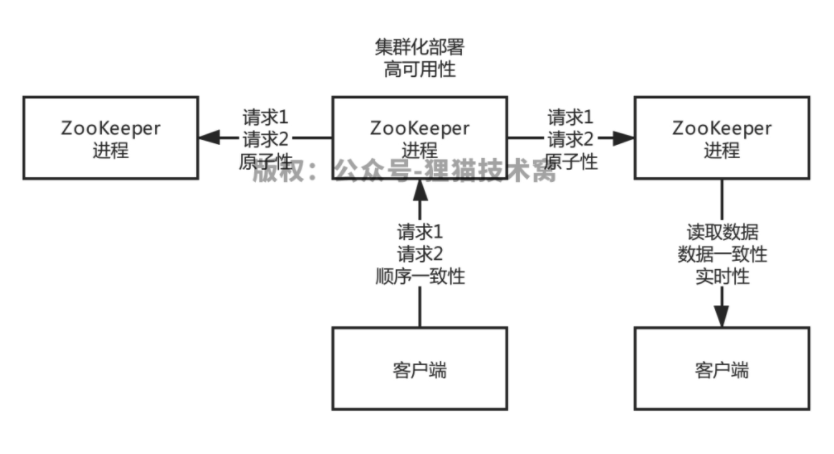
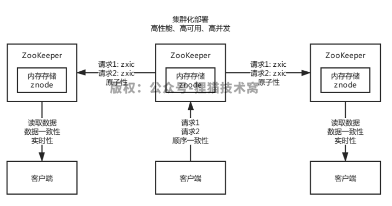
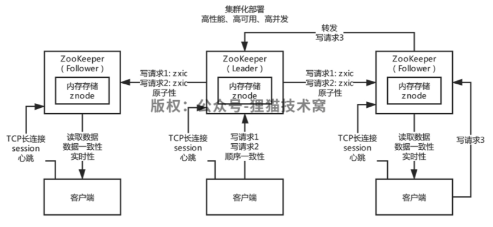
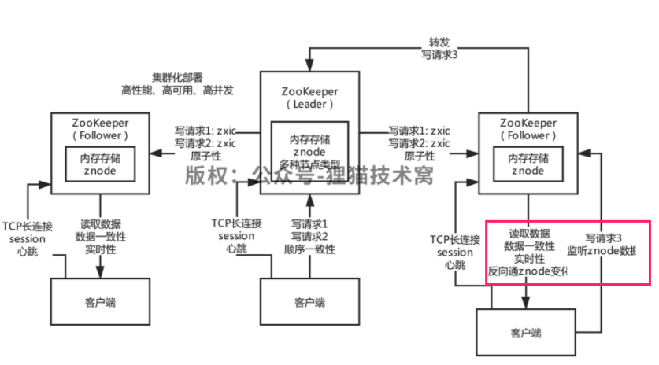
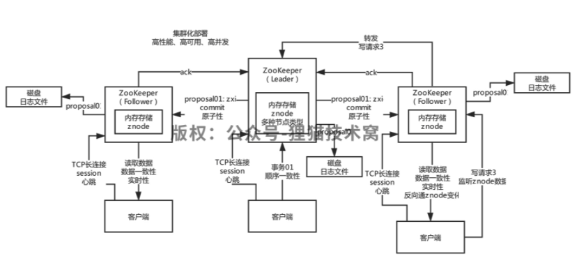
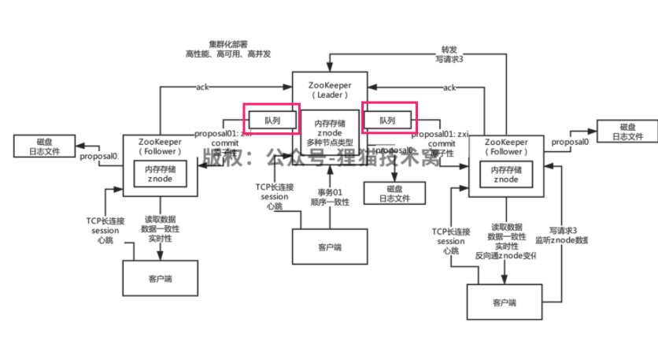

# Zookeeper

## 1. 核心功能

### 分布式锁

运用于分布式的Java业务系统中

 

### 元数据管理

Kafka、Canal，本身都是分布式架构，分布式集群在运行，本身他需要一个地方集中式的存储和管理分布式集群的核心元数据，所以他们都选择把核心元数据放在zookeeper中的

 

### 分布式协调

如果有人对zk中的数据做了变更，然后zk会反过来去通知其他监听这个数据的人，告诉别人这个数据变更了，kafka有多个broker，多个broker会竞争成为一个controller的角色。如果作为controller的broker挂掉了，此时他在zk里注册的一个节点会消失，其他broker瞬间会被zk反向通知这个事情，继续竞争成为新的controller。

这个就是非常经典的一个分布式协调的场景，有一个数据，一个broker注册了一个数据，其他broker监听这个数据

 

ZooKeeper，分布式协调系统，封装了分布式架构中所有核心和主流的需求和功能，**分布式锁、分布式集群的集中式元数据存储、Master选举、分布式协调和通知**

## 2. 使用场景

### 分布式Java业务系统

分布式电商平台，大部分的Java开发的互联网平台，或者是传统架构系统，都是分布式Java业务系统，Dubbo、Spring Cloud把系统拆分成很多的服务或者是子系统，大家协调工作，完成最终的功能。ZooKeeper，用的比较少，分布式锁的功能，而且很多人会选择用Redis分布式锁

 

### 开源的分布式系统 

Dubbo，HBase，HDFS，Kafka，Canal，Storm，Solr。**分布式集群的集中式元数据存储、Master选举实现HA架构、分布式协调和通知**

+ Dubbo：ZooKeeper作为注册中心，分布式集群的集中式元数据存储
+ HBase：分布式集群的集中式元数据存储
+ HDFS：Master选举实现HA架构
+ Kafka：分布式集群的集中式元数据存储，分布式协调和通知
+ Canal：分布式集群的集中式元数据存储，Master选举实现HA架构

 

### 自研的分布式系统

 HDFS，面向的超大文件，切割成一个一个的小块儿，分布式存储在一个大的集群里

分布式海量小文件系统：NameNode的HA架构，仿照HDFS的NameNode的HA架构，做主备两个NameNode，进行数据同步，然后自动基于zk进行热切换

## 3. 核心架构

### 3.1 架构要求

ZooKeeper肯定是一套系统，这个系统可以存储元数据，支持Master选举，可以进行分布式协调和通知

+ **集群部署**：不可能单机版本
+ **高可用**：如果某台机器宕机，要保证数据绝对不能丢失
+ **顺序一致性**：所有请求全部有序
+ **原子性**：要么全部机器都成功，要么全部机器都别成功
+ **数据一致性**：无论连接到哪台ZK上去，看到的都是一样的数据，不能有数据不一致
+ **实时性**：一旦数据发生变更，其他人要实时感知到

### 3.2 架构特点

+ **树形结构的数据模型**：**znode**，树形结构，数据模型简单，纯内存保存。数据结构就跟我们的文件系统是类似的，是有层级关系的树形的文件系统的数据结构。znode可以认为是一个节点而已
+ **顺序写**：集群中只有一台机器可以写，所有机器都可以读，所有写请求都会分配一个zk集群全局的唯一递增编号，zxid，保证各种客户端发起的写请求都是有顺序的
+ **数据一致性**：任何一台zk机器收到了写请求之后都会同步给其他机器，保证数据的强一致，你连接到任何一台zk机器看到的数据都是一致的
+ **高性能**：每台zk机器都在内存维护数据，所以zk集群绝对是高并发高性能的，如果你让zk部署在高配置物理机上，一个**3台机器的zk集群抗下每秒几万请求没有问题**

+ **高可用**：集群中挂掉不超过一半的机器，都能保证可用，数据不会丢失，3台机器可以挂1台，5台机器可以挂2台
+ **高并发**：高性能决定的，只要基于纯内存数据结构来处理，并发能力是很高的，**只有一台机器进行写，但是高配置的物理机，比如16核32G，写入几万QPS，读，所有机器都可以读**，3台机器的话，起码可以支撑十几万QPS

### 3.3 角色和连接

常来说ZooKeeper集群里有三种角色的机器

+ **Leader**: 集群启动自动选举一个Leader出来，只有Leader是可以写的

+ **Follower**: Follower是只能同步数据和提供数据的读取，Leader挂了，Follower可以继续选举出来Leader

+ **Observer**: Observer也只能读但是Observer不参与选举。**Observer节点是不参与leader选举的，他也不参与ZAB协议同步时候的过半follower ack的那个环节，他只是单纯的接收数据，同步数据**，可能数据存在一定的不一致的问题，但是是只读的

  

zk集群启动之后，自己分配好角色，然后客户端就会跟zk建立连接，**是TCP长连接。也就建立了一个会话，就是session**，可以通过心跳感知到会话是否存在，有一个**sessionTimeout**，意思就是如果连接断开了，只要客户端在指定时间内重新连接zk一台机器，**就能继续保持session，否则session就超时了**

zk集群无论多少台机器，**只能是一个leader进行写，单机写入最多每秒上万QPS，这是没法扩展的**，所以zk是适合写少的场景。**follower起码有2个或者4个，**读你起码可以有每秒几万QPS，没问题，**那如果读请求更多，此时你可以引入Observer节点**，他就只是同步数据，提供读服务，可以无限的扩展机器

### 3.4 节点类型

#### 持久节点

持久节点就是哪怕客户端断开连接，一直存在。如果你是做元数据存储，肯定是持久节点

#### 临时节点

就是只要客户端断开连接，节点就没了。如果你是做一些分布式协调和通知，很多时候是用临时节点，就是说，比如我创建一个临时节点，别人来监听这个节点的变化，如果我断开连接了，临时节点消失，此时人家会感知到，就会来做点别的事

#### 顺序节点

就是创建节点的时候自增加全局递增的序号。zk会自动给你的临时节点加上一个后缀，全局递增的，编号。如果你客户端断开连接了，就自动销毁这个你加的锁，此时人家会感知到，就会尝试去加锁

### 3.5 监听回调机制

ZooKeeper最核心的机制，就是你一个客户端可以对znode进行Watcher监听，然后znode改变的时候回调通知你的这个客户端，这个
是非常有用的一个功能，在分布式系统的协调中是很有必要的支持写和查：只能实现元数据存储，Master选举，部分功能

分布式系统的协调需求：**分布式架构中的系统A监听一个数据的变化，如果分布式架构中的系统B更新了那个数据/节点，zk反过来通知**
**系统A这个数据的变化**

使用zk很简单，内存数据模型（不同节点类型）；写数据，主动读取数据；监听数据变化，更新数据，反向通知数据变化

### 3.6 ZAB协议

#### 数据同步[广播 + 二段提交]

其实用的是特别设计的ZAB协议，**ZooKeeper Atomic Broadcast**，就是ZooKeeper**原子广播协议**。通过这个协议来进行zk集群间的数据同步，保证数据的强一致性

只有Leader可以接受写操作，Leader和Follower都可以读

+ Leader收到事务请求，转换为事务Proposal（提议）同步给所有的
+ Follower，超过半数的Follower都说收到事务proposal了
+ Leader再给所有的Follower发一个Commit消息，让所有Follower提交一个事务

**如果Leader崩溃，重新选举Leader保证运行**

#### 恢复模式vs广播模式

**zk集群启动的时候，进入恢复模式**，选举一个leader出来，然后leader等待集群中过半的follower跟他进行数据同步，只要过半follower完成数据同步，接着就退出恢复模式，可以对外提供服务了。**只要有超过一半的机器，认可你是leader，你就可以被选举为leader**

3台机器组成了一个zk集群，启动的时候，只要有2台机器认可一个人是Leader，那么他就可以成为leader了。3**台可以容忍不超过一半的机器宕机，1台剩余的2台机器，只要2台机器都认可其中某台机器时leader**，2台 > 一半，就可以选举出来一个leader了。1台机器时没有办法自己选举自己的。当然还没完成同步的follower会自己去跟leader进行数据同步的

 

**Leader选举完之后，会进入消息广播模式。**只有leader可以接受写请求，但是客户端可以随便连接leader或者follower，如果客户端连接到follower，follower会把写请求转发给leader。Leader收到写请求，就把请求同步给所有的follower，过半follower都说收到了，就再发commit给所有的follower，让大家提交这个请求事务

 

**如果突然leader宕机了，会进入恢复模式**，重新选举一个leader，只要过半的机器都承认你是leader，就可以选举出来一个leader，所以zk很重要的一点是主要宕机的机器数量小于一半，他就可以正常工作。因为主要有过半的机器存活下来，就可以选举新的leader

 

**新leader重新等待过半follower跟他同步，完了重新进入消息广播模式**

 **总结**

+ 集群启动：恢复模式，leader选举**（过半机器选举机制） + 数据同步**

+ 消息写入：消息广播模式，leader采用2PC模式的过半写机制，给follower进行同步
+ 崩溃恢复：恢复模式，leader/follower宕机，只要剩余机器超过一半，集群宕机不超过一半的机器，就可以选举新的leader，数据同步

#### 二段提交

每一个消息广播的时候，都是2PC思想走的，先是发起事务Proposal的广播，就是事务提议，仅仅只是个提议而已，各个follower返回ack，过半follower都ack了，就直接发起commit消息到全部follower上去，让大家提交

 

+ 发起一个事务proposal之前**，leader会分配一个全局唯一递增的事务id，zxid**，通过这个可以严格保证顺序
+ leader会为**每个follower创建一个队列**，里面放入要发送给follower的事务proposal，**这是保证了一个同步的顺序性**
+ **每个follower收到一个事务proposal之后，就需要立即写入本地磁盘日志中**，写入成功之后就可以保证数据不会丢失了，然后**返回一个ack给leader**
+ 过半follower都返回了ack，**leader推送commit消息给全部follower**
+ leader自己也会进行commit操作，commit之后，就意味这个数据可以被读取到了

### 3.6 最终一致性

#### 强一致性

只要写入一条数据，立马无论从zk哪台机器上都可以立马读到这条数据，强一致性，**你的写入操作卡住，直到leader和全部follower都进行了commit之后，才能让写入操作返回，认为写入成功了。**此时只要写入成功，无论你从哪个zk机器查询，都是能查到的，强一致性

**ZAB协议机制，zk一定不是强一致性** 

#### 最终一致性

写入一条数据，方法返回，告诉你写入成功了，此时有可能你立马去其他zk机器上查是查不到的，**短暂时间是不一致的，但是过一会儿，最终一定会让其他机器同步这条数据，最终一定是可以查到的**。其实过半follower对事务proposal返回ack，就会发送commit给所有follower了，只要follower或者leader进行了commit，这个数据就会被客户端读取到了。此时有的follower已经commit了，但是有的follower还没有commit。

所以zk不是强一致的，不是说leader必须保证一条数据被全部follower都commit了才会让你读取到数据，而是过程中可能你会在不同的follower上读取到不一致的数据，但是最终一定会全部commit后一致，让你读到一致的数据的

 

#### 顺序一致性 - Sequential Consistency

因此zk是最终一致性的，但是其实他比最终一致性更好一点，出去要说是顺序一致性的，**因为leader一定会保证所有的proposal同步到follower上都是按照顺序来走的**，起码顺序不会乱。但是全部follower的数据一致确实是最终才能实现一致的。如果要求强一致性，可以手动调用zk的sync()操作

### 3.7 可能存在的数据一致性问题

#### Commit之后宕机

**Leader收到了过半的follower的ack，接着leader自己commit了，还没来得及发送commit给所有follower自己就挂了**，这个时候相当于leader的数据跟所有follower是不一致的，你得保证全部follower最终都得commit

另外一个，leader可能会自己收到了一个请求，结果没来得及发送proposal给所有follower之前就宕机了，此时这个Leader上的请求应该是要被丢弃掉的

所以在leader崩溃的时候，**就会选举一个拥有事务id最大的机器作为leader，他得检查事务日志，如果发现自己磁盘日志里有一个proposal，但是还没提交，说明肯定是之前的leader没来得及发送commit就挂了**

#### Commit之前宕机 

此时他就得作为leader为这个proposal发送commit到其他所有的follower中去，这个就保证了之前老leader提交的事务已经会最终同步提交到所有follower里去。如果老leader自己磁盘日志里有一个事务proposal，**他启动之后跟新leader进行同步，发现这个事务proposal其实是不应该存在的，就直接丢弃掉就可以了**

### 3.8 选举

新选举出来一个leader之后，本身人家会挑选已经收到的事务zxid里最大的那个follower作为新的leader。

+ 5个机器，1leader + 4个follower 
+ 1个leader把proposal发送给4个follower
+ 其中3个folower（过半）都收到了proposal返回ack了，第四个follower没收到proposal

此时leader执行commit之后自己挂了，commit没法送给其他的follower，commit刚发送给一个follower。剩余的4个follower，只要3个人投票一个人当leader，就是leader。**假设那3个收到proposal的follower都投票第四台没有收到proposal的follower当心的leader？这条数据一定永久性丢失了**

**选择一个拥有事务zxid最大的机器作为新Leader**。其他的follower就会跟他进行同步，他给每个follower准备一个队列，然后把所有的proposal都发送给follower，**只要过半follower都ack了，就会发送commit给那个follower**。**所谓的commit操作，就是把这条数据加入内存中的znode树形数据结构里去，然后就对外可以看到了**，也会去通知一些监听这个znode的人。如果**一个follower跟leader完全同步了，就会加入leader的同步follower列表中去**，然后过半follower都同步完毕了，就可以对外继续提供服务了

### 3.9 抛弃未处理数据

每一条事务的zxid是64位的，**高32位是leader的epoch**，就认为是leader的版本吧；**低32位才是自增长的zxid**

老leader发送出去的proposal，高32位是1，低32位是11358。**如果一个leader自己刚把一个proposal写入本地磁盘日志，就宕机了**，没来得及发送给全部的follower，**此时新leader选举出来，他会的epoch会自增长一位。proposal，高32位是2**，低32位是继续自增长的zxid

然后老leader恢复了连接到集群是follower了，此时发现自己比新leader多出来一条proposal，**但是自己的epoch比新leader的epoch低了，所以就会丢弃掉这条数据。** 

启动的时候，过半机器选举leader，数据同步。**对外提供服务的时候，2PC + 过半写机制，顺序一致性（最终的一致性）**。崩溃恢复，剩余机器过半，重新选举leader，有数据不一致的情况，针对两种情况自行进行处理，保证数据是一致的（磁盘日志文件、zxid的高32位）

### 3.10 局限性 - 无法写扩展

小集群部署，每个节点收到的注册、心跳所有的信息，都必须向其他节点都进行同步，有很大的问题，他在进行同步的时候，采取的是完全的一个异步同步的机制，不管什么2PC，异步慢慢同步就可以了。**时效性是很差的，eureka，这个技术不适合大公司，大厂的场景去使用**

 

现在第二个问题，为什么zk的leader和follower只能是三五台机器，小集群部署？**因为你想，假设你有1个leader + 20个follower，**21台机器，你觉得靠谱吗？不靠谱，**因为follower要参与到ZAB的写请求过半ack里去。如果你有20个follower，一个写请求出去，要起码等待10台以上的Follower返回ack，才能发送commit，才能告诉你写请求成功了，性能是极差的**。

 所以zk的这个ZAB协议就决定了一般其实就是**1个leader + 2个follower的小集群就够了，写请求是无法扩展的，读请求如果量大，可以加observer机器，最终就是适合读多写少的场景**

 

主要就是用于分布式系统的一些协调工作。**这也就让大家知道了，很多互联网公司里，不少系统乱用zk，以为zk可以承载高并发写，结果每秒几万写请求下去，zk的leader机器直接可能就挂掉了**，扛不住那么大的请求量，zk一旦挂掉，连带的kafka等系统会全部挂掉。zk适合读多写少的，zk集群挂掉了。**leader写入压力过大， 最终导致集群挂掉了**，对一个公司的技术平台是有重大打击的，hbase、kafka之类的一些技术都是强依赖zk的，dubbo + zk去做服务框架的话，有上万甚至几十瓦的服务实例的时候。

大量的服务的上线、注册、心跳的压力，达到了每秒几万，甚至上十万，zk的单个leader写入是扛不住那么大的压力的

 

一般适合写比较少。读比较多，observer节点去线性扩展他的高并发读的能力